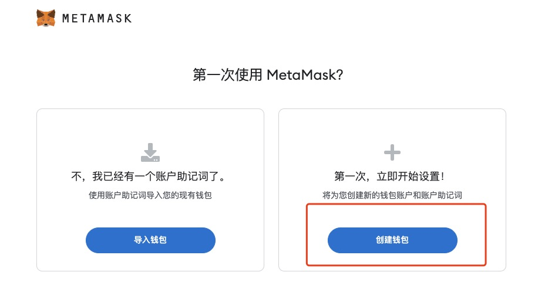

# Get Started With Web3: 1. 第一个web3身份

---

自学入门`Web3`不是一件容易的事，作为一个刚刚入门Web3的新人，梳理一下最简单直观的`Web3`小白入门教程。整合开源社区优质资源，为大家从入门到精通web3指路。每周更新1-3讲.

欢迎关注我的推特：[@beihai1337](https://twitter.com/beihai1337)

北航区块链协会DAO推特： [@BHBA_DAO](https://twitter.com/BHBA_DAO)

进入微信交流群请填表： [表格链接](https://forms.gle/QMBwL6LwZyQew1tX8)

文章开源在github： [https://github.com/beihaili/Get-Started-with-Web3](https://github.com/beihaili/Get-Started-with-Web3)

---

## Web3简述

`Web3`是一个开放的网络，任何人都可以在上面建立自己的应用，而不需要依赖于任何中心化的服务。就技术而言，`Web3`是基于区块链技术的去中心化网络。另一种更符合现状的说法是在web2网站上加上小狐狸钱包`Metamask`这个网站就变成了`Web3`网站😂。

## 小狐狸钱包`Metamask`简述

`Metamask`是一个去中心化的钱包浏览器插件，可以让用户轻松接入`Web3`的世界，绝大多数`Web3`项目都支持`Metamask`。

## 使用`Metamask`创建第一个`Web3`身份

与动不动就要关联手机号的`Web2`不同，创建`Web3`身份的过程简单的令人感到不可思议。我们接下来会带领大家使用`Metamask`创建一个`Web3`身份，保证全过程不超过5分钟。

创建`Web3`身份拢共分几步？三步！
+ 第一步：安装`Metamask`浏览器插件
+ 第二步：创建`Metamask`账户
+ 第三步：备份`Metamask`账户

### 第一步：安装`Metamask`浏览器插件

用`Chorme`浏览器访问[Metamask官网](https://metamask.io/)，点击`Get Chrome Extension`，然后点击`Add to Chrome`，即可安装`Metamask`浏览器插件。

  

  

### 第二步：创建`Metamask`账户

点击`Metamask`浏览器插件，点击`开始使用`点击`我同意`点击`创建钱包`，设置密码后即可创建`Metamask`账户。

  

### 第三步：备份`Metamask`账户

第一次创建账户默认会进行备份，推荐找个僻静地方抄到纸上，或者存到1password等密码管理工具中，如果选择复制助记词到电脑上最好进行加密存储。

  

### Metamask界面

恭喜你，你已经拥有了一个`Web3`身份。我们来熟悉一下`Metamask`的界面。

  

+ 最上面的`Ethereum Mainnet`是网络选择，默认选择`Ethereum Mainnet`
+ `0x...`是你的`Metamask`账户地址
+ `0 ETH`是你的`Metamask`账户余额

## 总结

你可能注意到在生成`Web3`身份的过程中没有任何验证，这意味着在`Web3`世界里人们就像戴上了一层面具，任何人都可以随意创造自己的身份，这创造了空前的自由，也放大了人性的善良和恶意，意味着在`Web3`世界里，你不能相信任何人，需要更加小心地保护自己,任何时候都要`Do Your Own Research`。

恭喜看到这里的你🎉你已经踏出了去往`Web3`世界的第一步，祝你玩得愉快！