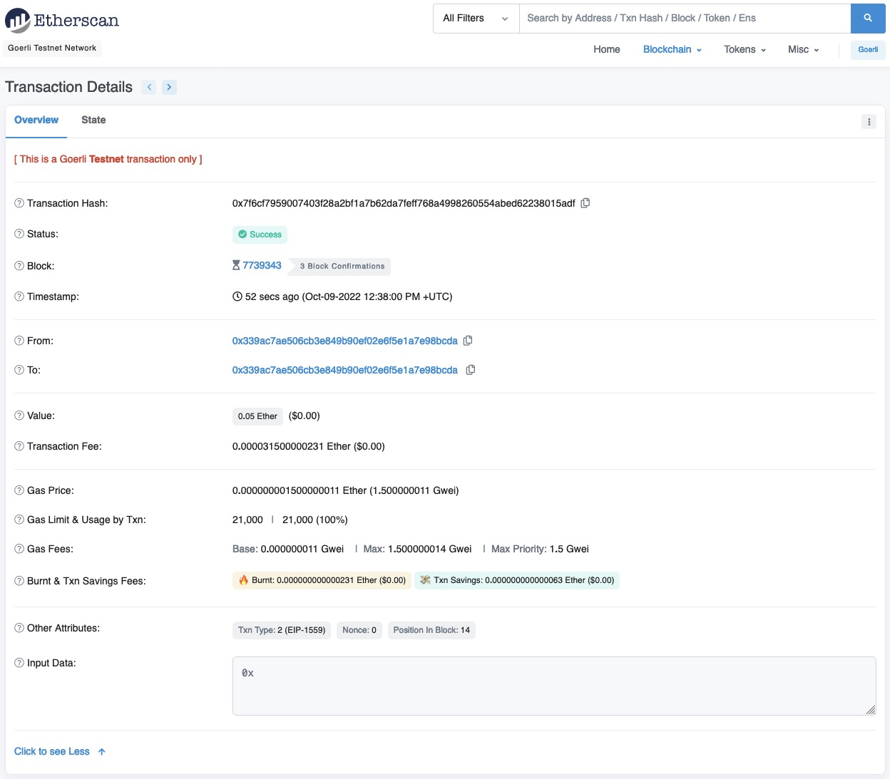

# Get Started With Web3: 2. 发送第一笔Web3交易

---

自学入门`Web3`不是一件容易的事，作为一个刚刚入门Web3的新人，梳理一下最简单直观的`Web3`小白入门教程。整合开源社区优质资源，为大家从入门到精通web3指路。每周更新1-3讲.

欢迎关注我的推特：[@beihai1337](https://twitter.com/beihai1337)

北航区块链协会DAO推特： [@BHBA_DAO](https://twitter.com/BHBA_DAO)

进入微信交流群请填表： [表格链接](https:)

文章开源在github： [github.com/beihai1337/GetStartedWithWeb3](https://github.com/beihai1337/GetStartedWithWeb3)

---

## 交易是什么

交易是一种在区块链上执行的动作，它可以是一次转账，也可以是一次合约调用。交易的执行需要消耗一定的`gas`，`gas`是用户为了执行交易向矿工或验证节点发送的一定数量的代币，`gas`的多少是由网络的实时情况决定的,通常矿工或验证节点会优先打包高`gas`的交易上链。交易的执行结果会被写入区块链中，所有人都可以通过区块链查询到交易的执行结果。

## 发出第一笔交易

### 1. 选择测试网络

首先我们要选择一个合适的测试网络方便发送交易，由于测试网络可以免费领取代币，又不会占用主网宝贵的资源所以我们选择测试网络进行第一笔交易的发送。打开小狐狸钱包，点击右上角的网络信息。

选择测试网络，如果跳转到设置页面就在设置页面中打开测试网络选项。

选择`Goerli`测试网络.

### 2. 领取测试代币

下一步我们去[goerlifaucet.com](https://goerlifaucet.com/)领取测试代币。登录网站，填入我们的的钱包地址，点击`Send me ETH1`按钮，等待一会就可以收到测试代币了。

点击后可以看到水龙头发送代币的交易信息。

回到钱包中我们可以看到代币余额变化了。

### 3. 发送交易

点击小狐狸钱包的`发送`按钮可以看到发送交易的页面，填入接收地址，这里我们方便起见写入发送地址。

点击确定后来到发送界面，选择发送资产类型，数额，`gas`费用。

`gas`费用可以根据需要选择低中高三种类型，也可以自定义`gas`费用，`gas`费用越高交易被打包的优先级越高，但是`gas`费用越高，交易的执行成本也越高。

最后点击发送按钮，发送交易。

### 4. 查询交易

发送交易后点击活动即可查询发出的交易。

目前交易显示待处理说明交易已经发送出去但是还没有被验证节点打包上链。

点击交易可以查看交易详情，交易详情中点击在区块链浏览器上查看可以看到更多信息。

在浏览器中可以看到
+ 交易哈希
+ 交易状态
+ 上链区块
+ 时间戳
+ 发送交易地址
+ 接收交易地址
+ 交易金额
+ 交易费用

点击显示详细信息可以看到更多信息包括：

+ `gas price`
+ `gas limit`
+ `gas fees`
+ `burnt & Txn Savings fees`
+ `other attributes`
+ `input data`

## 总结
本文介绍了如何使用小狐狸钱包发送一笔最简单的转账交易。交易是我们接触区块链最直接的方式，通常交易的参数和调用方法都在区块链项目的前端中写好，用户只需签署交易即可，非常简单。恭喜你完成了第一笔交易，你现在可以在10分钟内给国外的朋友转账了😄下一节我们将介绍如何与Dapp交互。

