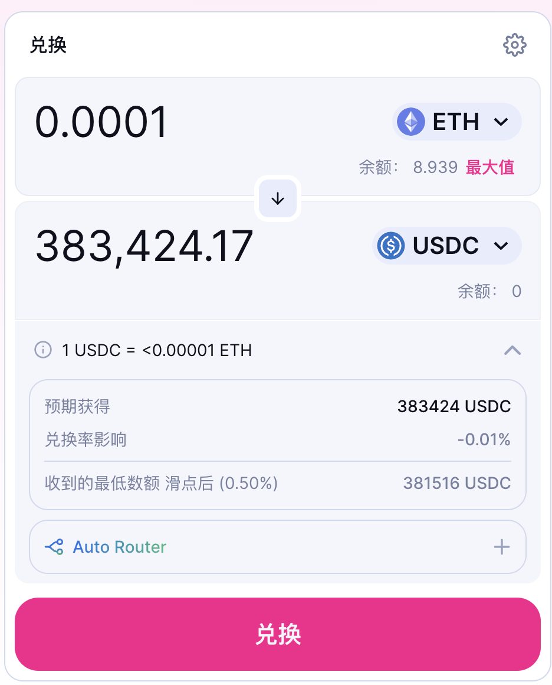
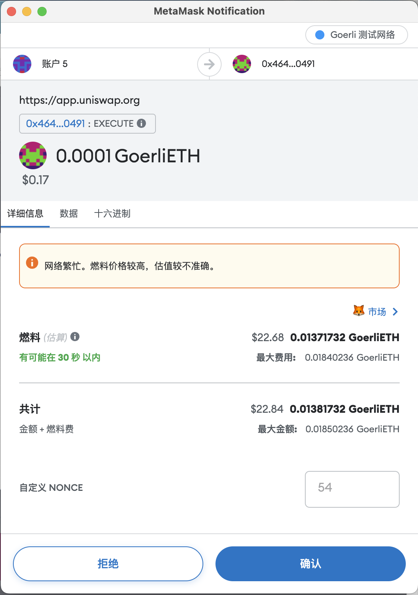
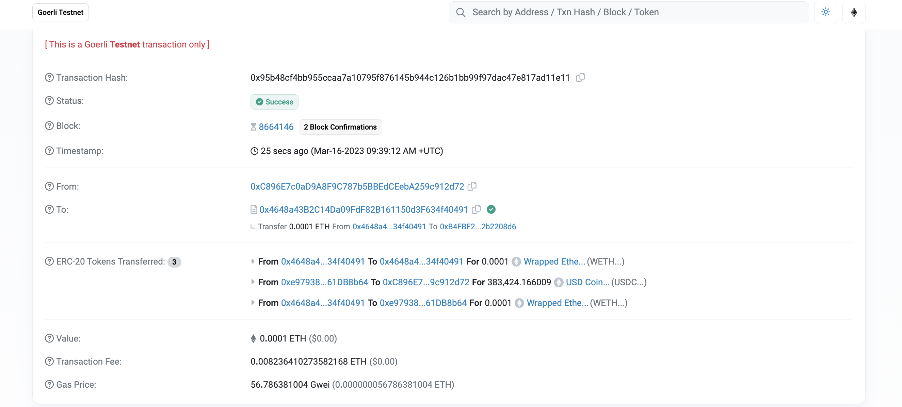

# Get Started With Web3: 使用 Web3 的第一个 DApp

---

自学入门 `Web3` 不是一件容易的事，作为一个刚刚入门 Web3 的新人，梳理一下最简单直观的 `Web3` 小白入门教程。整合开源社区优质资源，为大家从入门到精通 Web3 指路。每周更新 1-3 讲。

欢迎关注我的推特：[@bhbtc1337](https://twitter.com/bhbtc1337)

北航区块链协会 DAO 推特：[@BHBA_DAO](https://twitter.com/BHBA_DAO)

进入微信交流群请填表：[表格链接](https://forms.gle/QMBwL6LwZyQew1tX8)

文章开源在 GitHub：[Get-Started-with-Web3](https://github.com/beihaili/Get-Started-with-Web3)

---

## Dapp 是什么

Dapp 是 `Decentralized Application` 的缩写，中文翻译为去中心化应用。Dapp 是一种基于区块链的应用，它的运行不依赖于中心化的服务器，而是依赖于区块链网络。Dapp 的运行结果会被写入区块链中，所有人都可以通过区块链查询到交易的执行结果。Dapp 的应用场景广泛，可应用于：

- 去中心化金融：著名的有：Uniswap、Compound、Aave、Synthetix、MakerDAO、Yearn Finance、Curve Finance、Balancer 等
- 去中心化社交：著名的有：Damus、Lens protocol 等
- NFT：著名的有：OpenSea、Rarible、SuperRare 等
- 其他：治理，投票 著名的有：Snapshot、Gnosis 等

## 运行 Dapp 的流程

运行 Dapp 的流程如下：

1. 开发者创建一个区块链钱包，并获得一些以太币来支付交易费用。
2. 开发者编写 Dapp 的智能合约，并使用 Solidity 编程语言进行编码。
3. 开发者部署智能合约到以太坊网络中，例如通过 Remix 或 Truffle 等工具。
4. 开发者创建一个前端应用程序来与智能合约进行交互，例如使用 React 或 AngularJS 等工具。
5. 专业用户和开发者可以通过 web3 库连接前端应用程序和以太坊网络，以便与智能合约进行交互。
6. 普通用户通过前端应用程序与智能合约进行交互，例如提交交易或查询数据。

作为快速入门，本文仅介绍第 6 步，即普通用户通过前端应用程序与智能合约进行交互。第 1-5 步的内容将在后续的文章中介绍。

## 使用 Web3 的第一个 DApp

这里以 [Uniswap](https://uniswap.org/) 为例，介绍如何使用 Web3 的第一个 DApp。

1. 打开 [Uniswap](https://app.uniswap.org/#/swap)，点击 `Metamask` 选择 `Görli 测试网络`。点击 `Connect to a wallet`，选择 `Metamask`，然后点击 `Connect`。
   
  

2. 点击 `Select a token`，选择 `ETH`，然后点击 `Select`。点击 `Select a token`，选择 `USDC`，然后点击 `Select`。
   P.S. 现在 `Görli 测试网络` 上的 ETH 通过 [LayerZero 跨链桥](https://testnetbridge.com/) 可以兑换真 ETH，所以测试网 ETH 价格很高 hhh。
   
  

3. 输入希望交换的金额 `0.0001`，然后点击 `Swap`。点击 `Confirm Swap`，然后点击 `Swap`。
   
  

4. 这时交易已经被提交到以太坊网络中，等待被打包。点击 `View on Etherscan`，然后点击 `View`。
   
  

5. 交易成功上链，可以在 [以太坊区块浏览器](https://goerli.etherscan.io/) 中查询到交易的执行结果。
   
  

## 总结

本文介绍了如何使用 Web3 的第一个 DApp，即使用 Uniswap 交换 `Görli 测试网络` 的以太币和比特币。这里使用的是 Görli 测试网络，因此交易费用非常低，可以随意尝试。如果你想在主网上交易，可以使用以太坊网络，但是交易费用会比较高，因此需要谨慎操作。Dapp 的流程中的第 1-5 步在本文中略去了，实际上它们也很重要，将在后续的进阶学习中介绍。现在，你可以作为用户参与到几乎所有的区块链 Dapp 应用了，恭喜！🎉🎉🎉 好玩归好玩，还是要继续学习哦。下一篇文章我们将进入进阶学习。