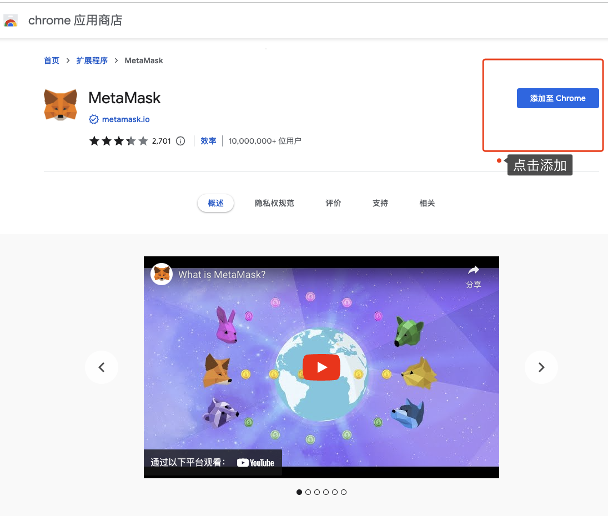

# 创建你的第一个 Web3 身份

> 💡 自学入门 `Web3` 不是一件容易的事，作为一个刚刚入门 Web3 的新人，梳理一下最简单直观的 `Web3` 小白入门教程。整合开源社区优质资源，为大家从入门到精通 Web3 指路。每周更新 1-3 讲。
> 
> 欢迎关注我的推特：[@bhbtc1337](https://twitter.com/bhbtc1337)
> 
> 北航区块链协会 DAO 推特：[@BHBA_DAO](https://twitter.com/BHBA_DAO)
> 
> 进入微信交流群请填表：[表格链接](https://forms.gle/QMBwL6LwZyQew1tX8)
> 
> 文章开源在 GitHub：[Get-Started-with-Web3](https://github.com/beihaili/Get-Started-with-Web3)
> 
> 购买BTC/ETH/USDT 等加密货币推荐 [币安](https://www.binance.com/zh-CN)[注册链接](https://accounts.marketwebb.me/register?ref=39797374)

## 目录

- [前言](#前言)
- [Web3 简述](#web3-简述)
- [小狐狸钱包 Metamask 简述](#小狐狸钱包-metamask-简述)
- [使用 Metamask 创建第一个 Web3 身份](#使用-metamask-创建第一个-web3-身份)
- [常见问题](#常见问题)
- [总结](#总结)

## 前言

还记得第一次接触互联网时的那种兴奋和好奇吗？今天，我们站在了另一个技术革命的起点 —— Web3。这个全新的网络世界不再由科技巨头控制，而是由每一个参与者共同拥有。作为一名Web3新人，我深知迈出第一步的重要性和挑战。希望通过这篇文章，能让你轻松获得自己的第一个Web3身份，打开这扇通往数字未来的大门！

## Web3 简述

`Web3` 是一个开放的网络，任何人都可以在上面建立自己的应用，而不需要依赖于任何中心化的服务。就技术而言，`Web3` 是基于区块链技术的去中心化网络。另一种更符合现状的说法是在 Web2 网站上加上小狐狸钱包 `Metamask`，这个网站就变成了 `Web3` 网站😂。

想象一下，如果互联网是一个大型商场：
- Web1是只能看橱窗的时代
- Web2是能够在商场内购物的时代
- Web3则是你成为商场共同所有者的时代

## 小狐狸钱包 Metamask 简述

`Metamask` 是一个去中心化的钱包浏览器插件，可以让用户轻松接入 `Web3` 的世界，绝大多数 `Web3` 项目都支持 `Metamask`。

简单来说，Metamask就像是你的Web3护照，它：
- 保管你的数字资产（加密货币）
- 证明你的身份
- 允许你与Web3应用互动

## 使用 Metamask 创建第一个 Web3 身份

与动不动就要关联手机号的 `Web2` 不同，创建 `Web3` 身份的过程简单的令人感到不可思议。我们接下来会带领大家使用 `Metamask` 创建一个 `Web3` 身份，保证全过程不超过 5 分钟。

创建 `Web3` 身份拢共分几步？三步！

- 第一步：安装 `Metamask` 浏览器插件
- 第二步：创建 `Metamask` 账户
- 第三步：备份 `Metamask` 账户

### 第一步：安装 Metamask 浏览器插件

用 `Chrome` 浏览器访问 [Metamask 官网](https://metamask.io/)，点击 `Get Chrome Extension`，然后点击 `Add to Chrome`，即可安装 `Metamask` 浏览器插件。

  

  

### 第二步：创建 Metamask 账户

点击 `Metamask` 浏览器插件，点击 `开始使用`，点击 `我同意`，点击 `创建钱包`，设置密码后即可创建 `Metamask` 账户。

  

### 第三步：备份 Metamask 账户

第一次创建账户默认会进行备份，推荐找个僻静地方抄到纸上，或者存到 1Password 等密码管理工具中，如果选择复制助记词到电脑上最好进行加密存储。

  

### Metamask 界面

恭喜你，你已经拥有了一个 `Web3` 身份。我们来熟悉一下 `Metamask` 的界面。

  

- 最上面的 `Ethereum Mainnet` 是网络选择，默认选择 `Ethereum Mainnet`
- `0x...` 是你的 `Metamask` 账户地址
- `0 ETH` 是你的 `Metamask` 账户余额

## 常见问题

#### ❓ 我的助记词丢失了，怎么办？

这是非常严重的问题。如果助记词丢失，就意味着你可能永久失去对钱包的控制权。请立即创建新钱包，并将资产转移到新钱包。以后务必妥善保管助记词，可以考虑：
- 抄写在纸上并放在保险箱
- 使用专业密码管理器加密存储
- 将助记词分成几部分，存放在不同的安全地方

#### ❓ Metamask支持哪些区块链网络？

Metamask默认支持以太坊主网，但也可以添加其他兼容EVM的网络，如：
- Binance Smart Chain (BSC)
- Polygon
- Avalanche
- Optimism
- Arbitrum
等等

#### ❓ 使用Metamask需要付费吗？

Metamask本身是免费的，但在区块链上进行交易时需要支付网络的"燃料费"（Gas Fee）。这些费用不会进入Metamask的口袋，而是支付给网络上的验证者。

## 总结

你可能注意到在生成 `Web3` 身份的过程中没有任何验证，这意味着在 `Web3` 世界里人们就像戴上了一层面具，任何人都可以随意创造自己的身份，这创造了空前的自由，也放大了人性的善良和恶意，意味着在 `Web3` 世界里，你不能相信任何人，需要更加小心地保护自己，任何时候都要 `Do Your Own Research`。

恭喜看到这里的你🎉你已经踏出了去往 `Web3` 世界的第一步！这扇门开启的不仅是一个钱包，更是一个充满无限可能的宇宙。想象一下，在这个世界里，你可以成为自己数据的真正主人，可以参与治理重要项目，甚至创建只属于你的数字王国。

接下来的旅程会更加精彩，我们将一起探索如何进行第一笔交易、参与DeFi、收藏NFT，以及更多Web3的奇妙应用。准备好了吗？Web3的冒险才刚刚开始！

---

<a href="https://github.com/beihaili/Get-Started-with-Web3">🏠 返回主页</a> | 
<a href="https://twitter.com/bhbtc1337">🐦 关注作者</a> | 
<a href="https://forms.gle/QMBwL6LwZyQew1tX8">📝 加入交流群</a>

