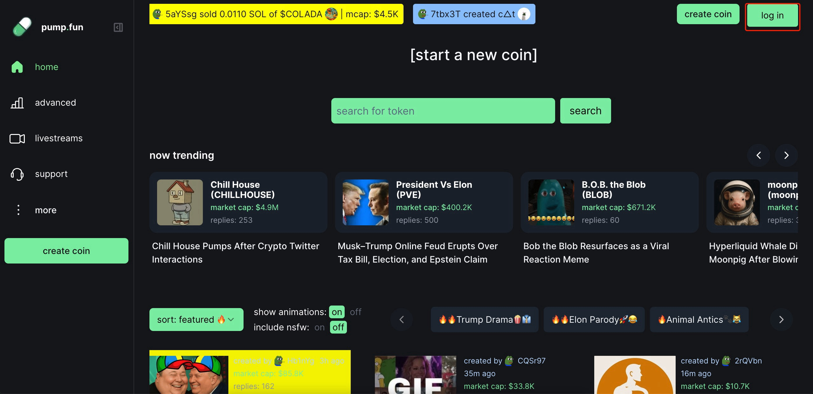
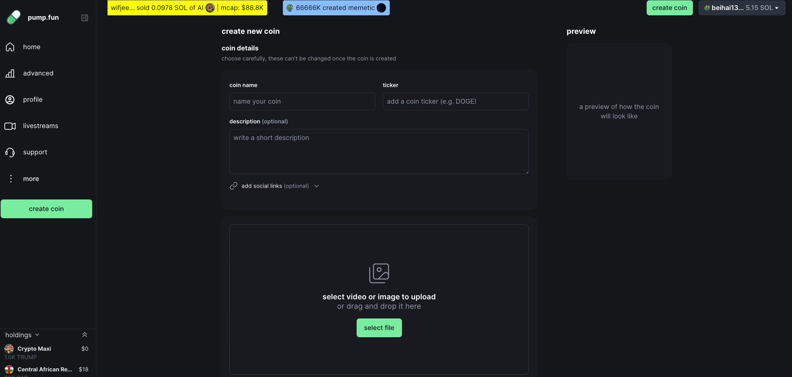
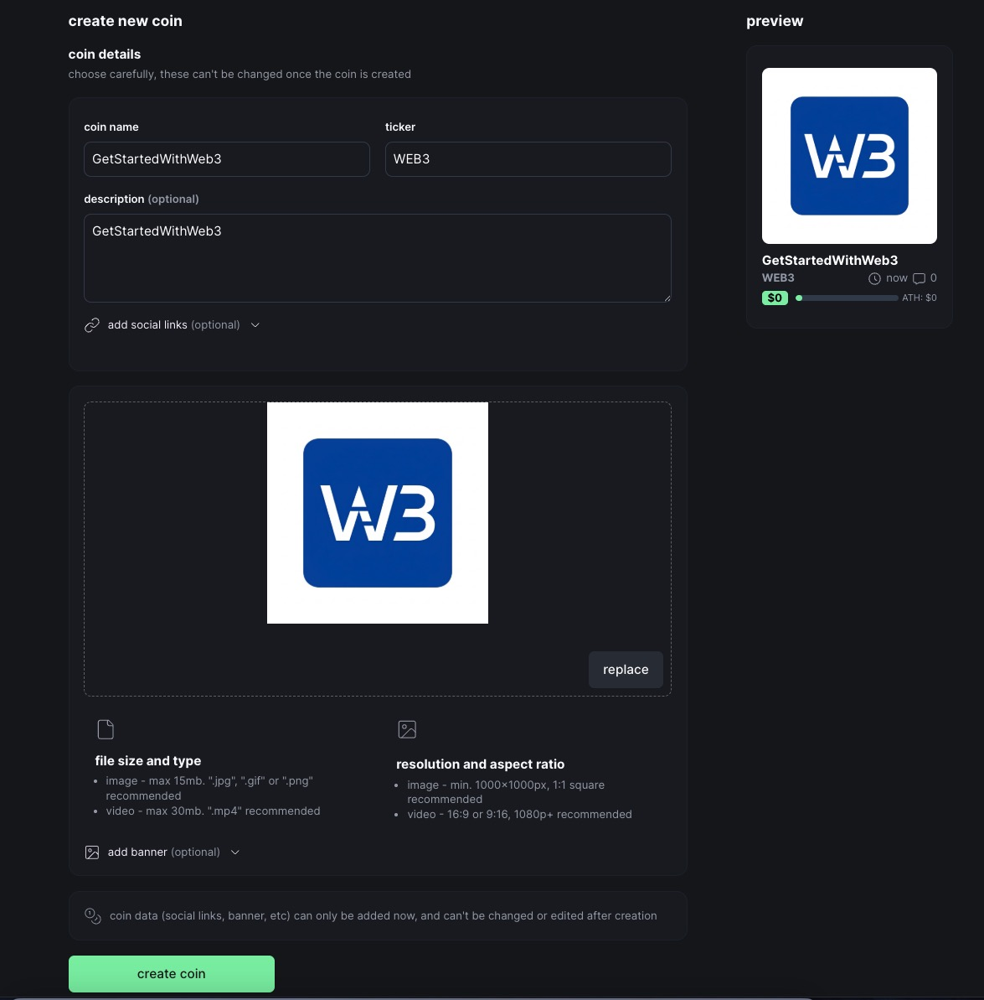
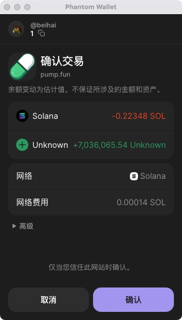
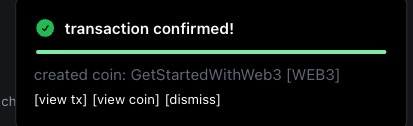
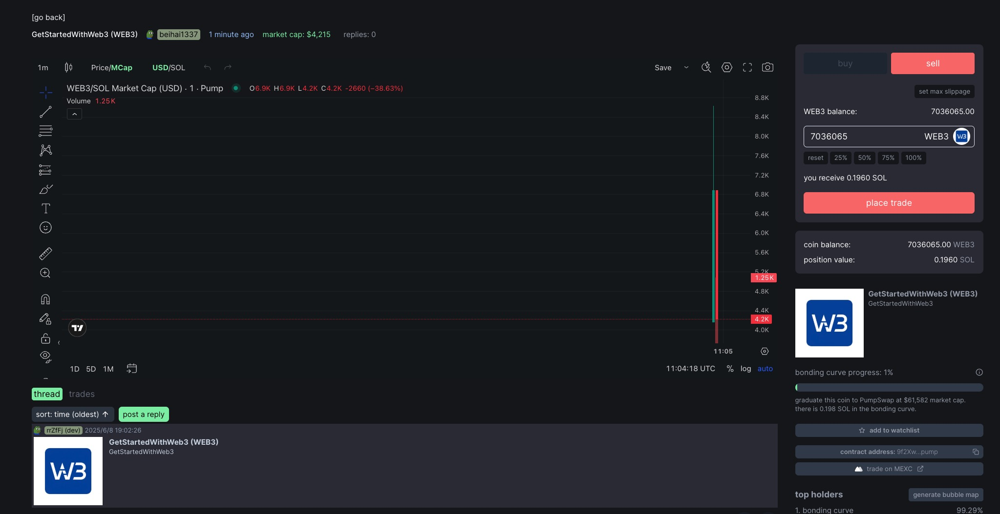
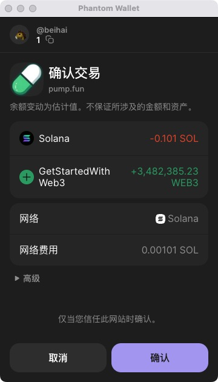

# 如何在 Pump.fun 上发行你的第一个 Solana 代币

> 💡 本教程将指导您如何在 Solana 链上通过 Pump.fun 平台快速发行自己的第一个代币，无需编写任何代码。整个过程只需几分钟即可完成，是 Web3 新手入门的绝佳实践。

## 目录

- [背景介绍](#背景介绍)
- [准备工作](#准备工作)
- [创建代币步骤](#创建代币步骤)
- [管理和推广您的代币](#管理和推广您的代币)
- [常见问题解答](#常见问题解答)
- [总结](#总结)

## 背景介绍

### 什么是 Pump.fun？

🚀 **Pump.fun** 是基于 Solana 链的一个一站式发币和交易平台，让任何人都能以极低的成本和门槛发行自己的代币。这些代币通常被称为"模因币"(meme coins)或"社区币"，可以反映特定主题、事件或社区。

Pump.fun 平台的独特之处在于：

| 特点 | 描述 |
|:----:|:----|
| 极低成本 | 仅需 0.02 SOL 即可完成代币发行 |
| 用户友好 | 无需编程知识，点击几下即可完成 |
| 自动流动性 | 自动在 Raydium 上创建交易对 |
| 实时交易 | 发行后立即可交易，无需等待 |
| 社区互动 | 内置评论和社交功能 |

### 为什么选择在 Solana 上发币？

⚡ Solana 区块链具有以下优势：
- 超高交易速度（每秒处理数千笔交易）
- 极低的交易费用（通常低于 0.01 美元）
- 活跃的生态系统和大量用户基础
- 对小型代币项目友好的环境

## 准备工作

### 必备条件

在开始前，请确保您已准备好以下内容：

1. **Solana 钱包**：推荐使用 [Phantom 钱包](https://phantom.app/)
   
   > 🔔 Phantom是最流行的Solana钱包之一，提供了友好的用户界面和安全特性
   
2. **SOL 代币**：至少 0.03 SOL（用于支付发行费用和首次购买）
3. **代币创意**：包括名称、符号、描述和图像

### 创建 Phantom 钱包（如果您还没有）

1. 访问 [Phantom 官网](https://phantom.app/) 并下载浏览器插件
2. 按照提示创建一个新钱包
3. 确保安全备份您的助记词
4. 向钱包中充值一些 SOL（可从交易所转入）

  

> ⚠️ **重要**：助记词是恢复钱包的唯一方式，请将它安全地存储在纸质介质上，并保存在安全的地方。永远不要将助记词分享给他人或存储在电子设备上。

## 创建代币步骤

### 步骤 1：访问 Pump.fun 平台

1. 打开浏览器，访问 [Pump.fun](https://pump.fun/)

   
  

2. 点击右上角的“Connect”按钮连接您的 Phantom 钱包

3. 在弹出的钱包界面中确认连接

   > 🔔 连接钱包时，请确保您在官方的 Pump.fun 网站上，以避免钱包汉钥被盗取的风险

### 步骤 2：开始创建新代币

1. 在平台首页点击"Start a new coin"按钮
   
   
  

2. 进入代币创建页面

### 步骤 3：填写代币信息

填写以下代币基本信息：

| 字段 | 说明 | 示例 |
|:----:|:----:|:----:|
| 名称 | 代币全称 | GetStartedWithWeb3 |
| 符号 | 代币简称(大写) | WEB3 |
| 图片 | 代币图标 | 上传一个正方形图像 |
| 描述 | 代币简介 | GetStartedWithWeb3社区meme |
| 网站/社交媒体 | 可选链接 | Twitter、Discord等这里我们把我们的仓库放上去https://github.com/beihaili |

  

> 🔔 注：填写代币名称、符号和描述，这些是您代币的基本信息。

> ⚠️ **注意**：请选择一个独特且有吸引力的名称和符号，这对代币的后续推广非常重要。

### 步骤 4：确认创建

1. 填写完所有信息后，点击"Create coin"按钮
2. 在弹出的确认框中，您可以选择是否在创建时购买一定数量的代币：

  

3. 建议购买一些初始代币（例如 0.2 SOL），这样您将持有自己发行代币的一部分
4. 确认交易详情，包括：
   - 发行费用（约 0.02 SOL）
   - 初始购买金额（如有）
   - 总费用

  

5. 点击“确认”按钮并在钱包中批准交易

### 步骤 5：发行成功

交易确认后，您的代币将在几秒钟内发行完成。系统会显示成功信息，并提供查看代币详情的链接。

  

点击"View"按钮查看您的代币详情页面。

  

我们的WEB3代币合约地址9f2Xw9HNx37YkXSbCTyV4saW4zwjaaFp9tFHPjtYpump，这个地址是唯一识别，可以通过这个地址在pumpfun购买meme币

## 管理和推广您的代币

### 查看代币详情

在代币详情页面，您可以看到以下信息：

- 代币价格走势图
- 当前市值
- 持有者数量
- 交易活动
- 社区评论
- 合约地址

### 如何购买代币

1. 打开pumpfun
2. 在搜索框中输入您的代币合约地址 例如我们的代币合约地址：9f2Xw9HNx37YkXSbCTyV4saW4zwjaaFp9tFHPjtYpump

  

3. 选择数量点击购买

  

4. 确认交易详情，包括：
   - 花费的 SOL 代币数量
   - 将收获的 WEB3 代币数量

  

5. 点击"确认"按钮并在钱包中批准交易

### 增加流动性

要使您的代币更具流动性，您可以：

1. 购买更多的代币来增加价格
2. 分享代币链接，鼓励他人购买
3. 考虑使用 Pump.fun 的高级工具

### 社区互动

积极参与代币页面的讨论：

1. 发表评论介绍您的代币愿景
2. 回复其他用户的问题
3. 定期更新代币发展进展

## 常见问题解答

### ❓ 发行代币需要多少 SOL？

最低需要 0.03 SOL，其中包括 0.02 SOL 的发行费用和 0.01 SOL 的交易费用。建议准备 0.1 SOL 以上，这样可以在发行后购买一些自己的代币。

### ❓ 代币发行后可以修改信息吗？

代币基本信息（如名称和符号）发行后无法修改，但您可以更新社交媒体链接和参与社区讨论。

#### ❓ 如何提高代币的价值？

- 创建实用的用例和路线图
- 建立活跃的社区
- 进行定期更新和营销
- 寻找合作伙伴和集成机会

#### ❓ 代币流动性如何管理？

Pump.fun 使用自动债券曲线来管理流动性，随着购买量增加，代币价格会上升；随着卖出量增加，价格会下降。无需手动提供流动性。

#### ❓ 创建代币后为什么在区块链浏览器上找不到？

发行完成后，你的代币需要几分钟时间在Solana区块浏览器（如Solscan或Solana Explorer）上更新索引。你可以先使用Pump.fun的界面查看代币信息，等待区块链浏览器更新完成。

#### ❓ 我需要维护我的代币吗？会有定期费用吗？

Pump.fun上发行的代币不需要你定期维护或支付维护费用。一旦发行，代币将永久存在于Solana区块链上。唯一的费用是初始发行费用和交易时的小额网络费。

## 结语

通过本教程，你已经完成了一次真正的 Web3 创造——在全球可访问的区块链上发行了自己的数字资产。当你看到自己的代币名字和代码出现在区块链浏览器上时，相信你一定感受到了这个全新金融世界的魅力。

别小看这看似简单的操作，它代表着一种历史性的变革：

- **金融民主化**：曾经，只有金融机构和政府才能发行货币或证券。你刚刚说明，现在任何人都可以这样做。
- **全球化**：你的代币可以被世界各地的人交易，没有国境限制。
- **无许可创新**：你不需要任何政府机构的批准就能创造新的金融工具。

从这里出发，你可以：

- 深入学习代币经济学，了解依靠更复杂的逻辑来设计有价值的代币
- 基于你的代币建立真正的社区，激发集体创造力
- 学习更复杂的智能合约开发，为你的代币添加实用功能
- 探索去中心化金融模式，考虑更多应用场景

Web3 的旅程才刚刚开始。从一个简单的代币到可能改变世界的项目，这条路上充满了无限的可能性。你的创造力、执行力和社区的力量，将决定你能走多远。

记住，每一个改变世界的项目，都是从一步简单的尝试开始的——你已经迈出了这一步。

---

<a href="https://github.com/beihaili/Get-Started-with-Web3">🏠 返回主页</a> | 
<a href="https://twitter.com/bhbtc1337">🐦 关注作者</a> | 
<a href="https://forms.gle/QMBwL6LwZyQew1tX8">📝 加入交流群</a>

