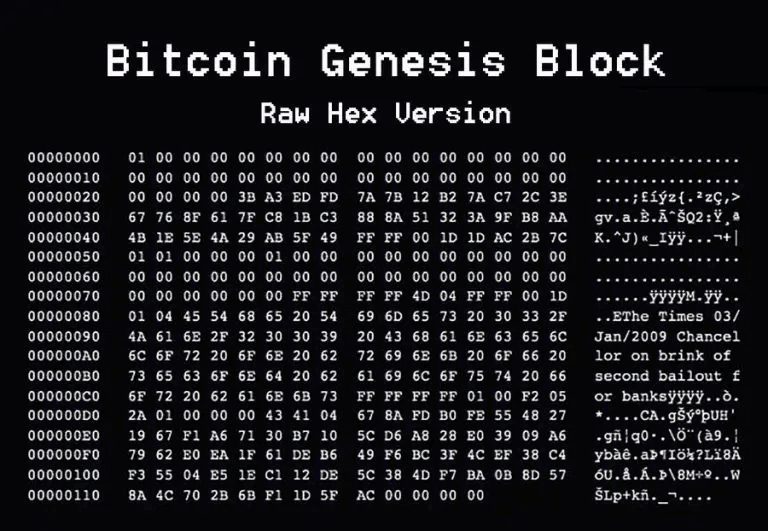

# Get Started With Web3
---
自学入门`Web3`不是一件容易的事，作为一个刚刚入门Web3的新人，梳理一下最简单直观的`Web3`小白入门教程。整合开源社区优质资源，为大家从入门到精通web3指路。每周更新1-3讲.

欢迎关注我的推特：[@beihai1337](https://twitter.com/beihai1337)

北航区块链协会DAO推特： [@BHBA_DAO](https://twitter.com/BHBA_DAO)

进入微信交流群请填表： [表格链接](https://forms.gle/QMBwL6LwZyQew1tX8)

文章开源在github： [github.com/beihai1337/GetStartedWithWeb3](https://github.com/beihai1337/GetStartedWithWeb3)

----

## 前言
> 比特币是区块链最成功的应用，没有之一。 ---beihai

这一章我们一起来学习比特币是什么，比特币到底有什么价值，比特币是如何运作的。比特币的话题是一个庞大的话题，我在本章仅做简单的介绍和引入，旨在为初学者提供一个全面基础的认识。文中会给大家引入一些其他人写的文章作为扩展和参考。

## 比特币是什么

> 比特币是一种全新的东西。比特币和互联网一样，都有着全新的底层技术，运行原理和上层应用，历史上从未有过类似的东西。给普通民众讲清楚比特币是什么，就像给80年代的民众讲清楚互联网是什么一样困难。--江卓尔

神秘人物中本聪在2008年发表了一篇名为[《比特币：一种点对点的电子现金系统》](https://bitcoin.org/bitcoin.pdf)的论文，仅仅9页内容，为我们勾勒出了提出了比特币的概念。
+ 从设计角度，比特币被设计为一种电子现金，具有去中心化、可验证、不可篡改、不可伪造的特点。就像真正的现金一样，比特币能够做到防止双花（double-spending），容易验证真伪，一定程度保证匿名性的特点
+ 比特币最重要的特性是去中心化。与传统主权国家的货币不同，比特币没有中心化的发行机构，比特币的发行和管理是通过算法来实现的，具体来说是通过`共识机制`实现的。正是这种去中心化的特性，使得比特币与众不同具备一定的价值储存特性，被称为“电子黄金”。比特币的总量被限制为2100万，每年的挖掘数量由算法规定，难以篡改。

在此作为延伸阅读强烈推荐江卓尔的[比特币是什么](https://www.zhihu.com/question/22076666/answer/69638270)这篇文章堪称中文圈最好的比特币介绍文章，从多个角度力争在短时间内为读者建立比特币的基本认识框架。

## 比特币有什么价值

> 比特币是人类历史上第一次，用技术手段实现了私有财产神圣不可侵犯 --李笑来

分析比特币的价值观点，总体上观点分为两类：
+ 比特币的价值来源于其价值储存特性，包括去中心化、总量恒定无法增发、具有一定的匿名性等等
+ 比特币的价值来源于用途，包括交易支付、跨国汇款、小额交易等等

笔者更为同意第一种观点。下面是一些支持第一种观点的说法：
> 比特币第一次从技术层面保证了货币不可增发 --beihai

> 比特币最核心的应用是储值，它的未来目标就是成为人们的储值首选。 --ahr999

> 比特币实现了哈耶克的货币竞争理论 --beihai

下面是一些支持第二种观点的说法：

> 比特币的价值来源于用途即交易支付 --江卓尔

在此作为延伸阅读强烈推荐ahr999的[囤比特币系列](https://github.com/CoxxA/bitcoin-ahr999-HODL)
ahr999的文章情感丰富，从布道者的角度为我们讲述了比特币的价值。
> 我写得内容，要么是我一直坚信的，要么是我亲身经历的。是我希望分享的经验和思考，也是我对比特币倾注的全部感情。 ---ahr999

## 比特币系统是如何运作的

比特币系统是一个公开可验证的账本，比特币的设计初衷是设计一种数字现金，具备纸币的各种优点，同时避免法定货币存在的中心化、难以在网络使用的缺点。下面我们从纸币系统是如何运作的、银行个人账户系统是如何运作的、比特币系统是如何运作的三个层级来理解比特币系统是如何运作的，为什么这样设计，有什么优缺点。

### 纸币系统是如何运作的
政府发行纸币，纸币的价值由政府背书，政府可以通过发行纸币来控制货币供应量
Alice想给Bob 100元纸币，流程如下：
1. Alice查看自己的钱包，发现有100元纸币
2. Alice给Bob 100元纸币
3. Bob收到纸币后，查看纸币上的防伪标志，确认纸币的真伪，放到自己的钱包里

可以看到系统的信任基础来自于政府的背书，在运行过程中Alice和Bob无需依靠和通知第三方，只需确认纸币的真伪即可。
存在的问题是
1. 依赖纸币的交付，难以实现电子交易、远程交易
2. 依赖政府的背书，政府可以通过发行纸币来控制货币供应量

### 银行个人账户系统是如何运作的
银行系统中的个人账户系统是一个中心化的账本系统，银行负责维护账本，账户的真实性由银行保证。
Alice想给Bob转账100元，流程如下：
1. Alice向银行发起转账请求
2. 银行查看Alice的账户余额，确认Alice有100元
3. 银行将100元从Alice的账户转到Bob的账户

可以看到系统的信任基础来自于银行，在运行过程中Alice和Bob需要依靠银行。
存在的问题是：
1. 依赖银行，要假设银行是诚实不作恶的第三方
2. 银行可能会因为各种原因停止服务，导致账户被冻结
3. 银行可能会因为各种原因破产，导致账户资金损失

### 比特币系统是如何运作的
比特币系统是一个去中心化的账本系统，账本是公开的，任何人都可以查看账本的所有交易记录。
Alice想给Bob转账100比特币，流程如下：
1. Alice发起转账请求，用自己的私钥（可理解为密码）对交易进行签名,并广播到比特币网络中。
2. 比特币网络节点之间传播Alice的交易，各个节点各自验证Alice的交易签名是否正确（详细说明请了解公钥加密），通过后将交易记录到自己的账本上。
3. 通过工作量证明机制随机选出一个节点作为出块节点，出块节点将Alice的交易打包到区块中加入到区块链中。
4. 其他节点验证区块的合法性，如果验证通过则将区块加入到自己的区块链中。
5. 等待6个区块确认后，Bob就可以确认收到了100比特币。

可以看到系统的信任基础来自于公私钥加密技术和假定大部分节点基于利益考量诚实运行。
1. 与纸币系统相比，比特币系统可以实现电子交易、远程交易，同时具备纸币系统在交易过程中不需要依赖第三方的优点。
2. 与银行个人账户系统相比，比特币系统不需要依赖银行，不需要假设银行是诚实不作恶的第三方，不需要担心银行停止服务、破产等问题。也要看到比特币系统的缺点，其存在交易速度慢，交易费用高等问题。

在此作为延伸阅读强烈推荐[Mastering Bitcoin](https://github.com/berryjam/mastering-bitcoin-3rd)这本书，Andreas Antonopoulos从技术开发者的角度详细全面的为我们讲述了比特币的运作原理。
> “本书主要面向编程人员。如果您能使用编程语言，本书将教会您加密货币的工作原理，如何使用它们，以及如何开发与之配合的软件。前几章也适合非编程人员——那些试图理解比特币和加密货币内部运作原理的人——作为深入介绍。”

## 结语
学习比特币是每一个Web3初学者的必经之路，这条路可能看起来很难，但是只要坚持下去，你会发现比特币的设计思想是如此朴实简单，大巧不工，但是却能够解决人类社会中的很多问题。正如中本聪在第一个区块中写下的内容一样：“泰晤士报2009年1月3日财政大臣即将对银行实施第二轮救助”，比特币的诞生正是对这种现状的一种反抗，是对中心化金融体系的一种挑战。

  

