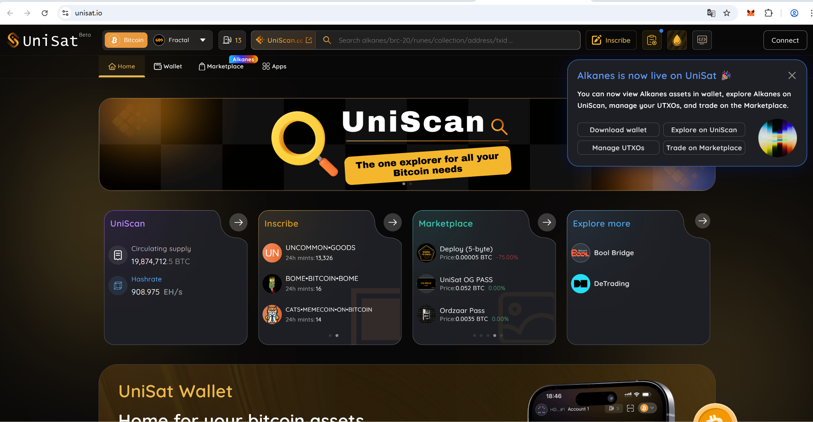
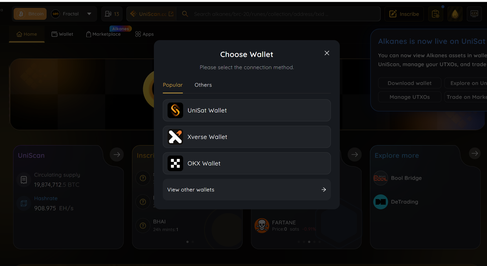

# Get Started With Web3: 创建一个比特币钱包

---

自学入门 `Web3` 不是一件容易的事，作为一个刚刚入门 Web3 的新人，梳理一下最简单直观的 `Web3` 小白入门教程。整合开源社区优质资源，为大家从入门到精通 Web3 指路。每周更新 1-3 讲。

欢迎关注我的推特：[@bhbtc1337](https://twitter.com/bhbtc1337)

北航区块链协会 DAO 推特：[@BHBA_DAO](https://twitter.com/BHBA_DAO)

进入微信交流群请填表：[表格链接](https://forms.gle/QMBwL6LwZyQew1tX8)

文章开源在 GitHub：[Get-Started-with-Web3](https://github.com/beihaili/Get-Started-with-Web3)

购买BTC/ETH/USDT 等加密货币推荐 [币安](https://www.binance.com/zh-CN)[注册链接](https://accounts.marketwebb.me/register?ref=39797374)

---

## 前言

通过上一节的学习，我们了解了比特币的基本概念、比特币的价值以及比特币的运作原理。在这一节中，我们将深入探讨比特币钱包的基本概念、比特币钱包的种类和比特币钱包的用途。最后，我将手把手教你如何创建一个比特币钱包。

区块链的世界被喻为一片黑暗森林，每个参与者都需要学会保护自己的财产安全，没有人会为你负责。和《三体》中的黑暗森林法则类似，区块链世界里，保护好自己的私钥，藏的越深越安全，切记 `Not Your Key, Not Your Coin`. 对于已经习惯于中心化保管的你来说，可能不适应这个世界的规则（例如，丢失钱包密码后，无法选择找回密码😂）。通过这一节的学习，你将能够更好地理解区块链，并妥善保存自己的比特币。

## 比特币钱包基本概念

### 什么是比特币钱包

比特币钱包是用于存储和管理比特币私钥的工具。比特币钱包并不直接存储比特币，而是存储一组密钥对（私钥和公钥）。私钥用来签署交易，而公钥通过加密算法生成比特币地址，用于接收比特币。钱包是用户与比特币网络互动的桥梁，它允许你接收、发送和管理比特币资产。

### 比特币钱包的种类

比特币钱包可以从以下两个维度来进行分类：

#### 根据是否触网分类

1. **热钱包**：热钱包连接互联网，适合日常使用和交易。这类钱包包括浏览器插件钱包、手机钱包和桌面钱包。由于热钱包始终在线，它们容易受到网络攻击，因此安全性较低。

2. **冷钱包**：冷钱包不连接互联网，适合长期存储比特币。包括硬件钱包和纸钱包等。冷钱包因为不联网，安全性更高，但使用起来不如热钱包方便。

#### 根据验证方式分类

1. **全节点钱包**：全节点钱包是运行完整的比特币区块链节点的软件，它不仅管理私钥，还直接与比特币网络同步所有区块数据。全节点钱包提供最高级别的安全性和隐私性，但需要大量的存储空间和网络带宽。

2. **轻量级钱包**：轻量级钱包不下载整个区块链数据，而是依赖第三方节点进行交易验证。虽然这些钱包更轻便，适合移动设备使用，但安全性和隐私性略低于全节点钱包。

### 比特币钱包的用途

比特币钱包的主要用途包括：

1. **存储比特币**：钱包用来安全存储比特币的私钥，确保你的比特币资产只有你能控制。

2. **接收和发送比特币**：钱包生成的比特币地址可以用来接收比特币，你也可以使用钱包发送比特币给其他人。

3. **管理资产**：钱包提供的界面和工具可以帮助你查看余额、交易记录以及管理多种加密货币资产。

## 手把手教你创建一个比特币钱包

### 浏览器插件钱包

浏览器插件钱包是最方便的热钱包之一，非常适合日常使用。以下是创建浏览器插件钱包的步骤：

1. **选择钱包插件**：推荐使用广泛使用和开源的钱包插件，如 [Unisat](https://unisat.io/)。
首页如下所示：

  

2. **安装插件**：访问插件的官方网站，按照提示将其安装到浏览器中。
首页上点击右上角的connect，会让你选择连接一个钱包，选择unisat wallet，或者直接选择首页中的wallet选项下载，是一样的效果。

  

点击第四项下载浏览器扩展程序：

  

点击右上角的添加至chrome：

  

耐心等待下载和安装。

  

3. **创建新钱包**：安装后，打开插件并选择"创建新钱包"。根据提示设置一个强密码，并妥善保存钱包的助记词。
安装完成后，运行插件会弹窗提示：

  

创建钱包后会让你设置一个密码，这个密码是用来在这个机器上查询私钥的。

4. **备份助记词**：助记词是恢复钱包的唯一途径，必须妥善保管，确保其不会丢失或泄露。
第一步备份完成助记词之后，第二步会让你选择钱包地址：

  

不同的地址应对不同的使用场景，交易手续费也不同。可以先选择默认的第一个地址类型，交易费用较低。但是对于一些特殊的场景，如ordinals协议类型的交易，需要使用taproot地址，这个后续可以在钱包设置中灵活修改。

5. **开始使用**：创建完成后，你可以使用钱包生成比特币地址，接收和发送比特币。

  

### 旧手机自制冷钱包

旧手机可以被用来制作一个高安全性的冷钱包，用于长期存储比特币。

1. **准备工作**：找到一部旧手机，并将其恢复出厂设置，确保没有恶意软件。

2. **安装钱包应用**：在手机上安装一个支持离线使用的钱包应用，如 [比太钱包](https://www.bitcoin.com/zh-cn/btc-wallet/)。

3. **断开网络**：在安装完钱包应用后，断开手机的网络连接（Wi-Fi 和移动数据）。

4. **创建冷钱包**：打开钱包应用，选择"创建新钱包"，确保生成的私钥随机，生成钱包助记词。

5. **重点：备份助记词**：将助记词抄写两份，加上冷钱包手机一共形成三份备份，分别放在不同的地方，注意防水防止字迹变淡消失。（这里的三份是经验之谈，能够比较好的平衡丢失和被人盗窃）

6. **转移比特币**：使用热钱包发送比特币到冷钱包的地址，并确保冷钱包的私钥不与网络连接。

7. **离线存储**：将手机关机，并安全存放在一个防火、防水的地方，作为离线冷钱包。

### 全节点钱包

全节点钱包适合那些希望完全控制自己的比特币交易和隐私的用户。

1. **安装 Bitcoin Core**：访问 Bitcoin Core 官方网站，下载并安装全节点钱包软件。

2. **初次同步**：启动 Bitcoin Core，软件会开始下载整个比特币区块链数据。这可能需要数天时间和数百 GB 的存储空间。

3. **创建钱包**：在 Bitcoin Core 完成初次同步后，选择"文件"菜单中的"创建钱包"选项。为新钱包设置名称，并根据需要选择是否加密。

4. **备份钱包**：在"文件"菜单中选择"备份钱包"，将钱包文件保存到安全的地方。确保备份副本离线存储，防止丢失。

5. **管理比特币**：你现在可以使用全节点钱包生成地址、接收比特币、发送比特币，并参与比特币网络的共识。

通过这几个步骤，你可以创建一个适合自己需求的比特币钱包，无论是用于日常交易还是长期存储比特币资产。选择适合的工具并了解其使用方法，是保障数字资产安全的重要一步。
