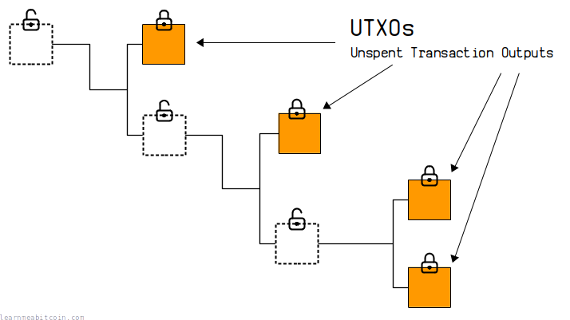

# 比特币交易基础


> 💡 自学入门 `Web3` 不是一件容易的事，作为一个刚刚入门 Web3 的新人，梳理一下最简单直观的 `Web3` 小白入门教程。整合开源社区优质资源，为大家从入门到精通 Web3 指路。每周更新 1-3 讲。
> 
> 欢迎关注我的推特：[@bhbtc1337](https://twitter.com/bhbtc1337)
> 
> 
> 进入微信交流群请填表：[表格链接](https://forms.gle/QMBwL6LwZyQew1tX8)
> 
> 文章开源在 GitHub：[Get-Started-with-Web3](https://github.com/beihaili/Get-Started-with-Web3)
> 
> 购买BTC/ETH/USDT 等加密货币推荐 [币安](https://www.binance.com/zh-CN)[注册链接](https://accounts.marketwebb.me/register?ref=39797374)

## 目录

- [前言](#前言)
- [比特币交易的组成](#比特币交易的组成)
- [交易的核心要素](#交易的核心要素)
- [UTXO模型](#utxo模型)
- [比特币交易的结构](#比特币交易的结构)
- [交易验证基础](#交易验证基础)
- [实战演练：基础交易操作](#实战演练基础交易操作)
- [常见问题](#常见问题)
- [结语](#结语)

## 前言

在前面的章节中，我们学习了比特币的基本概念、钱包的使用、节点的搭建以及RPC接口的操作。现在，我们要深入探索比特币系统的核心——交易机制。

比特币交易是整个比特币系统的基石，每一笔交易都记录着价值的转移，每一个区块都承载着数千笔交易的见证。理解比特币交易的机制，不仅能让我们更好地使用比特币，更能让我们深入理解区块链技术的精髓。

在这一章中，我们将从交易的基本组成开始，逐步深入到交易的结构、验证过程，为后续学习更高级的交易类型和技术升级打下坚实基础。

## 比特币交易的组成

### 交易的基本介绍

想象一下如果你拿着一个账本给大家记录转账的情景，你会怎么做？

比特币采用的方式是记录下每一笔钱每次是从哪里来的，往哪里去的。

每个交易就是一些输入，一些输出，可能有多个输入或者输出。


把这些记录链状的连在一起就能追踪每笔钱从诞生到现状的所有状态，这种链状结构就可以做到。


这种模式下要查看跟踪交易和管理余额就要维护一个未花费交易输出(UTXO)。




### 交易的核心要素

如上面介绍的，一笔交易最主要的部分是输入和输出

又由于是一个链状结构输入就是上一笔交易的输出，输出就是下一笔交易的输入。

输入要指向先前交易的输出，证明发送者拥有这些比特币

输出要定义比特币的新归属。

下面我们详细介绍一下输入和输出是如何做到这一点的。

### 1. 输入（Inputs）

交易输入指向先前交易的输出，证明发送者拥有这些比特币。每个输入都包含以下核心要素：

**基本组成**：
- **TXID（Transaction ID）**：指向之前交易的唯一标识符（32字节哈希值）
- **VOUT（Output Index）**：指向该交易中特定输出的索引号（从0开始）
- **ScriptSig**：解锁脚本，证明发送者有权使用这些资金
- **Sequence**：序列号，用于交易替换和时间锁定

让我们通过一个最简单的例子来理解输入：

#### 最简单的P2PKH（Pay to Public Key Hash）交易输入

```json
{
  "txid": "a1b2c3d4e5f6...（省略）",
  "vout": 0,
  "scriptSig": {
    "asm": "3044022078b3ab78a1b2c3d4...（数字签名） 0279be667ef9dcbb...（公钥）",
    "hex": "473044022078b3ab78a1b2c3d4...210279be667ef9dcbb..."
  },
  "sequence": 4294967295
}
```

**解释**：
- **TXID（交易ID）**：指向之前交易的唯一标识符，就像"身份证号"一样唯一识别每笔交易
- **VOUT（输出索引）**：指定要使用上一笔交易的第几个输出（从0开始计数）
  - 例如：`vout: 0` 表示使用上一笔交易的第1个输出
  - 例如：`vout: 2` 表示使用上一笔交易的第3个输出
- **ScriptSig（解锁脚本）**：这是证明你有权花费这些比特币的关键部分

#### 🔑 ScriptSig 工作原理

ScriptSig包含数字签名和公钥，用于证明你对这些比特币的所有权：

**工作原理**：
1. **数字签名**：使用私钥对**当前新交易**的信息进行签名
2. **公钥**：对应的公钥，用于验证签名
3. **验证过程**：网络节点使用公钥验证签名是否正确

**⚠️ 重要**：签名的是**当前这笔新交易**的信息，不是之前交易的信息！

**📖 具体例子**：
假设Alice要给Bob发送比特币：
1. Alice创建一笔新交易："我要把上一笔交易的输出转给Bob"
2. Alice用她的私钥对这笔**新交易**的信息签名
3. 网络验证：Alice的公钥确实能验证这个签名
4. 确认：Alice确实有权花费这些比特币

- **Sequence（序列号）**：通常设为最大值 `4294967295`，表示交易最终确定
  - 较小的值可用于RBF（Replace-By-Fee，手续费替换）
  - 也可用于时间锁定功能

### 2. 输出（Outputs）

交易输出定义了比特币的新归属，指定谁可以在未来花费这些比特币。

**基本组成**：
- **Value**：转移的比特币数量（以聪为单位，1 BTC = 100,000,000 聪）
- **ScriptPubKey**：锁定脚本，定义了如何才能花费这些比特币

让我们通过一个最简单的例子来理解输出：

#### 最简单的P2PKH输出（发送到普通地址）

```json
{
  "value": 0.01000000,
  "n": 0,
  "scriptPubKey": {
    "asm": "OP_DUP OP_HASH160 76a914...（20字节公钥哈希） OP_EQUALVERIFY OP_CHECKSIG",
    "hex": "76a914762d99cb5b1c59...88ac",
    "type": "pubkeyhash",
    "address": "1BoatSLRHtKNngkdXEeobR76b53LETtpyT"
  }
}
```

**解释**：
- **Value**：0.01 BTC（1,000,000聪），转移的比特币数量
- **ScriptPubKey**：锁定脚本，规定了如何花费这些比特币
  - `OP_DUP OP_HASH160 ... OP_EQUALVERIFY OP_CHECKSIG`：P2PKH标准脚本
  - 含义："只有能提供正确公钥和对应签名的人才能花费这些比特币"
  - `asm`和`hex`是同一个脚本的两种表现形式:
    - `asm`：以操作码形式显示,方便人类阅读(如 OP_DUP OP_HASH160)
    - `hex`：以十六进制形式显示,用于网络传输(如 76a914...)
  - `type`：脚本类型，如"pubkeyhash"表示这是一个P2PKH输出
- **Address**：1开头的传统比特币地址

> 📖 **输出的作用**：
> 输出就像给比特币"上锁"，锁定脚本规定了"解锁条件"
> - 这个例子中：只有拥有特定私钥的人才能解锁并花费这0.01 BTC

### 3. 交易元数据

除了输入输出外，完整的交易还包含：
- **Version**：交易版本号，定义了交易格式的规则
- **Locktime**：锁定时间，指定交易何时可以被包含在区块中

> ❓ **常见疑问**：自定义数据（留言、说话）存储在哪里？
> 
> 自定义数据存储在**交易的输出（Outputs）**中，具体是通过一种特殊的输出类型——**OP_RETURN 输出**来实现。
> 具体内容将在进阶篇中详细介绍。

## UTXO模型

比特币使用UTXO（Unspent Transaction Output，未花费交易输出）模型，这与传统银行账户的余额模型截然不同：

```
传统账户模型：
Alice账户: 100 BTC
Bob账户: 50 BTC

UTXO模型：
Alice拥有的UTXO:
- UTXO1: 30 BTC (来自交易A)
- UTXO2: 70 BTC (来自交易B)
总计: 100 BTC

Bob拥有的UTXO:
- UTXO3: 50 BTC (来自交易C)
总计: 50 BTC
```

### UTXO工作原理

1. **没有账户余额**：比特币网络不维护账户余额
2. **只有交易输出**：所有比特币都以UTXO的形式存在
3. **花费即销毁**：花费UTXO时，整个UTXO被销毁，创建新的UTXO
4. **找零机制**：如果UTXO价值大于要转移的金额，需要创建找零输出

### UTXO实际例子

假设Alice有一个10 BTC的UTXO，想给Bob转5 BTC：

```json
// Alice的交易
{
  "vin": [
    {
      "txid": "previous_tx_id",
      "vout": 0,  // Alice的10 BTC UTXO
      "scriptSig": {...}  // Alice的签名
    }
  ],
  "vout": [
    {
      "value": 5.0,  // 给Bob的5 BTC
      "scriptPubKey": {...}  // Bob的地址
    },
    {
      "value": 4.99,  // Alice的找零4.99 BTC
      "scriptPubKey": {...}  // Alice的找零地址
    }
    // 注意：10 - 5 - 4.99 = 0.01 BTC作为矿工费
  ]
}
```

**结果**：
- Alice原来的10 BTC UTXO被销毁
- 创建了两个新UTXO：Bob的5 BTC + Alice的4.99 BTC
- 0.01 BTC作为矿工费

## 比特币交易的结构

### 交易的技术结构

一笔标准的比特币交易具有以下结构：

```
Transaction {
    version: 4字节
    input_count: 变长整数
    inputs: [
        {
            previous_output: {
                txid: 32字节
                vout: 4字节
            }
            script_length: 变长整数
            script_sig: 变长字节数组
            sequence: 4字节
        }
        ...
    ]
    output_count: 变长整数
    outputs: [
        {
            value: 8字节
            script_length: 变长整数
            script_pubkey: 变长字节数组
        }
        ...
    ]
    locktime: 4字节
}
```

### 真实交易示例分析

让我们分析一笔真实的比特币交易：

```json
{
  "txid": "f4184fc596403b9d638783cf57adfe4c75c605f6356fbc91338530e9831e9e16",
  "version": 1,
  "locktime": 0,
  "vin": [
    {
      "txid": "0437cd7f8525ceed2324359c2d0ba26006d92d856a9c20fa0241106ee5a597c9",
      "vout": 0,
      "scriptSig": {
        "asm": "3045022100f3581e1972ae8ac7c7367a7a253bc1135223adb9a468bb3a59233f45bc578380022059af01ca17d00e41928954ac7ffe...21036873b4df35e5b6a967cf7ed4e6a9b6e0a6e2ff7c7b99ee1a8e6a4e4b1b6d6d6d",
        "hex": "483045022100f3581e1972ae8ac7c7367a7a253bc1135223adb9a468bb3a59233f45bc578380022059af01ca17d00e41928954ac7ffe...21036873b4df35e5b6a967cf7ed4e6a9b6e0a6e2ff7c7b99ee1a8e6a4e4b1b6d6d6d"
      },
      "sequence": 4294967295
    }
  ],
  "vout": [
    {
      "value": 10.00000000,
      "n": 0,
      "scriptPubKey": {
        "asm": "OP_DUP OP_HASH160 389ffce9cd9ae88dcc0631e88a821ffdbe9bfe26 OP_EQUALVERIFY OP_CHECKSIG",
        "hex": "76a914389ffce9cd9ae88dcc0631e88a821ffdbe9bfe2688ac",
        "type": "pubkeyhash",
        "address": "16CQL6VEW2RWkZ9WfGS8NhisDVZi5tCZRE"
      }
    },
    {
      "value": 40.00000000,
      "n": 1,
      "scriptPubKey": {
        "asm": "OP_DUP OP_HASH160 389ffce9cd9ae88dcc0631e88a821ffdbe9bfe26 OP_EQUALVERIFY OP_CHECKSIG",
        "hex": "76a914389ffce9cd9ae88dcc0631e88a821ffdbe9bfe2688ac",
        "type": "pubkeyhash",
        "address": "16CQL6VEW2RWkZ9WfGS8NhisDVZi5tCZRE"
      }
    }
  ]
}
```

**分析这笔交易**：
- **版本号**：1（基础交易格式）
- **输入**：1个，花费了之前交易的输出
- **输出**：2个，分别转移10 BTC和40 BTC到同一个地址
- **锁定时间**：0（立即生效）
- **使用了传统的比特币地址格式**

## 交易验证基础

比特币网络中的每个节点都需要验证交易的有效性，主要验证以下方面：

### 1. 基础格式验证
- 交易结构是否符合协议规范
- 字段长度是否正确
- 数据类型是否匹配

### 2. UTXO验证
- 输入引用的UTXO是否存在
- UTXO是否尚未被花费
- 输入总额是否足够

### 3. 脚本验证
- ScriptSig是否能正确解锁ScriptPubKey
- 数字签名是否有效
- 公钥是否与地址匹配

### 4. 经济规则验证
- 输出总额不能超过输入总额
- 矿工费计算是否合理
- 金额是否在有效范围内

### 验证流程示例

```python
def verify_transaction(tx):
    # 1. 格式验证
    if not validate_format(tx):
        return False
    
    # 2. UTXO验证
    for input in tx.inputs:
        utxo = get_utxo(input.txid, input.vout)
        if not utxo or utxo.spent:
            return False
    
    # 3. 脚本验证
    for i, input in enumerate(tx.inputs):
        if not verify_script(input.scriptSig, utxo.scriptPubKey):
            return False
    
    # 4. 经济验证
    if sum(tx.outputs) > sum(inputs):
        return False
    
    return True
```

## 实战演练：基础交易操作

### 查看UTXO

使用Bitcoin Core RPC查看可用的UTXO：

```python
import requests
import json

def bitcoin_rpc(method, params=[]):
    url = "http://localhost:8332"
    headers = {'content-type': 'application/json'}
    
    payload = {
        "method": method,
        "params": params,
        "jsonrpc": "2.0",
        "id": 0,
    }
    
    response = requests.post(url, data=json.dumps(payload), headers=headers, auth=('user', 'password'))
    return response.json()

# 查看钱包中的未花费输出
utxos = bitcoin_rpc("listunspent")
print("可用UTXO:")
for utxo in utxos['result']:
    print(f"TXID: {utxo['txid']}")
    print(f"VOUT: {utxo['vout']}")
    print(f"金额: {utxo['amount']} BTC")
    print(f"地址: {utxo['address']}")
    print("---")
```

### 创建基础交易

```python
def create_simple_transaction():
    # 1. 选择输入UTXO
    inputs = [
        {
            "txid": "your_utxo_txid_here",
            "vout": 0
        }
    ]
    
    # 2. 定义输出
    outputs = {
        "bc1qar0srrr7xfkvy5l643lydnw9re59gtzzwf5mdq": 0.001,  # 接收地址
        "bc1qchange_address_here": 0.0089  # 找零地址
    }
    
    # 3. 创建原始交易
    raw_tx = bitcoin_rpc("createrawtransaction", [inputs, outputs])
    
    # 4. 签名交易
    signed_tx = bitcoin_rpc("signrawtransactionwithwallet", [raw_tx['result']])
    
    # 5. 广播交易
    if signed_tx['result']['complete']:
        txid = bitcoin_rpc("sendrawtransaction", [signed_tx['result']['hex']])
        print(f"交易已发送，TXID: {txid['result']}")
    else:
        print("交易签名失败")

# 执行创建交易
create_simple_transaction()
```

## 常见问题

### ❓ 为什么需要找零地址？

比特币使用UTXO模型，必须完全花费UTXO：

```
例子：
你有一个5 BTC的UTXO，想转1 BTC
必须：
- 输入：5 BTC UTXO
- 输出1：1 BTC 给接收方
- 输出2：3.99 BTC 找零给自己
- 矿工费：0.01 BTC
```

### ❓ 矿工费如何计算？

矿工费 = 输入总额 - 输出总额

```python
def calculate_fee(transaction):
    input_total = sum([get_utxo_value(inp.txid, inp.vout) for inp in transaction.inputs])
    output_total = sum([out.value for out in transaction.outputs])
    return input_total - output_total
```

### ❓ 交易确认需要多长时间？

- **1个确认**：约10分钟（包含在一个区块中）
- **3个确认**：约30分钟（较安全）
- **6个确认**：约60分钟（高安全性，交易所常用）

确认数量越多，交易被逆转的可能性越小。

## 结语

通过本章的学习，你已经掌握了比特币交易的基础知识：

- 理解了交易的输入、输出结构
- 掌握了UTXO模型的工作原理
- 了解了P2PKH交易的基本流程
- 学会了基础的交易验证概念
- 能够创建简单的比特币交易

这些基础知识为你进一步学习更高级的交易类型（如多重签名、SegWit、Taproot等）打下了坚实基础。在下一章《比特币交易进阶》中，我们将探讨这些更复杂但功能强大的交易技术。

---

<div align="center">
<a href="https://github.com/beihaili/Get-Started-with-Web3">🏠 返回主页</a> | 
<a href="https://twitter.com/bhbtc1337">🐦 关注作者</a> | 
<a href="https://forms.gle/QMBwL6LwZyQew1tX8">📝 加入交流群</a>
</div>