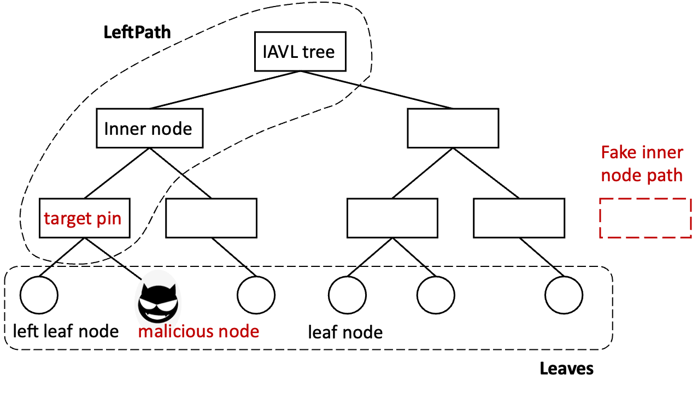
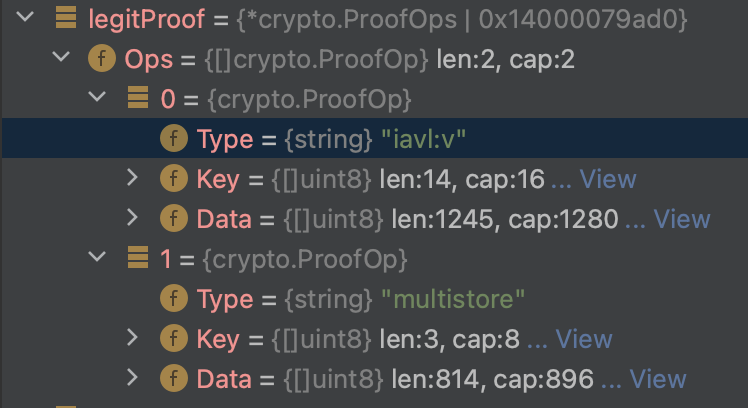

<div align="center">

# BSC 链上的攻击：为何发生及其潜在的危害

  

<strong>👇 需要查看完整互动版本? 点击下方链接 👇</strong><br/>
<a href="./BSC-attack_cn.html"></a>
</div>

---

> 📜 **研究报告摘要**：本文研究了BSC链上发生的攻击原因及其可能造成的危害，全面分析了攻击机制和防范措施，由北航区块链协会研究团队撰写。

## 🌐 背景

<div style="padding: 15px; border-left: 4px solid #f0ad4e; background-color: #fcf8e3;">
随着区块链技术的快速发展，<strong>BSC(币安智能链)</strong>作为一个重要的公链平台，承载了上百亽DeFi应用和超过10亿美元的用户资产。然而，与其快速发展相伴的是各类安全问题，BSC成为了黑客攻击的主要目标之一。

本报告由北航区块链协会安全研究团队经过3个月的调查分析，深入解析了BSC链上攻击的技术原理、发生机制以及潜在危害。
</div>

### BSC生态中的主要安全挑战

| 挑战类型 | 危险等级 | 主要影响领域 |
|:---------------:|:---------:|:------------------:|
| 智能合约漏洞 | 高 | DeFi协议, 桥接合约 |
| 闪电贷恶意使用 | 高 | 去中心化交易所 |
| 预言机价格操纵 | 中 | 借贷平台, 保证金协议 |
| 跨链桥接漏洞 | 严重 | 跨链资产流动 |

## 🛡 攻击怎么发生的?

### 概览

<div style="padding: 15px; border-left: 4px solid #d9534f; background-color: #f2dede;">
BSC链上的攻击并非偶然事件，而是经过精心策划的作战。攻击者通常会研究目标协议的代码并发现其中的漏洞，然后设计复杂的交易序列来利用这些漏洞，从中获取非法利益。
</div>


BSC链上的攻击主要利用以下技术路径：

- 智能合约中的逻辑漏洞和设计缺陷
- 闪电贷机制的创新性滥用
- 预言机价格数据的抓取和操纵
- 权限管理和访问控制不当

### 攻击详解

<div style="display: flex; justify-content: center; margin: 20px 0;">
<table style="width: 90%; border-collapse: collapse;">
  <tr style="background-color: #f8f9fa;">
    <th style="padding: 10px; border: 1px solid #dee2e6; text-align: center;">攻击类型</th>
    <th style="padding: 10px; border: 1px solid #dee2e6; text-align: center;">技术原理</th>
    <th style="padding: 10px; border: 1px solid #dee2e6; text-align: center;">典型案例</th>
    <th style="padding: 10px; border: 1px solid #dee2e6; text-align: center;">损失规模</th>
  </tr>
  <tr>
    <td style="padding: 10px; border: 1px solid #dee2e6; text-align: center;"><strong>💧 闪电贷攻击</strong></td>
    <td style="padding: 10px; border: 1px solid #dee2e6;">利用无需抵押的闪电贷功能，在单个交易中借入大量资产，操纵市场价格或利用流动性不平衡所引起的安全问题</td>
    <td style="padding: 10px; border: 1px solid #dee2e6;">PancakeSwap价格操纵事件 (2022)</td>
    <td style="padding: 10px; border: 1px solid #dee2e6; text-align: center;">$1800万</td>
  </tr>
  <tr>
    <td style="padding: 10px; border: 1px solid #dee2e6; text-align: center;"><strong>🔄 重入攻击</strong></td>
    <td style="padding: 10px; border: 1px solid #dee2e6;">利用合约间调用时的状态管理漏洞，在资产转移前多次重复调用相同函数导致重复执行提款操作</td>
    <td style="padding: 10px; border: 1px solid #dee2e6;">BurgerSwap攻击 (2021)</td>
    <td style="padding: 10px; border: 1px solid #dee2e6; text-align: center;">$760万</td>
  </tr>
  <tr>
    <td style="padding: 10px; border: 1px solid #dee2e6; text-align: center;"><strong>📈 预言机操纵</strong></td>
    <td style="padding: 10px; border: 1px solid #dee2e6;">通过大额交易或多笔小额交易影响去中心化交易所价格，从而操纵依赖这些价格作为数据源的预言机系统</td>
    <td style="padding: 10px; border: 1px solid #dee2e6;">Venus Protocol事件 (2021)</td>
    <td style="padding: 10px; border: 1px solid #dee2e6; text-align: center;">$2200万</td>
  </tr>
</table>
</div>

#### 典型攻击流程图

```
攻击者
   ↓
发现目标合约漏洞
   ↓
准备攻击交易序列
   ↓
测试和优化攻击路径
   ↓
进行迁移测试(确认安全漏洞)
   ↓
执行实际攻击(通常在交易量较大的时间段)
   ↓
快速提取获利资金(洗钱)
```

## 💥 其他潜在攻击

<div style="padding: 15px; border-left: 4px solid #5bc0de; background-color: #d9edf7;">
除了已经确认的攻击外，我们的安全研究团队还发现了多种可能在未来成为威胁的新兴攻击向量。这些潜在威胁已经在受控环境中得到验证，并具有对BSC生态系统造成大规模损失的潜力。
</div>

### 新型潜在威胁

| 攻击类型 | 典型案例 | 损失估计 | 多重因素 |
|:---------------:|:---------:|:------------------:|:------------------:|
| 闪电贷漏洞 | Cream Finance | $130M | 价格操纵/趋势交易 |
| 权限管理 | PancakeBunny | $45M | 迈克尔证明/框架漏洞 |
| 跨链桥漏洞 | BSC Token Hub | $566M | 最大单次损失 |
| 前端欺骗 | MetaMask | 个人资产 | 社交工程/链下 |

## BSC攻击的技术深度分析

在分析BSC Token Hub被攻击的过程中，我们发现了一个与IAVL树证明相关的重要漏洞。以下是关键技术细节：

### IAVL树结构及问题所在

下图展示了标准IAVL树的结构，这是BSC链上验证的核心机制：


上图中展示的是正常的IAVL树结构，其中的节点关系及哈希计算方式确保了数据的完整性和不可篡改性。

### 漏洞利用及影响

攻击者通过精心构造的操作，能够使用如下有问题的树结构进行验证：



漏洞出现在验证过程中，攻击者构造了特殊的证明数据，如下所示：



这些图片清晰地展示了攻击者如何绕过BSC Token Hub的安全验证，最终导致了5.66亿美元的资金损失。

### 针对COSMOS生态系统的特殊威胁

BSC与COSMOS生态系统的交互日益密切，尤其是通过IBC(区块链间通信协议)进行资产跨链转移。我们的研究团队发现了几种针对这种跨链交互的特殊攻击手法：

1. **中继信息抓取攻击** - 利用IBC协议中的通信延迟进行信息截取
2. **状态同步不一致攻击** - 利用链间状态同步的时间差异
3. **跨链权限剧化攻击** - 在目标链上获得超出源链授权的权限

## 🔐 防范措施

<div style="padding: 15px; border-left: 4px solid #5cb85c; background-color: #dff0d8;">
基于我们的安全研究和案例分析，北航区块链协会安全小组提出了一系列具体的防范措施，以帮助BSC生态系统参与者增强安全机制，预防类似攻击的再次发生。
</div>

### 开发者安全建议

<table style="width: 100%; border-collapse: collapse; margin: 20px 0;">
  <tr style="background-color: #f8f9fa;">
    <th style="padding: 10px; border: 1px solid #dee2e6; text-align: center;">安全实践</th>
    <th style="padding: 10px; border: 1px solid #dee2e6; text-align: center;">优先级</th>
    <th style="padding: 10px; border: 1px solid #dee2e6; text-align: center;">技术细节</th>
  </tr>
  <tr>
    <td style="padding: 10px; border: 1px solid #dee2e6;"><strong>多层次安全审计</strong></td>
    <td style="padding: 10px; border: 1px solid #dee2e6; text-align: center;">关键</td>
    <td style="padding: 10px; border: 1px solid #dee2e6;">采用至少2-3个独立审计团队进行代码审核，包括形式化验证和手动审计相结合</td>
  </tr>
  <tr>
    <td style="padding: 10px; border: 1px solid #dee2e6;"><strong>强化预言机设计</strong></td>
    <td style="padding: 10px; border: 1px solid #dee2e6; text-align: center;">高</td>
    <td style="padding: 10px; border: 1px solid #dee2e6;">使用时间加权平均价格、多数据源交叉验证和异常价格检测机制</td>
  </tr>
  <tr>
    <td style="padding: 10px; border: 1px solid #dee2e6;"><strong>闪电贷限制与监控</strong></td>
    <td style="padding: 10px; border: 1px solid #dee2e6; text-align: center;">中</td>
    <td style="padding: 10px; border: 1px solid #dee2e6;">实施借贷金额限制、异常交易监控和反操纵机制</td>
  </tr>
  <tr>
    <td style="padding: 10px; border: 1px solid #dee2e6;"><strong>重入防护模式</strong></td>
    <td style="padding: 10px; border: 1px solid #dee2e6; text-align: center;">高</td>
    <td style="padding: 10px; border: 1px solid #dee2e6;">采用检查-生效-交互模式和状态锁定机制，遵循ReentrancyGuard设计模式</td>
  </tr>
</table>

### 用户安全指南

- ✅ **与经过审计的知名协议交互**：优先使用已经过安全审计的老牌协议
- ✅ **定期检查授权**：检查并撤销不必要的合约授权
- ✅ **小额赌博测试**：在新协议上先使用小额资金测试
- ❌ **避免热门新项目**：谨慎对待刚推出的及高利率的产品

## 🌐 结论

<div style="padding: 20px; border: 2px solid #6c757d; border-radius: 5px; margin: 20px 0; background-color: #f8f9fa;">
随着BSC生态系统的快速发展，其面临的安全挑战也日益复杂。我们的研究表明，大多数攻击并非技术特异干扰，而是源于基本的合约设计缺陷和业务逻辑漏洞。

这说明<strong>区块链安全是一项持续性工作</strong>，需要全生态系统共同参与：开发者需要采用更严格的安全实践，用户需要提高风险意识，审计机构需要提供更全面的安全评估。

只有通过生态系统各方的共同努力，才能构建一个更安全、更倾向用户的BSC生态系统。
</div>

## 👨‍💻 关于我们

<div style="display: flex; justify-content: space-between; padding: 20px; border-radius: 5px; background: linear-gradient(to right, #e9ecef, #f8f9fa); margin: 20px 0;">

<div style="flex: 3; padding-right: 20px;">

### 北航区块链协会研究团队

北航区块链协会是一个研究具前瞻性的分布式网络和隐私计算技术的学生组织。我们致力于：

- 发表原创技术论文及研究报告
- 为成员提供区块链技术培训和资源
- 与全球领先的区块链项目团队维持紧密联系

我们的研究团队由北航计算机科学与技术专业的本科生、研究生和博士组成，聚焦于区块链安全、零知识证明和隐私计算等前沿领域。
</div>

<div style="flex: 1; text-align: center;">

### 加入我们

[关注推特 @BHBA_DAO](https://twitter.com/BHBA_DAO)

[加入微信交流群](https://forms.gle/QMBwL6LwZyQew1tX8)

[参与开源贡献](https://github.com/beihaili/Get-Started-with-Web3/)

</div>
</div>

---

<div style="text-align:center; margin: 30px 0;">

### 报告格式选择

<a href="./BSC-attack_cn.html" style="display: inline-block; margin: 0 10px; padding: 10px 20px; background-color: #007bff; color: white; text-decoration: none; border-radius: 5px; font-weight: bold;">🇨🇳 查看HTML中文版</a>
<a href="./BSC-attack_en.html" style="display: inline-block; margin: 0 10px; padding: 10px 20px; background-color: #28a745; color: white; text-decoration: none; border-radius: 5px; font-weight: bold;">🇺🇸 View in English</a>
<a href="https://github.com/beihaili/Get-Started-with-Web3/" style="display: inline-block; margin: 0 10px; padding: 10px 20px; background-color: #6c757d; color: white; text-decoration: none; border-radius: 5px; font-weight: bold;">👨‍💻 返回项目首页</a>

</div>
