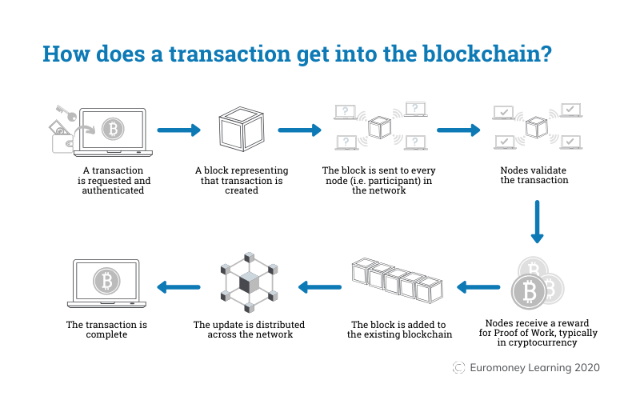

# Get Started With Web3: Web3工作机会

---

自学入门`Web3`不是一件容易的事，作为一个刚刚入门Web3的新人，梳理一下最简单直观的`Web3`小白入门教程。整合开源社区优质资源，为大家从入门到精通web3指路。每周更新1-3讲.

欢迎关注我的推特：[@beihai1337](https://twitter.com/beihai1337)

北航区块链协会DAO推特： [@BHBA_DAO](https://twitter.com/BHBA_DAO)

进入微信交流群请填表： [表格链接](https:)

文章开源在github： [github.com/beihai1337/GetStartedWithWeb3](https://github.com/beihai1337/GetStartedWithWeb3)

---
# Web3大厂工作实习机会
+ Alchemy 
https://boards.greenhouse.io/alchemy

简评：无远程工作机会，无实习，地点在美国

+ Uniswap
https://boards.greenhouse.io/uniswaplabs

简评:无实习，地点在美国，申请工作需要有美国工作资格

+ Aave
https://jobs.eu.lever.co/aave

简评：观感不错，在英国，有远程机会，无实习

+ Openzeppalin
https://www.openzeppelin.com/jobs

简评：观感不错，地点在美国，有远程机会，无实习

+ Consensusys
https://consensys.net/open-roles/

简评:观感不错，地点在美国，有远程机会，无实习

+ Paradigm
https://www.paradigm.xyz/opportunities

简评:观感不错，工作很多，有远程机会，有实习（市场方向），fellowship活动有点意思，地点在美国，年龄限制23岁以下

+ Sui
https://jobs.sui.io/jobs

简评：观感不错，地点在美国，有远程机会，有实习（密码学博士生），很不错

+ Apotos
https://boards.greenhouse.io/aptoslabs

简评：观感不错，地点在美国，有远程机会，没有实习

+ Curve
https://classic.curve.fi/careers

简评：工作比较少，可远程，没有实习

# 面试资料
## 中文问答
+ 描述一笔交易上链的过程
+ 介绍以太坊分层架构
+ POS和POW的区别

## 英文问答
+ Q:what is foundary?
+ A:Foundry is a comprehensive suite of tools for building and deploying decentralized applications (dApps) on the Ethereum blockchain.

+ Q:what is Consensus mechanism？
+ Consensus mechanism is a process utilized by the distributed systems or blockchain networks to obtain agreement on a single data version, ensuring that all nodes in the network have consistent data records.

+ Q:Discribe the process of a transaction on the blockchain?
+ A:In a blockchain network, every node has a copy of the ledger or blockchain record, and all nodes must agree on the current state of the ledger to ensure that transactions are valid and prevent double-spending. Consensus algorithms use various methods, such as Proof of Work (PoW), delegated Proof of Stake (dPoS), and Byzantine Fault Tolerance (BFT), to validate transaction blocks and ensure a consistent ledger across the network.

+ Q:What is consensus mechanism?
+ A:The consensus mechanism is a fundamental component of blockchain technology, ensuring that a distributed network can function efficiently and securely.

+ Q:What is the consensus mechanism of Ethereum?
+ A:Proof of Stake

## 英文寒暄
+ Interviewer: Hello, I'm Tracy. Thanks so much for coming in.
+ Jane (Interviewee): It's my pleasure, thank you so much for meeting with me.
+ Interviewer: Have a seat, please. Jane, how are you doing?
+ Jane (Interviewee): I'm doing really well. It's such a nice day out there. 
+ Interviewer: Yes, it is. It was perfect weather all the weekend. Oh, can I have your resume（简历）? Jane, now tell me a little about yourself.
+ Jane (Interviewee): I studied tourism management in Fudan University. Last year, I graduated and got my bachelor degree with GPA ranking first. Then I made up my mind to further my study. So, now I’m a graduate student in the same major and same school. In my senior year, I worked in Ctrip as a marketing intern. During that time, I ran a social media account on my own, and got thousands of fans in just a month. I also started a co-branding project from scratch. Because of this work, I’ve earned a lot of experience in communication and how to learn things in a short time. Now I am looking for new opportunities and I’m really honored to be here today.