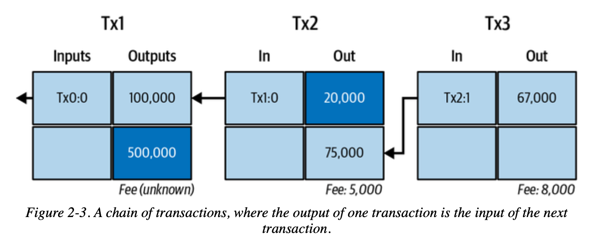
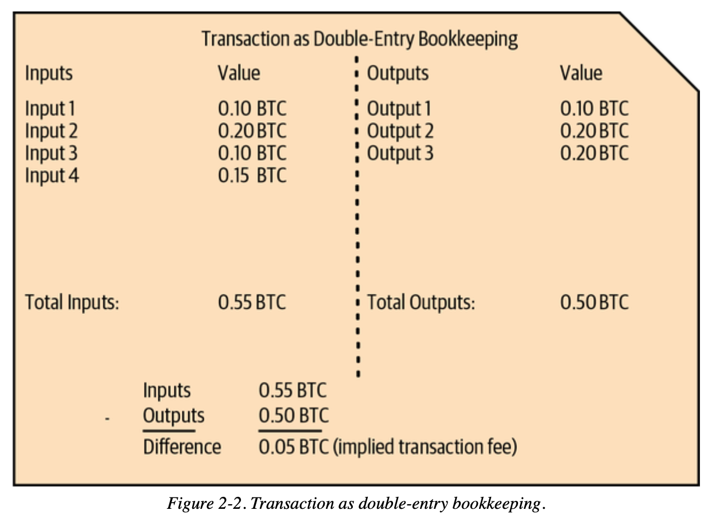

# Lesson 03: Bitcoin Transaction Fundamentals


> Getting started with `Web3` on your own is no easy task. As someone who recently entered the Web3 space, I've put together the simplest and most intuitive `Web3` beginner's guide. By integrating quality resources from the open-source community, I aim to guide everyone from beginner to expert in Web3. Updated 1-3 lessons per week.
>
> Follow me on Twitter: [@bhbtc1337](https://twitter.com/bhbtc1337)
>
> Join the discussion group: [Form Link](https://forms.gle/QMBwL6LwZyQew1tX8)
>
> Articles are open-sourced on GitHub: [Get-Started-with-Web3](https://github.com/beihaili/Get-Started-with-Web3)
>
> Recommended exchange for buying BTC/ETH/USDT: [Binance](https://www.binance.com/zh-CN) [Registration Link](https://www.bsmkweb.cc/register?ref=39797374)

## Table of Contents

- [Introduction: Why Doesn't the Banking Model Work for Bitcoin?](#introduction-why-doesnt-the-banking-model-work-for-bitcoin)
- [The UTXO Model: Cash vs. Bank Account Philosophy](#the-utxo-model-cash-vs-bank-account-philosophy)
- [Transaction Structure: Digitized Cash Flow](#transaction-structure-digitized-cash-flow)
- [Inputs and Outputs: Where Money Comes From and Where It Goes](#inputs-and-outputs-where-money-comes-from-and-where-it-goes)
- [Transaction Verification: How Math Ensures Security](#transaction-verification-how-math-ensures-security)
- [Hands-On: Creating a Transaction Step by Step](#hands-on-creating-a-transaction-step-by-step)
- [FAQ](#faq)
- [Conclusion](#conclusion)

## Introduction: Why Doesn't the Banking Model Work for Bitcoin?

Imagine managing fund transfers in a completely trustless environment — say, among a group of strangers who need to record lending relationships, but with no central authority overseeing things.

**Traditional Banking Approach:**
```
Alice's account: Balance 100 BTC
Bob's account: Balance 50 BTC

Alice transfers 10 BTC to Bob:
Alice's account: 100 - 10 = 90 BTC
Bob's account: 50 + 10 = 60 BTC
```

**The problem is:**
- Who guarantees Alice actually has 100 BTC?
- Who prevents Alice from simultaneously telling multiple people "I have 100 BTC"?
- Without a bank, how do you prevent double spending?

**Bitcoin's solution: Don't track balances — only track cash flow**

Just like using physical cash:
- You have several bills in your pocket, each with a serial number
- To spend, you must hand over specific bills
- Others can verify that these bills are indeed yours and haven't been spent before

This is the core idea behind Bitcoin's UTXO (Unspent Transaction Output) model.

## The UTXO Model: Cash vs. Bank Account Philosophy

### Why Choose the "Cash Model"?

**Problems with the bank account model:**
- Requires a central authority to maintain account balances
- Prone to double spending (spending the same money twice)
- Requires complex locking and synchronization mechanisms
- Difficult to reach consensus in a distributed environment

**Advantages of the cash model:**
- Each "bill" has an independent identity
- Once spent, it's destroyed and cannot be reused
- Easy to verify: check whether the bill exists and hasn't been used
- Naturally prevents double spending

### UTXO Model In Detail

**Core Concept:**
```
UTXO = A "digital bill" that hasn't been spent yet
Each UTXO contains:
- Amount: How much this "bill" is worth
- Locking condition: Who can spend this "bill"
```

**Practical Example:**
```
Alice's "wallet" contains:
- UTXO1: 30 BTC (from salary)
- UTXO2: 70 BTC (from investment returns)
Total wealth: 100 BTC

Alice wants to send 50 BTC to Bob:
Cannot simply "reduce the balance"
Must select specific UTXOs to spend
```



### The Transfer Process: Digital "Making Change"

**Scenario:** Alice uses her 70 BTC UTXO to buy something costing 50 BTC

```json
{
  "inputs": [
    {"previous_utxo": "70 BTC", "owner": "Alice"}
  ],
  "outputs": [
    {"amount": "50 BTC", "recipient": "Bob"},
    {"amount": "19.99 BTC", "recipient": "Alice (change address)"}
  ],
  "fee": "0.01 BTC"
}
```

**Result:**
- Alice's 70 BTC UTXO is "destroyed"
- Two new UTXOs are created: Bob's 50 BTC + Alice's 19.99 BTC
- 0.01 BTC goes to the miner as a fee

This is like paying for a $50 item with a $100 bill — the cashier:
1. Takes your $100 bill (destroys old UTXO)
2. Gives the merchant $50 (new UTXO)
3. Gives you $49 in change (change UTXO)
4. $1 as a "service fee"

### Deep Dive: UTXO Set Management

**UTXO Set Data Structure:**
```
Global UTXO Set = {
    "txid1:vout0": {value: 1.5, scriptPubKey: "..."},
    "txid2:vout1": {value: 0.8, scriptPubKey: "..."},
    "txid3:vout0": {value: 2.1, scriptPubKey: "..."},
    ...
}
```

**Key Properties:**
- **Unique identifier**: Each UTXO is uniquely identified by "Transaction ID:Output Index"
- **Atomic operation**: A UTXO either fully exists or doesn't exist at all
- **No ordering required**: UTXOs have no sequential relationship
- **Parallel verification**: Different UTXOs can be verified in parallel

**Comparison with the Banking Model:**

| Property | Bank Account Model | UTXO Model |
|----------|-------------------|------------|
| State storage | Account balance | Unspent output set |
| Payment method | Balance deduction | UTXO consumption + creation |
| Double-spend protection | Database locks | Cryptographic proofs |
| Parallel processing | Difficult (accounts must be locked) | Easy (independent UTXOs) |
| Privacy | Poor (account linkage) | Good (address separation) |

## Transaction Structure: Digitized Cash Flow

### Components of a Transaction

Every Bitcoin transaction is like a complex "transfer voucher":



**Basic Composition:**
```
Transaction = Input List + Output List + Metadata
```

**Specific Structure:**
```json
{
  "txid": "f4184fc596403b9d638783cf57adfe4c75c605f6356fbc91338530e9831e9e16",
  "version": 1,
  "locktime": 0,
  "vin": [Input Array],
  "vout": [Output Array]
}
```

### Deep Dive: Transaction Binary Format

**Transaction Serialization Format:**
```
[4-byte version] [varint input count] [input data...] [varint output count] [output data...] [4-byte locktime]
```

**Serialization Process:**
1. **Version number**: Defines transaction parsing rules
2. **Input count**: Encoded as a variable-length integer
3. **Input data**: Each input serialized in order
4. **Output count**: Encoded as a variable-length integer
5. **Output data**: Each output serialized in order
6. **Locktime**: 4-byte timestamp or block height

**Variable-Length Integer Encoding:**
```
< 0xFD: 1 byte, direct representation
0xFD: 2-byte representation
0xFE: 4-byte representation
0xFF: 8-byte representation
```

## Inputs and Outputs: Where Money Comes From and Where It Goes

### Transaction Input: Proving "I Have Money to Spend"

Each input is like a "withdrawal voucher":

```json
{
  "txid": "0437cd7f8525ceed2324359c2d0ba26006d92d856a9c20fa0241106ee5a597c9",
  "vout": 0,
  "scriptSig": {
    "asm": "3045022100... 0279be667ef9dcbb...",
    "hex": "483045022100...21036873b4df35e5b6a967cf7ed4e6a9b6e0a6e2ff7c7b99ee1a8e6a4e4b1b6d6d6d"
  },
  "sequence": 4294967295
}
```

**Field Explanation:**
- **TXID**: Points to the "ID number" of a previous transaction
- **VOUT**: Specifies which output to spend (index number)
- **ScriptSig**: Contains the digital signature and public key as "proof of ownership"
- **Sequence**: Sequence number, used for advanced features

**Key Understanding: How ScriptSig Works**
```
ScriptSig = [Digital Signature] [Public Key]

Verification Process:
1. Extract the public key, compute the corresponding Bitcoin address
2. Check if this address matches the locking condition of the UTXO being spent
3. Use the public key to verify the digital signature
4. Confirm the signature corresponds to the current transaction's content
```

### Transaction Output: Specifying "Who Gets the Money"

Each output is like a "deposit voucher":

```json
{
  "value": 0.01000000,
  "n": 0,
  "scriptPubKey": {
    "asm": "OP_DUP OP_HASH160 389ffce9cd9ae88dcc0631e88a821ffdbe9bfe26 OP_EQUALVERIFY OP_CHECKSIG",
    "hex": "76a914389ffce9cd9ae88dcc0631e88a821ffdbe9bfe2688ac",
    "type": "pubkeyhash",
    "address": "16CQL6VEW2RWkZ9WfGS8NhisDVZi5tCZRE"
  }
}
```

**Field Explanation:**
- **Value**: Amount (in satoshis; 1 BTC = 100,000,000 satoshis)
- **ScriptPubKey**: Locking script that defines the "unlock conditions"
- **Address**: The corresponding Bitcoin address (for human readability)

**P2PKH Locking Script Explained:**
```
OP_DUP OP_HASH160 <Public Key Hash> OP_EQUALVERIFY OP_CHECKSIG

In plain English:
"Whoever can provide a public key such that:
1. The hash of that public key equals the specified value
2. The provided signature can be verified with that public key
...can spend this money"
```

### Why Do Both Inputs and Outputs Have Scripts?

**Dual Verification Mechanism:**
```
Output Script (lock): "Only Alice can spend this"
Input Script (key): "I am Alice, here is my proof"

Verification:
Lock + Key -> Mathematical computation -> True/False
```

It's like:
- **Output script** is the lock on a safe, defining the unlock conditions
- **Input script** is the key and password, proving you can open it

## Transaction Verification: How Math Ensures Security

### Why Is Verification Needed?

In a world without a central bank, everyone must verify on their own that the money they receive is "real":

**What needs checking:**
- Does this money actually exist?
- Does the sender truly own it?
- Has it already been spent?
- Is the signature correct?

### Four Levels of Verification

#### 1. Format Validation: Basic Compliance Check
```
Checks:
- Is the transaction structure complete?
- Are field types correct?
- Are data lengths reasonable?
- Does it comply with protocol specifications?
```

#### 2. UTXO Validation: Does the Money Actually Exist?
```
Checks:
- Does the referenced UTXO exist in the UTXO set?
- Has the referenced UTXO already been spent?
- Are input amounts sufficient to cover output amounts?
```

#### 3. Script Validation: Cryptographic Proof
```
Verification process:
Input Script + Output Script -> Script Engine Execution -> True/False

Specifically for P2PKH:
1. Extract public key and signature from the input script
2. Compute public key hash, compare with hash in output script
3. Use public key to verify the signature
4. Confirm the signature matches the current transaction content
```

#### 4. Economic Rules Validation: Mathematical Balance
```
Checks:
- Total outputs <= Total inputs
- Miner fee = Total inputs - Total outputs >= 0
- Each individual output amount > 0
- Total amount does not exceed the 21 million BTC limit
```

### Deep Dive: Script Verification Engine

**Bitcoin Script is a stack-based programming language:**

```
P2PKH Verification Process (Stack Operations):

Initial stack: []
Execute input script: [signature] [public_key]
Stack state: [signature, public_key]

Execute output script:
OP_DUP -> [signature, public_key, public_key]
OP_HASH160 -> [signature, public_key, pubkey_hash]
<target_hash> -> [signature, public_key, pubkey_hash, target_hash]
OP_EQUALVERIFY -> [signature, public_key] (if hashes match)
OP_CHECKSIG -> [True] (if signature verification succeeds)

Final: True on top of stack means verification passed
```

## Hands-On: Creating a Transaction Step by Step

### Step 1: Check Available Funds

```python
# View UTXOs (equivalent to checking which bills are in your wallet)
utxos = rpc.listunspent()
for utxo in utxos:
    print(f"UTXO: {utxo['amount']} BTC (from {utxo['txid'][:8]}...)")
```

### Step 2: Select UTXOs to Spend

```python
# Select a sufficiently large UTXO (like choosing a bill large enough)
def select_utxo(utxos, target_amount):
    for utxo in sorted(utxos, key=lambda x: x['amount'], reverse=True):
        if utxo['amount'] >= target_amount:
            return utxo
    return None
```

### Step 3: Construct the Transaction

```python
# Create the transaction structure
def create_transaction(from_utxo, to_address, amount):
    inputs = [{
        "txid": from_utxo['txid'],
        "vout": from_utxo['vout']
    }]

    outputs = {
        to_address: amount,
        "change_address": from_utxo['amount'] - amount - 0.0001  # Subtract miner fee
    }

    return rpc.createrawtransaction(inputs, outputs)
```

### Complete Transaction Flow

For the detailed transaction creation, signing, and broadcasting process, see: [transaction_examples.py](./transaction_examples.py)

## FAQ

### Why doesn't Bitcoin simply track account balances?

**Technical reasons:**
- **Distributed consensus difficulty**: Maintaining a global account state in a distributed network requires complex synchronization
- **Double-spend protection**: The UTXO model naturally prevents the same money from being spent twice
- **Parallel processing capability**: Different UTXOs can be verified in parallel, improving network efficiency

**Philosophical reasons:**
- **Decentralization principle**: No central authority needed to maintain account state
- **Transparency**: The origin and destination of every coin is fully transparent
- **Privacy protection**: A new address can be used for each transaction

### What is transaction malleability?

**Problem description:**
The transaction ID is computed from the entire transaction content, but the signature portion can be maliciously modified without affecting the transaction's validity, resulting in the same transaction having different IDs.

**Specific example:**
```
Original transaction: TXID = A1B2C3...
Maliciously modified signature format: TXID = D4E5F6...
But both transactions are valid and have the same effect
```

**Solution:**
SegWit (Segregated Witness) separates the signature data, solving this problem.

### How do I calculate an appropriate miner fee?

**Fee calculation formula:**
```
Miner Fee = Transaction Size (bytes) x Fee Rate (sat/byte)
```

**Dynamic fee rate strategy:**
```python
def estimate_fee(target_confirmations):
    fee_rate = rpc.estimatesmartfee(target_confirmations)
    return fee_rate['feerate']  # BTC/KB

# Fee rates for different priorities
urgent_fee = estimate_fee(1)    # Confirmed in next block
normal_fee = estimate_fee(6)    # Confirmed within 1 hour
economy_fee = estimate_fee(144) # Confirmed within 24 hours
```

**Typical transaction sizes:**
- Simple P2PKH transaction: ~225 bytes
- 2-input, 2-output P2PKH: ~400 bytes
- SegWit transaction: 20-40% smaller than legacy transactions

### Why are confirmations needed?

**Confirmation process:**
```
0 confirmations: Transaction is in the mempool
1 confirmation: Transaction has been included in a block
6 confirmations: Transaction is protected by 6 blocks of depth
```

**Increasing security:**
- **1 confirmation**: Basic security, suitable for small transactions
- **3 confirmations**: Medium security, suitable for moderate amounts
- **6 confirmations**: High security, the standard for exchanges and large transactions

**Mathematical principle:**
To reverse a transaction with n confirmations, an attacker needs to:
- Control more than 51% of the network's hashrate
- Re-mine all subsequent blocks from that transaction onward
- Cost increases exponentially with the number of confirmations

### What is Replace-By-Fee (RBF)?

**Replace-By-Fee mechanism:**
- While a transaction is unconfirmed, you can send a higher-fee version
- Miners prioritize packaging higher-fee transactions
- The original transaction is replaced by the new one

**Use cases:**
```
Scenario 1: Fee was underestimated, transaction remains unconfirmed for a long time
Solution: Send a higher-fee version to accelerate confirmation

Scenario 2: Discovered an error in the transfer amount
Solution: Send a corrected version (if not yet confirmed)
```

## Conclusion

The design of Bitcoin's transaction system reflects the wisdom of decentralized systems:

### Design Philosophy

- **Trust minimization**: No reliance on any central authority
- **Transparent and verifiable**: Every transaction can be independently verified
- **Mathematical guarantees**: Security ensured by cryptography, not human promises
- **Economic incentives**: The fee mechanism ensures network operation

### Technical Highlights

- **UTXO model**: Simple, robust, parallel-friendly
- **Script system**: Flexible, secure, extensible
- **Fee market**: Dynamic adjustment, supply-demand balance
- **Confirmation mechanism**: Probabilistic security, quantifiable risk

### Practical Value

After mastering transaction fundamentals, you can:
- Understand how any Bitcoin wallet works
- Develop your own transaction analysis tools
- Optimize transaction fees and confirmation times
- Build a foundation for advanced topics (multisig, SegWit, Taproot)

Bitcoin transactions are not just technology — they represent a new philosophy of value exchange. They prove that on the foundation of mathematics and cryptography, we can build a global value network without trusted intermediaries.

Every transaction is a practice of the "code is law" philosophy; every verification is a contribution to decentralized consensus.

> **Complete Code Examples**: For all transaction operation code implementations covered in this chapter, see: [transaction_examples.py](./transaction_examples.py)

---

<div align="center">
<a href="https://github.com/beihaili/Get-Started-with-Web3">Home</a> |
<a href="https://twitter.com/bhbtc1337">Follow the Author</a> |
<a href="https://forms.gle/QMBwL6LwZyQew1tX8">Join the Community</a>
</div>
