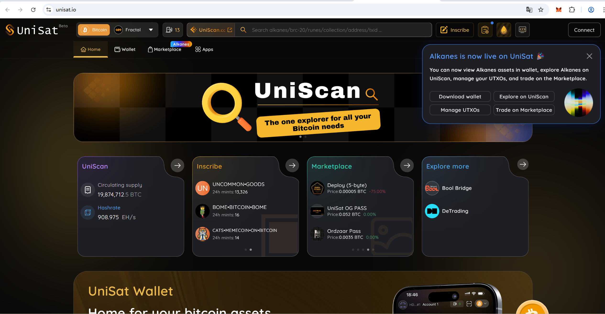
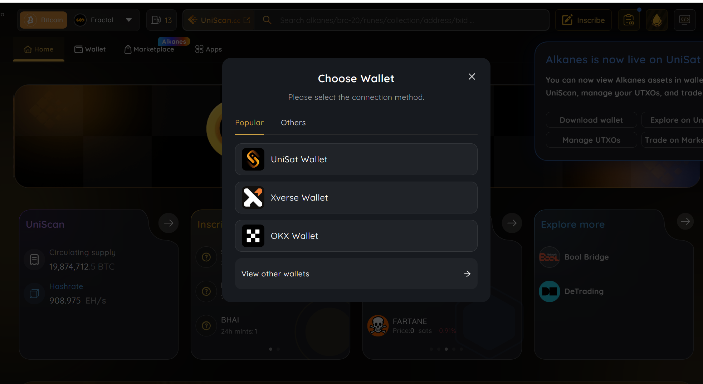
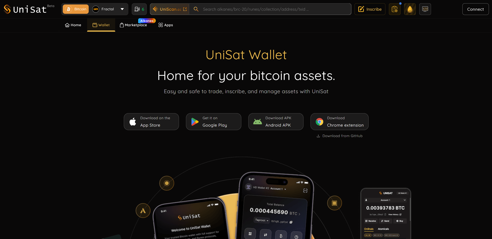
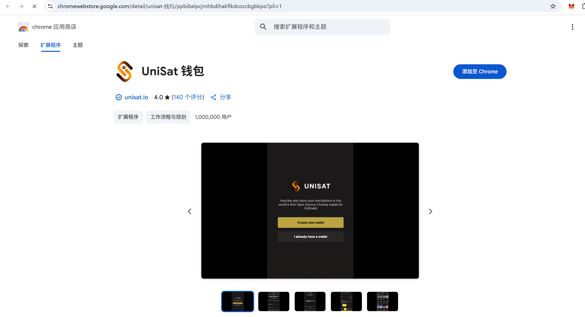
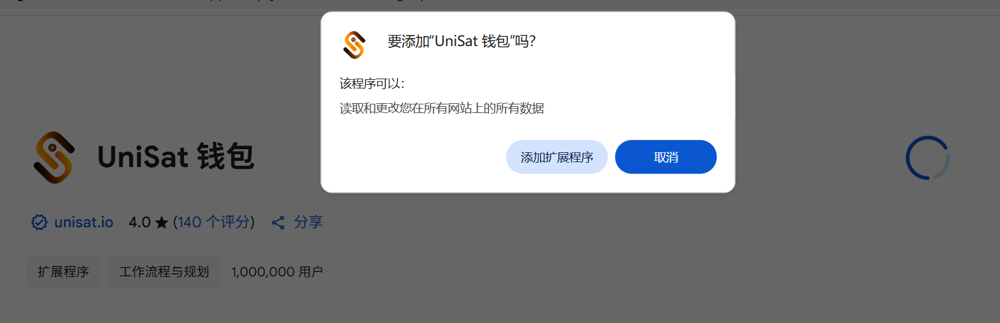
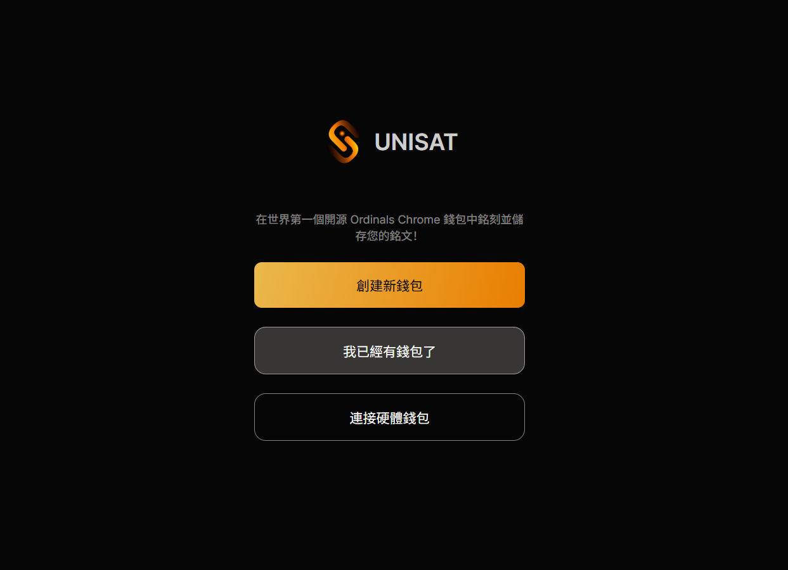
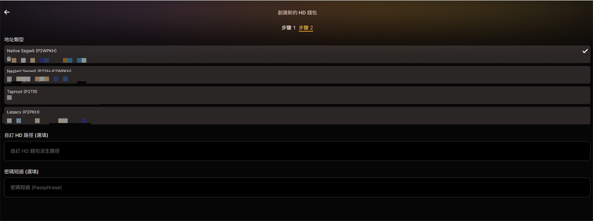
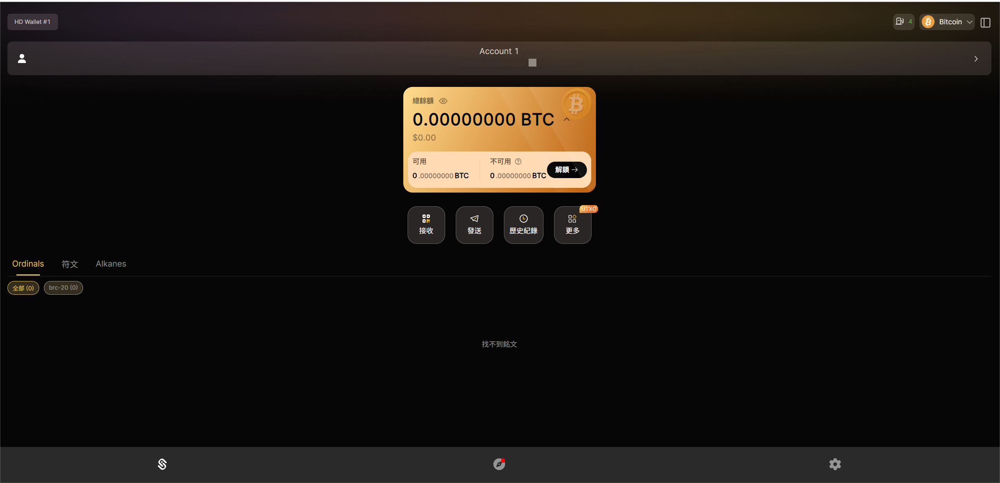

# Lesson 15: Bitcoin Wallets


> 💡 Self-learning Web3 is no easy task. As a newcomer to Web3, I'm putting together the simplest and most intuitive beginner tutorials. Aggregating quality open-source community resources to guide everyone from beginner to expert in Web3. Updated 1-3 lessons per week.
>
> Follow me on Twitter: [@bhbtc1337](https://twitter.com/bhbtc1337)
>
> Join the discussion group: [Form Link](https://forms.gle/QMBwL6LwZyQew1tX8)
>
> Open-sourced on GitHub: [Get-Started-with-Web3](https://github.com/beihaili/Get-Started-with-Web3)
>
> Recommended exchange for buying BTC / ETH / USDT: [Binance](https://www.binance.com/en) [Registration Link](https://www.bsmkweb.cc/register?ref=39797374)

## Table of Contents

- [Introduction](#introduction)
- [Bitcoin Wallet Basics](#bitcoin-wallet-basics)
- [Creating Your Own Bitcoin Wallet](#creating-your-own-bitcoin-wallet)
- [FAQ](#faq)
- [Conclusion](#conclusion)

## Introduction

When entering the cryptocurrency world, having a secure and reliable Bitcoin wallet is your first hurdle. Just as you wouldn't leave cash lying in the street, your crypto assets need a secure "container" for storage and management.

The blockchain world is described as a dark forest — every participant needs to learn to protect their own assets, because no one else will be responsible for you. Similar to the Dark Forest theory in *The Three-Body Problem*, in the blockchain world, protecting your private keys is paramount — the deeper they're hidden, the safer. Always remember: `Not Your Key, Not Your Coin`.

For beginners, you may need some time to adjust to this world's rules — for example, when you lose your wallet password, there's no "forgot password" button 😂. In this section, we'll explore Bitcoin wallet core concepts, different wallet types and their trade-offs, and how to create your very first Bitcoin wallet step by step.

## Bitcoin Wallet Basics

### What Is a Bitcoin Wallet

A Bitcoin wallet is a tool for storing and managing Bitcoin private keys. Bitcoin wallets don't directly store bitcoins — they store a set of key pairs (private keys and public keys). The private key signs transactions, while the public key generates Bitcoin addresses through cryptographic algorithms for receiving Bitcoin. A wallet is the bridge between users and the Bitcoin network, allowing you to receive, send, and manage Bitcoin assets.

### Types of Bitcoin Wallets

Bitcoin wallets can be classified along two dimensions:

#### By Network Connectivity

1. **Hot wallets**: Connected to the internet, suitable for daily use and trading. Includes browser extension wallets, mobile wallets, and desktop wallets. Since hot wallets are always online, they're vulnerable to cyberattacks and have lower security.

2. **Cold wallets**: Not connected to the internet, suitable for long-term Bitcoin storage. Includes hardware wallets and paper wallets. Cold wallets are more secure because they're offline, but less convenient than hot wallets.

#### By Verification Method

1. **Full node wallets**: Software that runs a complete Bitcoin blockchain node. It not only manages private keys but also directly syncs all block data with the Bitcoin network. Provides the highest level of security and privacy but requires significant storage space and bandwidth.

2. **Lightweight wallets**: Don't download the entire blockchain; instead rely on third-party nodes for transaction verification. More lightweight and suitable for mobile use, but with slightly lower security and privacy than full node wallets.

### Bitcoin Wallet Uses

1. **Store Bitcoin**: Wallets securely store Bitcoin private keys, ensuring only you can control your Bitcoin assets.
2. **Send and receive Bitcoin**: Wallet-generated Bitcoin addresses are used to receive Bitcoin, and you can use the wallet to send Bitcoin to others.
3. **Manage assets**: Wallet interfaces and tools help you view balances, transaction history, and manage multiple cryptocurrency assets.

## Step-by-Step Guide to Creating a Bitcoin Wallet

### Browser Extension Wallet

Browser extension wallets are among the most convenient hot wallets, ideal for daily use:

1. **Choose a wallet plugin**: Recommended to use widely adopted open-source wallet plugins such as [UniSat](https://unisat.io/). Homepage shown below:
<div align="center">  </div>

2. **Install the plugin**: Visit the plugin's official website and follow the prompts to install it in your browser. Click "connect" at the top right of the homepage to select a wallet — choose UniSat Wallet, or directly select the wallet option on the homepage to download — same result.
<div align="center">  </div>
  Click the fourth item to download the browser extension:
<div align="center">  </div>
  Click "Add to Chrome" at the top right:
<div align="center">  </div>
  Wait patiently for download and installation:
<div align="center">  </div>

3. **Create a new wallet**: After installation, running the plugin will show a prompt:
<div align="center">  </div>
  Open the plugin and select "Create New Wallet." Follow the prompts to set a strong password and carefully save the wallet's mnemonic phrase. After creating the wallet, you'll set a password used to view the private key on this machine.

4. **Back up your mnemonic phrase**: The mnemonic phrase is the only way to recover your wallet — it must be kept safe and never lost or exposed. After backing up the mnemonic, the second step will ask you to select a wallet address:
<div align="center">  </div>
  Different address types serve different use cases with different transaction fees. You can start with the default first address type for lower fees. For special scenarios like Ordinals protocol transactions, you'll need a Taproot address — this can be flexibly changed in wallet settings later.

5. **Start using it**: After creation, you can use the wallet to generate Bitcoin addresses, and receive and send Bitcoin.
<div align="center">  </div>

### DIY Cold Wallet from an Old Phone

An old phone can be repurposed into a high-security cold wallet for long-term Bitcoin storage.

1. **Preparation**: Find an old phone and factory reset it to ensure no malware. (Optional) Physically damage the phone's signal transmission/reception module.
2. **Install a wallet app**: Install an offline-capable wallet app like [Bither Wallet](https://www.bitcoin.com/zh-cn/btc-wallet/).
3. **Disconnect network**: After installation, disconnect all network connections (Wi-Fi and mobile data).
4. **Create cold wallet**: Open the wallet app, select "Create New Wallet," ensure random private key generation, and generate the mnemonic phrase.
5. **IMPORTANT: Back up your mnemonic**: Write down the mnemonic twice — combined with the cold wallet phone, you'll have three copies total. Store them in different locations, with waterproofing to prevent ink fading. (Three copies is an experience-based recommendation that balances loss and theft risk.)
6. **Transfer Bitcoin**: Use a hot wallet to send Bitcoin to the cold wallet address, ensuring the cold wallet's private key never touches the network.
7. **Offline storage**: Power off the phone and store it safely in a fire- and water-resistant location.

### Full Node Wallet

Full node wallets are ideal for users who want complete control over their Bitcoin transactions and privacy.

1. **Install Bitcoin Core**: Visit the Bitcoin Core official website to download and install the full node wallet software.
2. **Initial sync**: Launch Bitcoin Core and it will begin downloading the entire Bitcoin blockchain. This may take several days and hundreds of GB of storage.
3. **Create wallet**: After Bitcoin Core completes the initial sync, select "Create Wallet" from the File menu. Name the new wallet and choose whether to encrypt it.
4. **Back up wallet**: Select "Back Up Wallet" from the File menu and save the wallet file to a secure location. Ensure the backup copy is stored offline.
5. **Manage Bitcoin**: You can now use the full node wallet to generate addresses, receive Bitcoin, send Bitcoin, and participate in Bitcoin network consensus.

## 📖 Wallet Type Comparison Table

Choosing the right wallet is the first step in protecting your Bitcoin assets. The table below compares common wallet types across multiple dimensions.

| Wallet Type | Security | Convenience | Cost | Use Case | Representative Products | Pros | Cons |
|-------------|----------|-------------|------|----------|------------------------|------|------|
| **Browser Extension Wallet** | ★★☆☆☆ | ★★★★★ | Free | Daily trading, DApp interaction | UniSat, MetaMask | Easy to use, DApp support | Vulnerable to cyberattacks, high phishing risk |
| **Mobile Wallet** | ★★★☆☆ | ★★★★☆ | Free | Daily payments, small storage | Blue Wallet, Muun | Mobile-friendly | Phone loss/theft risk |
| **Desktop Wallet** | ★★★☆☆ | ★★★☆☆ | Free | Medium-amount management | Sparrow, Electrum | Feature-rich, advanced operations | Requires secure OS environment |
| **Hardware Wallet** | ★★★★★ | ★★☆☆☆ | $60-$250 | Large long-term storage | Ledger, Trezor, Coldcard | Private keys isolated offline | Requires device purchase, higher learning curve |
| **Paper Wallet** | ★★★★☆ | ★☆☆☆☆ | Free | Long-term cold storage | Self-generated | Completely offline, zero cost | Easily physically damaged, inconvenient for trading |
| **Brain Wallet** | ★☆☆☆☆ | ★☆☆☆☆ | Free | Not recommended | None | No physical storage needed | Extremely vulnerable to brute-force attacks |
| **Full Node Wallet** | ★★★★★ | ★★☆☆☆ | Free (needs disk space) | High privacy, transaction verification | Bitcoin Core | Highest privacy and security | Requires hundreds of GB storage and sync time |
| **Multisig Wallet** | ★★★★★ | ★★☆☆☆ | Free/Paid | Large assets, institutional management | Sparrow (multisig), Nunchuk | Multi-party verification, no single point of failure | Complex setup, requires multiple signing devices |

> 💡 **Tip**: For beginners, start with a mobile wallet (like Blue Wallet) to learn the basics with small amounts. As your holdings grow, upgrade to a hardware wallet. For large assets, use a multisig solution.

## 📖 HD Wallet Derivation Paths Explained

Modern Bitcoin wallets mostly use the **HD wallet** (Hierarchical Deterministic Wallet) architecture. A single mnemonic phrase can derive infinitely many addresses, powered by the BIP32/BIP44/BIP84/BIP86 standards.

### 🔑 What Is an HD Wallet

HD wallets derive countless child key pairs from a single **master seed** (generated from the mnemonic phrase) in a tree structure:

- **One mnemonic = unlimited addresses**: No need to back up each address separately
- **Deterministic**: The same mnemonic generates identical address sets in any compatible wallet
- **Privacy**: Can use a new address for each transaction

### 🔑 BIP Standards Explained

| BIP Standard | Name | Purpose | Address Prefix | Path Format |
|-------------|------|---------|---------------|-------------|
| **BIP32** | Hierarchical Deterministic Wallets | Defines tree-structured key derivation from seed | - | `m/child_path` |
| **BIP39** | Mnemonic Standard | Encodes randomness as human-readable word sequences | - | - |
| **BIP44** | Multi-coin Multi-account | Legacy address derivation standard | `1...` | `m/44'/0'/0'/0/0` |
| **BIP49** | Compatible SegWit | SegWit-compatible addresses (P2SH-P2WPKH) | `3...` | `m/49'/0'/0'/0/0` |
| **BIP84** | Native SegWit | Native SegWit addresses (bech32) | `bc1q...` | `m/84'/0'/0'/0/0` |
| **BIP86** | Taproot | Taproot addresses (bech32m) | `bc1p...` | `m/86'/0'/0'/0/0` |

### 💡 Derivation Path Structure

Using path `m/84'/0'/0'/0/0` as an example:

```
m / 84' / 0' / 0' / 0 / 0
│    │     │     │    │   │
│    │     │     │    │   └── Address index (1st address)
│    │     │     │    └────── 0 = external chain (receiving), 1 = internal chain (change)
│    │     │     └─────────── Account index (1st account)
│    │     └───────────────── Coin type (0 = Bitcoin, 60 = Ethereum)
│    └─────────────────────── BIP standard number (84 = Native SegWit)
└──────────────────────────── Master key
```

> 💡 **Tip**: The `'` (apostrophe) in paths indicates "Hardened Derivation," meaning child keys at that level cannot be derived from the public key, improving security.

### 🔑 Common Derivation Path Examples

```
# Legacy address (P2PKH) - starts with 1
m/44'/0'/0'/0/0  →  1BvBMSEYstWetqTFn5Au4m4GFg7xJaNVN2
m/44'/0'/0'/0/1  →  1JvF1TGAXHQnMqr4jGqK7Npt7qc8FVcaYz

# Compatible SegWit address (P2SH-P2WPKH) - starts with 3
m/49'/0'/0'/0/0  →  3J98t1WpEZ73CNmQviecrnyiWrnqRhWNLy

# Native SegWit address (bech32) - starts with bc1q (recommended)
m/84'/0'/0'/0/0  →  bc1qw508d6qejxtdg4y5r3zarvary0c5xw7kv8f3t4

# Taproot address (bech32m) - starts with bc1p (newest)
m/86'/0'/0'/0/0  →  bc1p5d7rjq7g6rdk2yhzks9smlaqtedr4dekq08ge8ztwac72sfr9rusxg3297
```

> ⚠️ **Important**: Different address types have different fees. Native SegWit (bc1q) addresses have transaction fees about 30-40% lower than Legacy (1-prefix) addresses; Taproot (bc1p) addresses may have even lower fees in some scenarios. Prefer bc1q or bc1p addresses.

## 📖 Mainstream Wallet Setup Guides

### 🔑 Sparrow Wallet (Desktop)

Sparrow Wallet is a powerful Bitcoin desktop wallet supporting PSBT, multisig, hardware wallet connection, and other advanced features.

**Installation steps:**

1. Visit [Sparrow Wallet website](https://sparrowwallet.com/) and download the installer for your OS
2. **Verify the download file signature** (important! Prevents supply chain attacks):
   ```bash
   # Import the developer's GPG public key
   gpg --keyserver keyserver.ubuntu.com --recv-keys D4D0D3202FC06849A257B38DE94618334C674B40
   # Verify signature
   gpg --verify sparrow-1.9.1-manifest.txt.asc sparrow-1.9.1-manifest.txt
   ```
3. Install and open Sparrow Wallet
4. Select **New Wallet**
5. Choose wallet type:
   - **Single Sig**: Single signature (suitable for personal use)
   - **Multi Sig**: Multisignature (suitable for large assets)
6. Select script type (recommended: **Native SegWit (P2WPKH)**)
7. Click **New or Imported Software Wallet**
8. Record the 24 mnemonic words and back them up securely
9. Set a wallet password and complete creation

### 🔑 Blue Wallet (Mobile)

Blue Wallet is an open-source Bitcoin mobile wallet supporting iOS and Android, with built-in Lightning Network functionality.

**Installation steps:**

1. Search for **Blue Wallet** in App Store or Google Play and download
2. Open the app and tap **Add a wallet**
3. Enter a wallet name
4. Choose wallet type:
   - **Bitcoin**: On-chain Bitcoin wallet
   - **Lightning**: Lightning Network wallet (small, fast payments)
5. Tap **Create**
6. **Back up your mnemonic**: The app will display 12 English words — write them down by hand
7. Complete verification and start using

### 🔑 Ledger Hardware Wallet

Ledger is one of the most popular hardware wallets, providing the highest level of security by physically isolating private keys.

**Setup steps:**

1. Purchase from the [Ledger official website](https://www.ledger.com/) (never buy from unofficial channels!)
2. Download and install **Ledger Live** desktop app
3. Connect the Ledger device to your computer via USB
4. Select **Set up as new device** on the device
5. Set a 4-8 digit **PIN code**
6. The device will generate and display **24 mnemonic words**:
   - Write them down one by one on the Ledger-provided recovery card
   - **Never type or photograph them on any electronic device!**
7. Complete mnemonic verification
8. Install the **Bitcoin App** in Ledger Live
9. Add a Bitcoin account, select address type (recommended: Native SegWit)
10. Generate a receiving address and start using

> ⚠️ **Important**: Always buy hardware wallets from official channels! Devices from second-hand or unofficial channels may have malicious firmware pre-installed, compromising your private keys. Upon receiving, confirm the packaging is intact and the device is in an uninitialized state.

## 📖 Wallet Security Best Practices

### 🔑 Mnemonic Backup Strategies

| Backup Method | Security | Durability | Recommendation | Notes |
|---------------|----------|-----------|----------------|-------|
| Paper writing | ★★★☆☆ | ★★☆☆☆ | Moderate | Watch out for water/fire damage; ink may fade |
| Metal mnemonic plate | ★★★★★ | ★★★★★ | Strongly recommended | Fire/water resistant; e.g., Cryptosteel, Billfodl |
| Password manager | ★★★☆☆ | ★★★★☆ | Moderate | e.g., 1Password; requires trusting the provider |
| Encrypted USB drive | ★★★☆☆ | ★★★☆☆ | Moderate | Electronic storage devices can fail |
| Shamir secret sharing | ★★★★★ | ★★★★☆ | Recommended | Split mnemonic into shares; any N shares can recover |

**Core principles:**

- **At least two backups** stored in different physical locations
- **Never** store mnemonics in plaintext on internet-connected devices
- **Never** photograph or screenshot mnemonics
- **Never** send mnemonics via email, messaging apps, etc.
- **Regularly check** that backups are intact and readable

### 🔑 Multisig Schemes

Multisig requires a specified number of private keys to co-sign before initiating a transaction, greatly enhancing security:

```
Common multisig schemes:
- 2-of-3: 2 out of 3 keys needed (recommended for personal use)
- 3-of-5: 3 out of 5 keys needed (recommended for institutional use)
```

**2-of-3 multisig example layout:**

- **Key 1**: Hardware wallet at home (e.g., Ledger)
- **Key 2**: Another hardware wallet in a safe deposit box (e.g., Coldcard)
- **Key 3**: Mnemonic backup held by a trusted family member

This way, even if any single key is lost or stolen, assets remain safe.

### 🔑 Inheritance Planning

Bitcoin asset inheritance is an often overlooked but critically important topic:

1. **Create an inheritance document**: Record wallet types, BIP standards used, approximate amounts (without mnemonics)
2. **Trusted executor**: Designate someone who knows you have crypto assets
3. **Layered information**:
   - At a lawyer's: Sealed letter explaining the existence of crypto assets and basic procedures
   - In a safe / with a trusted person: Mnemonic backup or one of the multisig keys
4. **Regular updates**: Review inheritance arrangements at least annually
5. **Consider timelocks**: Advanced users can use Bitcoin script timelocks to auto-transfer assets to a designated address after a period of inactivity

> 💡 **Tip**: According to Chainalysis, approximately 3.7 million bitcoins may be permanently lost. Good inheritance planning is responsible to both your family and yourself.

## 📖 Common Wallet Troubleshooting

### ❓ Imported my mnemonic but addresses are different?

This is one of the most common issues, usually caused by:

1. **Different derivation paths**: Different wallets may default to different BIP standards
   - Check whether the original wallet used BIP44 (Legacy), BIP49 (Compatible SegWit), or BIP84 (Native SegWit)
   - Select the matching derivation path in the new wallet
2. **Passphrase**: If the original wallet had an extra passphrase (25th word), you need to enter it during import
3. **Different mnemonic standards**: Some wallets use non-BIP39 mnemonic standards

**Resolution steps:**

```
1. Confirm the original wallet's address type (check prefix: 1..., 3..., bc1q..., bc1p...)
2. Select the matching address type in the new wallet
3. If still mismatched, try switching BIP standards
4. Check if you missed a Passphrase
```

### ❓ Wallet shows zero balance but there are coins on-chain?

Possible causes:

1. **Sync incomplete**: Wait for the wallet to finish blockchain sync
2. **Connected node issue**: Try switching to another node or server
3. **Wrong address type**: Check if the wallet displays balances for all address types
4. **Wallet index range**: HD wallets default to scanning only the first 20 addresses; if your Bitcoin is at a later address, increase the gap limit

### ❓ Transaction stuck unconfirmed?

1. **Check fee rate**: View current recommended rates at [mempool.space](https://mempool.space/)
2. **Use RBF**: If RBF (Replace-By-Fee) was enabled when sending, rebroadcast with a higher fee
3. **Use CPFP**: Create a new transaction spending the unconfirmed change output with a higher fee
4. **Wait**: If the rate is reasonable, the transaction will eventually confirm when network congestion eases
5. **Will it expire?**: By default, unconfirmed transactions are cleared from most nodes' mempools after 14 days

### ❓ Should I use one wallet or multiple?

Recommended **layered strategy**:

| Purpose | Recommended Wallet Type | % of Holdings |
|---------|----------------------|---------------|
| Daily transactions | Mobile / Browser extension wallet | 5-10% |
| Medium amounts | Desktop / Single-sig hardware wallet | 20-30% |
| Long-term storage | Multisig hardware wallet scheme | 60-75% |

> 💡 **Tip**: Don't put all your eggs in one basket. Spread assets across different wallet types to ensure daily convenience while keeping the majority of assets secure.

## FAQ

#### ❓ What's the difference between hot and cold wallets?

1. **Network connection**: Hot wallets stay connected to the internet; cold wallets are completely offline.
2. **Security**: Cold wallets are more secure due to no cyberattack risk; hot wallets are more vulnerable.
3. **Convenience**: Hot wallets are more convenient for instant transactions; cold wallets require extra steps.
4. **Use cases**: Hot wallets suit daily trading and small amounts; cold wallets suit long-term storage and large assets.

#### ❓ What is a mnemonic phrase and why is it so important?

A mnemonic phrase is a set of ordinary words used to generate and recover wallet private keys:

1. **Key recovery**: If your device is lost or damaged, the mnemonic is the only way to recover wallet access.
2. **Cross-platform compatible**: Mnemonics can be shared across different wallet software for easy migration.
3. **Human readable**: Easier to record and store than complex private key strings.

If the mnemonic is lost, it's equivalent to permanently losing access to all assets in the wallet.

#### ❓ What type of wallet should a beginner choose?

1. **Starting out**: Use a browser extension wallet like UniSat or a mobile app wallet — relatively simple to operate.
2. **Small amounts**: Hot wallets are suitable for small amounts of Bitcoin.
3. **After gaining experience**: As assets grow, add a cold wallet for storing the majority.

## Conclusion

Creating and managing Bitcoin wallets is a foundational skill for every Web3 explorer. Once you understand the characteristics and purposes of different wallet types, you can make informed choices based on your needs and safely manage your crypto assets.

Remember, in the cryptocurrency world, security is not an option but a necessity. Everyone must take responsibility for their own asset security — this is the core message of "Not Your Keys, Not Your Coins."

Your cryptocurrency journey has begun. May you find your path in this exciting and opportunity-filled space. Remember, all beginnings are hard — when you've traveled far enough, looking back, you'll find you've progressed more than you imagined.

---

<div align="center">
<a href="https://github.com/beihaili/Get-Started-with-Web3">🏠 Back to Home</a> |
<a href="https://twitter.com/bhbtc1337">🐦 Follow the Author</a> |
<a href="https://forms.gle/QMBwL6LwZyQew1tX8">📝 Join the Discussion</a>
</div>
