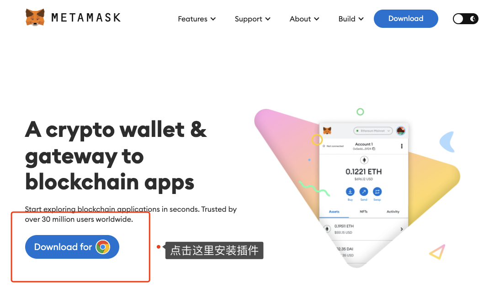
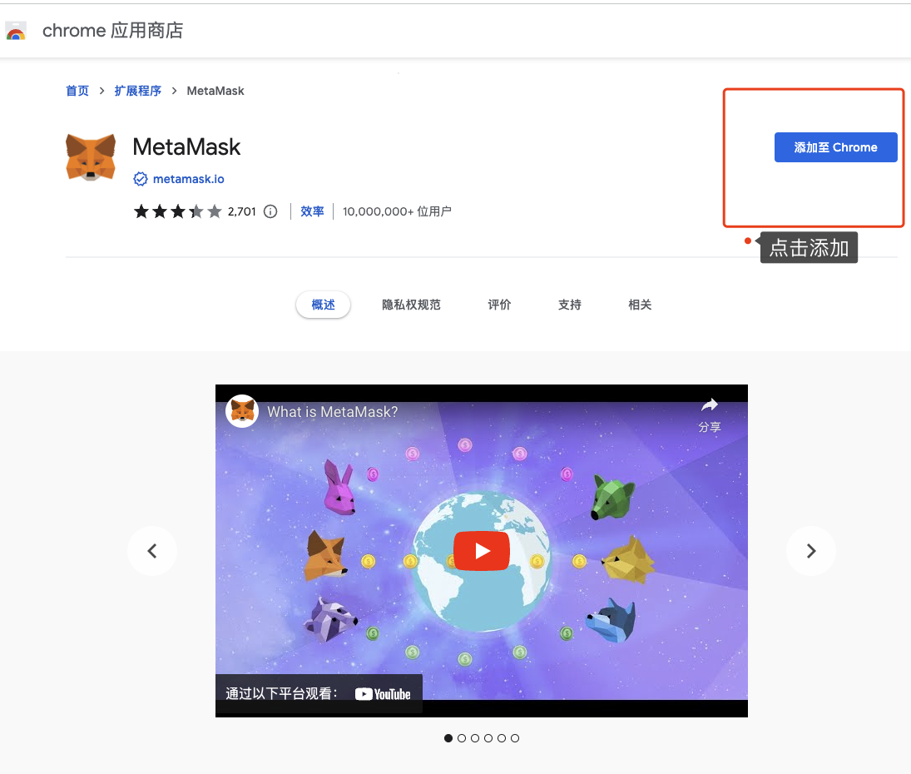
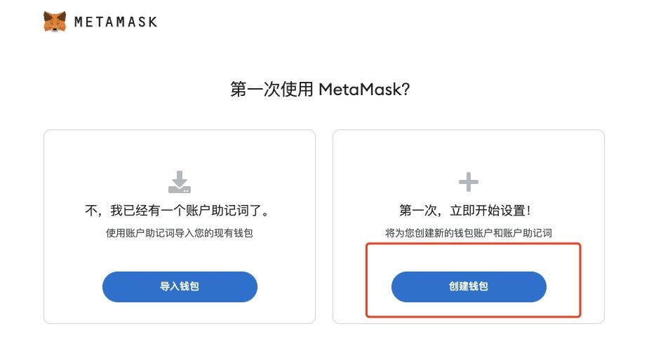
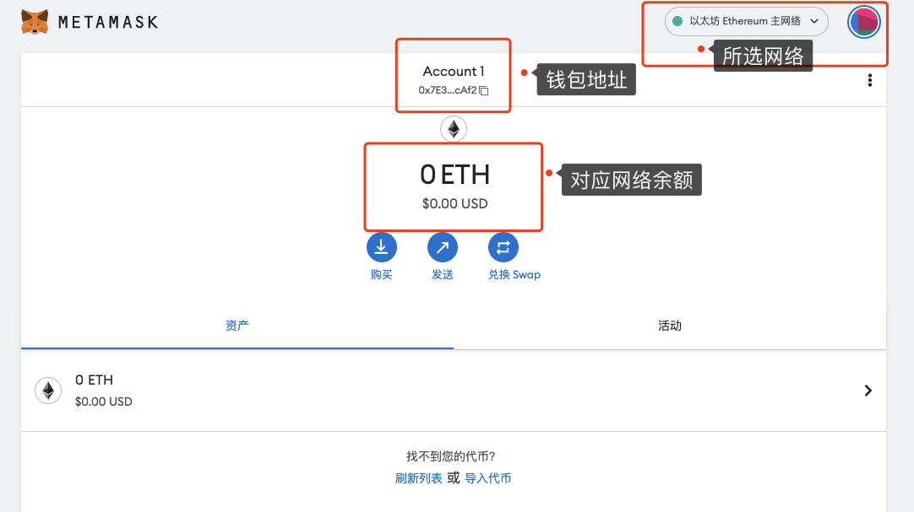

# Create Your First Web3 Identity


> 💡 Teaching yourself `Web3` isn't easy. As someone who recently got started with Web3, I've put together the simplest and most straightforward beginner's tutorial. By integrating quality open-source community resources, I hope to guide everyone from beginner to expert in Web3. Updated 1-3 lessons per week.
>
> Follow me on Twitter: [@bhbtc1337](https://twitter.com/bhbtc1337)
>
>
> Join our WeChat group: [Form Link](https://forms.gle/QMBwL6LwZyQew1tX8)
>
> Articles are open-sourced on GitHub: [Get-Started-with-Web3](https://github.com/beihaili/Get-Started-with-Web3)
>
> Recommended exchange for buying BTC / ETH / USDT: [Binance](https://www.binance.com/en) [Registration Link](https://accounts.marketwebb.me/register?ref=39797374)

## Table of Contents

- [Introduction](#introduction)
- [A Brief Overview of Web3](#a-brief-overview-of-web3)
- [MetaMask Wallet Overview](#metamask-wallet-overview)
- [Create Your First Web3 Identity with MetaMask](#create-your-first-web3-identity-with-metamask)
- [FAQ](#faq)
- [Summary](#summary)

## Introduction

Remember the excitement and curiosity you felt the first time you used the internet? Today, we stand at the starting point of another technological revolution — Web3. This brand-new digital world is no longer controlled by tech giants but is collectively owned by every participant. As a Web3 newcomer myself, I understand the importance and challenge of taking that first step. I hope this article will help you easily obtain your first Web3 identity and open the door to the digital future!

## A Brief Overview of Web3

`Web3` is an open network where anyone can build applications without relying on any centralized services. Technically, `Web3` is a decentralized network built on blockchain technology. A more practical description of the current state is: add the MetaMask browser extension to a Web2 website, and it becomes a `Web3` website 😂.

Imagine the internet as a giant shopping mall:
- Web1 was the era when you could only window-shop
- Web2 was the era when you could actually shop inside the mall
- Web3 is the era when you become a co-owner of the mall

## MetaMask Wallet Overview

`MetaMask` is a decentralized wallet browser extension that lets users easily access the `Web3` world. The vast majority of `Web3` projects support `MetaMask`.

Simply put, MetaMask is like your Web3 passport — it:
- Stores your digital assets (cryptocurrencies)
- Proves your identity
- Allows you to interact with Web3 applications

## Create Your First Web3 Identity with MetaMask

Unlike `Web2`, where you constantly need to link a phone number, creating a `Web3` identity is incredibly simple. We'll walk you through using `MetaMask` to create a `Web3` identity — the entire process takes less than 5 minutes.

How many steps does it take to create a `Web3` identity? Just three!

- Step 1: Install the `MetaMask` browser extension
- Step 2: Create a `MetaMask` account
- Step 3: Back up your `MetaMask` account

### Step 1: Install the MetaMask Browser Extension

Open the [MetaMask website](https://metamask.io/) in your `Chrome` browser, click `Get Chrome Extension`, then click `Add to Chrome` to install the `MetaMask` browser extension.

<div align="center">  </div>

<div align="center">  </div>

### Step 2: Create a MetaMask Account

Click the `MetaMask` browser extension, click "Get Started", click "I Agree", click "Create a Wallet", and set a password to create your `MetaMask` account.

<div align="center">  </div>

### Step 3: Back Up Your MetaMask Account

When you first create an account, you'll be prompted to back up your seed phrase. We recommend finding a quiet place to write it down on paper, or store it in a password manager like 1Password. If you choose to copy the seed phrase to your computer, make sure to encrypt it.

<div align="center">  </div>

### MetaMask Interface

Congratulations, you now have a `Web3` identity. Let's familiarize ourselves with the `MetaMask` interface.

<div align="center">  </div>

- At the top, `Ethereum Mainnet` is the network selector, defaulting to `Ethereum Mainnet`
- `0x...` is your `MetaMask` account address
- `0 ETH` is your `MetaMask` account balance

## 📖 Detailed MetaMask Installation and Setup Guide

Earlier we quickly walked through the three-step creation process. Now let's go into detail on each step and its important considerations.

### 🔑 Download and Installation

1. **Open Chrome browser** and visit the official MetaMask website: [https://metamask.io](https://metamask.io)

> ⚠️ **Important**: Make sure the URL is `metamask.io`. Do not click on ad links from search engines! Many users have lost assets after installing fake MetaMask extensions.

2. Click the **Download** button and select **Chrome** browser
3. After being redirected to the Chrome Web Store, click **Add to Chrome**
4. In the confirmation popup, click **Add extension**
5. Once installed, the fox icon will appear in the top-right corner of your browser

**Supported Browsers and Platforms**:

| Platform | Support | Download Method |
|----------|---------|-----------------|
| Chrome | Supported | Chrome Web Store |
| Firefox | Supported | Firefox Add-ons |
| Brave | Supported | Chrome Web Store |
| Edge | Supported | Chrome Web Store |
| iOS | Supported | App Store |
| Android | Supported | Google Play |

### 🔑 Detailed Wallet Creation Steps

1. Click the MetaMask fox icon in the top-right corner of your browser
2. Select **Create a new wallet**
3. Read and agree to the terms of service
4. **Set a password**:
   - At least 8 characters
   - Recommended: combination of uppercase + lowercase letters + numbers + special characters
   - This password is only used to unlock MetaMask on the current device
   - **Note**: This password ≠ your seed phrase. If you forget the password, you can recover using the seed phrase
5. Watch the seed phrase security tutorial video (recommended for beginners)
6. **Record your seed phrase**: MetaMask will display 12 English words
7. **Verify your seed phrase**: Click the words in the correct order to complete verification
8. Done! Your first Web3 identity has been created

### 🔑 Adding Custom Networks

MetaMask connects to Ethereum Mainnet by default. You can manually add other EVM-compatible networks:

1. Click the network dropdown at the top of MetaMask
2. Click **Add network**
3. Fill in the network information. For example, to add Polygon:

```
Network Name: Polygon Mainnet
RPC URL: https://polygon-rpc.com
Chain ID: 137
Currency Symbol: MATIC
Block Explorer: https://polygonscan.com
```

**Common EVM Network Information**:

| Network Name | Chain ID | Currency Symbol | RPC URL |
|-------------|----------|-----------------|---------|
| Ethereum Mainnet | 1 | ETH | https://eth.llamarpc.com |
| Polygon | 137 | MATIC | https://polygon-rpc.com |
| Arbitrum One | 42161 | ETH | https://arb1.arbitrum.io/rpc |
| Optimism | 10 | ETH | https://mainnet.optimism.io |
| BSC | 56 | BNB | https://bsc-dataseed.binance.org |
| Avalanche C-Chain | 43114 | AVAX | https://api.avax.network/ext/bc/C/rpc |
| Base | 8453 | ETH | https://mainnet.base.org |

> 💡 **Tip**: You can also visit [Chainlist.org](https://chainlist.org/) to add various EVM networks to MetaMask with one click, saving you the hassle of manual entry.

## 📖 Address Format Explained

Understanding Ethereum address formats and rules can help you avoid transfer errors and asset loss.

### 🔑 Ethereum Address Structure

An Ethereum address is a 42-character hexadecimal string consisting of the `0x` prefix + 40 hex characters:

```
0x71C7656EC7ab88b098defB751B7401B5f6d8976F
│  │                                        │
│  └────────── 40 hexadecimal characters ───┘
└── Prefix
```

**Address generation process**:

```
Private Key (256-bit random number)
    ↓ Elliptic curve operation (secp256k1)
Public Key (512 bits)
    ↓ Keccak-256 hash
Hash Value (256 bits)
    ↓ Take the last 20 bytes
Ethereum Address (160 bits = 40 hex characters)
    ↓ Add 0x prefix
Full Address: 0x71C7656EC7ab88b098defB751B7401B5f6d8976F
```

### 🔑 EIP-55 Checksum Addresses

Ethereum uses mixed-case formatting to implement address checksums (EIP-55 standard):

```
No checksum: 0x71c7656ec7ab88b098defb751b7401b5f6d8976f (all lowercase)
With checksum: 0x71C7656EC7ab88b098defB751B7401B5f6d8976F (mixed case)
```

The positions of uppercase and lowercase letters are determined by a hash calculation. If you accidentally change the case when manually entering an address, wallet software can detect the error and issue a warning.

> 💡 **Tip**: Always copy and paste addresses rather than typing them manually when making transfers. Before sending, carefully verify the first 4 and last 4 characters of the address.

### 🔑 ENS Domain Names

**ENS** (Ethereum Name Service) allows you to map complex Ethereum addresses to human-readable domain names:

```
Address: 0x71C7656EC7ab88b098defB751B7401B5f6d8976F
ENS Domain: vitalik.eth
```

Advantages of ENS domains:
- **Easy to remember**: Much easier than remembering a 42-character hex string
- **Multi-purpose**: Can point to Ethereum addresses, other chain addresses, IPFS content, etc.
- **Decentralized**: Domain registration is on Ethereum smart contracts, no centralized authority needed
- **Identity**: ENS domains are becoming the identity card of the Web3 world

**Registering an ENS domain**: Visit [app.ens.domains](https://app.ens.domains/) to search for and register your favorite `.eth` domain. Pricing depends on name length (5+ characters is about $5/year).

## 📖 Wallet Backup Strategies

Your seed phrase is the lifeline of your Web3 identity. Once lost, no one can help you recover it.

### 🔑 Seed Phrase Security Principles

| Do | Don't |
|----|-------|
| Write it down by hand on paper | Take screenshots or photos |
| Store in multiple secure locations | Store in the cloud (iCloud, Google Drive) |
| Use a metal seed phrase plate for disaster protection | Send via messaging apps or email |
| Consider encrypted storage with a password manager | Save in a plain text file on your computer |
| Regularly check that backups are intact | Enter your seed phrase on any website |

### 🔑 Recommended Backup Plans

**Plan A: Basic Backup (for small amounts)**

1. Handwrite the seed phrase on paper — two copies
2. Store them in two different secure locations at home
3. Ensure they're waterproof and fireproof (use sealed plastic bags)

**Plan B: Intermediate Backup (for moderate amounts)**

1. Purchase a metal seed phrase plate (e.g., Cryptosteel Capsule) and engrave the seed phrase
2. Keep one paper backup as redundancy
3. Store the metal plate in a home safe
4. Store the paper backup at a separate physical location (e.g., a family member's home)

**Plan C: Advanced Backup (for large amounts)**

1. Use **Shamir's Secret Sharing** to split the seed phrase into 3 parts — any 2 can recover it
2. Store the three parts in different cities in secure locations
3. Use in combination with a hardware wallet
4. Create an inheritance plan

> ⚠️ **Important**: Never have just one backup! Fires, floods, and moving can all lead to losing your only backup. At the same time, don't create too many copies — the more backups exist, the higher the risk of someone else discovering them. 2-3 copies is a good balance.

## 📖 Multi-Chain Identity Management

In the Web3 world, a single set of seed words can generate addresses on multiple blockchains. Understanding multi-chain identity management is an essential skill for becoming a Web3 veteran.

### 🔑 EVM-Compatible Chains: Same Address

All EVM (Ethereum Virtual Machine) compatible chains share **the same address format and derivation method**. This means:

```
The same seed phrase generates the exact same address on these chains:
- Ethereum: 0x71C7656EC7ab88b098defB751B7401B5f6d8976F
- Polygon:  0x71C7656EC7ab88b098defB751B7401B5f6d8976F
- BSC:      0x71C7656EC7ab88b098defB751B7401B5f6d8976F
- Arbitrum: 0x71C7656EC7ab88b098defB751B7401B5f6d8976F
- Optimism: 0x71C7656EC7ab88b098defB751B7401B5f6d8976F
- Base:     0x71C7656EC7ab88b098defB751B7401B5f6d8976F
```

This is because EVM chains all use the same cryptographic standard (secp256k1 curve + Keccak-256 hash).

### 🔑 Non-EVM Chains: Different Address Formats

Different blockchains use different address formats and derivation paths:

| Blockchain | Address Format | Example | Seed Phrase Compatibility |
|-----------|---------------|---------|--------------------------|
| **Ethereum/EVM** | 0x + 40 hex chars | `0x71C7...976F` | BIP39 compatible |
| **Bitcoin** | Starts with bc1/1/3 | `bc1qw508...v8f3t4` | BIP39 compatible but different derivation path |
| **Solana** | Base58-encoded 32 bytes | `7EcDhS...3rPk` | Uses different derivation path (ed25519) |
| **Cosmos** | cosmos1 prefix | `cosmos1...` | BIP39 compatible but different derivation path |
| **Polkadot** | SS58 encoding | `15oF4u...` | Uses sr25519 curve |
| **Tron** | Starts with T, Base58 | `TJCnKs...` | BIP39 compatible but different derivation path |

> ⚠️ **Important**: Although the seed phrase format is the same (BIP39), the same seed phrase generates **completely different addresses** on different chains (except among EVM chains). Do not send assets to the wrong chain address, or they may be permanently lost!

### 🔑 Multi-Chain Wallet Management Tips

1. **EVM chains**: Use MetaMask to manage all EVM-compatible chain assets
2. **Bitcoin**: Use a dedicated Bitcoin wallet (e.g., Sparrow, Blue Wallet)
3. **Solana**: Use Phantom or Backpack wallet
4. **Cosmos ecosystem**: Use Keplr wallet
5. **Unified management**: You can also use multi-chain wallets (e.g., OKX Wallet, Rabby Wallet)

## 📖 Common Mistakes and Solutions

### ❓ Mistake 1: Entered seed phrase on a phishing website

**Severity**: Critical

**Symptoms**: A website claims it needs your seed phrase to "verify your wallet" or "claim an airdrop"

**Solution**:
1. **Immediately** create a new wallet
2. **Immediately** transfer all assets to the new wallet
3. Consider the old wallet compromised — never use it again
4. Check for unauthorized token approvals

> ⚠️ **Important**: MetaMask and all legitimate wallets and DApps will **never** ask you to enter your seed phrase. Any website requesting your seed phrase is 100% a scam.

### ❓ Mistake 2: Sent tokens to the wrong network

**Severity**: Moderate

**Symptoms**: Sent tokens on the Polygon network, but the recipient only checked Ethereum Mainnet

**Solution**:
1. Notify the recipient to switch to the correct network
2. If the network isn't in MetaMask, simply add it manually
3. Since EVM chain addresses are the same, the assets won't be lost

### ❓ Mistake 3: Gas fee set too low, causing transaction failure

**Severity**: Low

**Symptoms**: Transaction stuck in Pending state for a long time or eventually failed

**Solution**:
1. Find the pending transaction in MetaMask's Activity tab
2. Click **Speed Up** to increase the gas fee
3. Or click **Cancel** to cancel the transaction
4. Next time, use the gas fee recommended by MetaMask

### ❓ Mistake 4: Approved a malicious contract with unlimited allowance

**Severity**: High

**Symptoms**: Tokens mysteriously disappear, transferred by an unknown contract

**Solution**:
1. Visit [revoke.cash](https://revoke.cash/) and connect your wallet
2. Review all token approval records
3. Revoke suspicious or unnecessary approvals
4. Make it a habit to regularly check approvals

### ❓ Mistake 5: Reinstalled the browser without backing up the seed phrase

**Severity**: Critical (unrecoverable without backup)

**Symptoms**: MetaMask is empty after reinstalling the browser or switching computers

**Solution**:
1. If you have a seed phrase backup: Reinstall MetaMask → Select **Import wallet** → Enter the seed phrase to recover
2. If you have no backup: Unfortunately, the assets are permanently lost
3. **Prevention**: Back up your seed phrase immediately after creating a wallet!

## 📖 Advanced Web3 Identity

Once you're familiar with basic wallet operations, you can explore more cutting-edge Web3 identity concepts.

### 🔑 ENS Domains — Your Web3 Business Card

ENS (Ethereum Name Service) is more than just a domain service — it's your identity in the Web3 world:

- **Social identity**: Display your `.eth` domain on Twitter, Discord, and other platforms
- **Receiving address**: Others can send ETH and tokens directly to `yourname.eth`
- **Decentralized websites**: Point your `.eth` domain to a website hosted on IPFS
- **Subdomains**: Create subdomains like `blog.yourname.eth`
- **NFT properties**: ENS domains are themselves NFTs that can be traded and transferred

### 🔑 Lens Protocol — Decentralized Social Graph

Lens Protocol is a decentralized social protocol built on Polygon:

- **Profile NFT**: Your social identity is an NFT
- **Content ownership**: All content you publish belongs to you
- **Composability**: Multiple frontend apps (e.g., Hey, Orb) share the same social graph
- **Data portability**: When you switch apps, your followers and content come with you

### 🔑 SBT (Soulbound Tokens) — Non-Transferable Identity Credentials

SBT (Soulbound Token) is a non-transferable NFT used to represent identity, qualifications, reputation, and more:

- **Education certificates**: On-chain proof of course completion
- **Community contributions**: Records of DAO governance participation
- **Skill certifications**: On-chain credentials for developer skills
- **Credit scores**: Decentralized credit records

| Concept | Transferable | Use Case | Examples |
|---------|-------------|----------|----------|
| NFT | Yes | Digital art, collectibles | BAYC, CryptoPunks |
| ENS | Yes | Domain names, identity | vitalik.eth |
| SBT | No | Identity credentials, reputation | POAP, Gitcoin Passport |

> 💡 **Tip**: The core idea behind Web3 identity is "Self-Sovereign Identity" — you fully own and control your identity data without depending on any centralized institution. This stands in stark contrast to the Web2 model where platforms control user data.

## FAQ

#### ❓ My seed phrase is lost. What should I do?

This is a very serious issue. If your seed phrase is lost, it means you may permanently lose control of your wallet. Please immediately create a new wallet and transfer your assets to it. Going forward, make sure to keep your seed phrase safe. Consider:
- Writing it down on paper and keeping it in a safe
- Using a professional password manager for encrypted storage
- Splitting the seed phrase into parts and storing them in different secure locations

#### ❓ Which blockchain networks does MetaMask support?

MetaMask supports Ethereum Mainnet by default, but you can add other EVM-compatible networks, such as:
- Binance Smart Chain (BSC)
- Polygon
- Avalanche
- Optimism
- Arbitrum
and more

#### ❓ Does using MetaMask cost money?

MetaMask itself is free, but making transactions on the blockchain requires paying network "gas fees." These fees don't go to MetaMask — they're paid to the network's validators.

## Summary

You may have noticed that no verification was required during the `Web3` identity creation process. This means that in the `Web3` world, people essentially wear a mask — anyone can freely create their own identity. This creates unprecedented freedom but also amplifies both human goodness and malice. In the `Web3` world, you can't trust anyone and need to be extra careful about protecting yourself. Always remember to `Do Your Own Research`.

Congratulations on making it this far 🎉 You've taken the first step into the `Web3` world! This door opens not just a wallet, but a universe filled with infinite possibilities. Imagine — in this world, you can become the true owner of your data, participate in governing important projects, and even create your own digital kingdom.

The journey ahead will be even more exciting. Together, we'll explore how to make your first transaction, participate in DeFi, collect NFTs, and discover many more amazing Web3 applications. Are you ready? The Web3 adventure has just begun!

---

<div align="center">
<a href="https://github.com/beihaili/Get-Started-with-Web3">🏠 Back to Home</a> |
<a href="https://twitter.com/bhbtc1337">🐦 Follow the Author</a> |
<a href="https://forms.gle/QMBwL6LwZyQew1tX8">📝 Join the Community</a>
</div>
