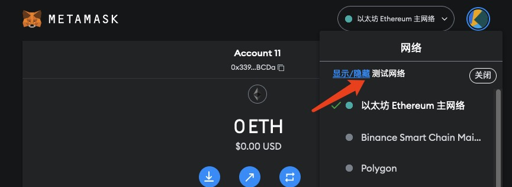
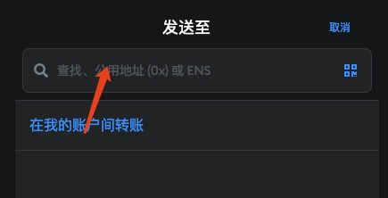
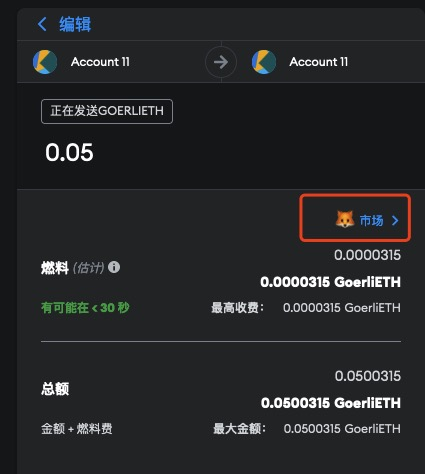
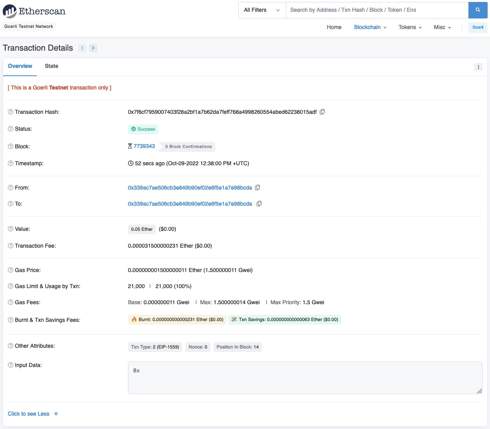

# Send Your First Web3 Transaction

> 💡 Teaching yourself `Web3` isn't easy. As someone who recently got started with Web3, I've put together the simplest and most straightforward beginner's tutorial. By integrating quality open-source community resources, I hope to guide everyone from beginner to expert in Web3. Updated 1-3 lessons per week.
>
> Follow me on Twitter: [@bhbtc1337](https://twitter.com/bhbtc1337)
>
>
> Join our WeChat group: [Form Link](https://forms.gle/QMBwL6LwZyQew1tX8)
>
> Articles are open-sourced on GitHub: [Get-Started-with-Web3](https://github.com/beihaili/Get-Started-with-Web3)
>
> Recommended exchange for buying BTC / ETH / USDT: [Binance](https://www.binance.com/en) [Registration Link](https://accounts.marketwebb.me/register?ref=39797374)

## Table of Contents

- [Introduction](#introduction)
- [What Is a Transaction?](#what-is-a-transaction)
- [Send Your First Transaction on Testnet at Zero Cost](#send-your-first-transaction-on-testnet-at-zero-cost)
- [(Optional) Send Your First Transaction on Mainnet](#optional-send-your-first-transaction-on-mainnet)
- [FAQ](#faq)
- [Summary](#summary)

## Introduction

Remember the first time you transferred money to a friend using your phone? That sense of accomplishment from successfully completing the operation is something you never forget. Today, we'll experience an even more meaningful step in the Web3 world — your first blockchain transaction.

Unlike traditional bank transactions, Web3 transactions require no intermediaries, no waiting for weekends or holidays, and no worrying about exorbitant international transfer fees. Today, I'll guide you step by step through your very first Web3 transaction and let you experience the new financial possibilities that blockchain technology brings!

## What Is a Transaction?

A transaction is an action executed on the blockchain. It can be a transfer or a contract call. Executing a transaction requires a certain amount of Gas — a fee paid in tokens by users to miners or validators. The amount of Gas is determined by real-time network conditions, and miners/validators typically prioritize packaging transactions with higher Gas fees. Transaction results are recorded on the blockchain, and anyone can query the results through the blockchain.

## Send Your First Transaction on Testnet at Zero Cost

### 1. Select a Test Network

First, we need to choose a suitable test network for sending our transaction. Since test networks offer free tokens and don't consume valuable mainnet resources, we'll use a test network for our first transaction. Open MetaMask and click the network information in the upper-right corner.

  

Select a test network. If you're redirected to the settings page, enable the test networks option in settings.

  

Select the Sepolia test network.

### 2. Claim Test Tokens

Next, go to the [Sepolia Faucet](https://www.alchemy.com/faucets/ethereum-sepolia) to claim test tokens. Log in to the website, enter your wallet address, and click the "Send me ETH" button. After a short wait, you'll receive your test tokens.

  

After clicking, you can see the transaction information for the faucet sending tokens.

  

Back in your wallet, you can see that the token balance has changed.

  

### 3. Send a Transaction

Click the "Send" button in MetaMask to open the transaction page. Enter a recipient address — for convenience, we'll use our own sending address.

  

After clicking confirm, you'll reach the send screen where you can select the asset type, amount, and gas fee.

  

Gas fees can be set to Low, Medium, or High, or you can customize the gas fee. Higher gas fees mean higher priority for your transaction to be included in a block, but they also mean higher execution costs.

  

  

Finally, click the Send button to submit the transaction.

### 4. Check the Transaction

After sending the transaction, click on Activity to view your sent transactions.

  

The transaction currently shows as Pending, meaning it has been broadcast to the network but hasn't been included in a block by validators yet.

  

Click on the transaction to view its details. In the transaction details, click "View on block explorer" for more information.

  

In the block explorer, you can see:
- Transaction hash
- Transaction status
- Block number
- Timestamp
- Sender address
- Recipient address
- Transaction amount
- Transaction fee

Click "Show more details" for additional information, including:

- Gas Price
- Gas Limit
- Gas Fees
- Burnt & Txn Savings fees
- Other attributes
- Input data

  

## (Optional) Send Your First Transaction on Mainnet

### 1. Obtain Mainnet Tokens

Just like on the testnet, sending transactions on mainnet also requires tokens to pay for Gas.

You can obtain tokens through exchanges or other channels. For small amounts, you can try joining our community chat and arranging a private transaction with a group member (recommended for amounts under ~$7; this carries some risk and is not recommended for larger amounts). Both parties will need to check the current asset price, which can be done through [CoinMarketCap](https://coinmarketcap.com/) or [CoinGecko](https://www.coingecko.com/en). CoinMarketCap and CoinGecko are two popular websites for checking cryptocurrency prices, providing price information for most digital assets.

For obtaining tokens through an exchange, we'll use OKX as an example. Open OKX, register an account, complete identity verification, and then obtain digital assets through C2C (peer-to-peer) trading. C2C trading allows users to trade directly with each other. Users can post their trade offers on OKX, and other users can view and execute these trades. OKX serves as an escrow, making this a relatively safe option. The typical process is to first buy USDT with fiat currency, then exchange USDT for other digital assets within the exchange (e.g., USDT to ETH). Here we'll use ETH as an example. After the C2C trade, wait for the 24-hour cooling period, purchase ETH, then click Withdraw. Select the ETH mainnet, paste your wallet address, enter your password, and confirm the withdrawal. After a short wait, the exchange will transfer the tokens from the exchange address to your address, and you'll be able to see your ETH balance in your wallet.

P.S. You can register an OKX account through this referral link for a trading fee discount: [OKX Registration](https://cnouyi.studio/join/7133496)

## FAQ

#### ❓ Why do I need to pay gas fees?

Gas fees are the "fuel" of the blockchain network, used to compensate miners or validators for their computational resources. Think of it like sending a package — you must pay postage to get it delivered. The difference is that gas fees fluctuate based on network congestion.

#### ❓ My transaction hasn't been confirmed. What should I do?

This usually happens because the gas fee was set too low or the network is congested. You can:

1. Wait — network congestion often resolves itself
2. If your wallet supports it, try the "Speed Up Gas" or "Cancel Transaction" feature
3. Try setting a higher gas fee next time

#### ❓ What's the difference between testnet and mainnet?

The main differences are:

1. **Value**: Testnet tokens have no real value, while mainnet tokens have real economic value
2. **Security**: Mainnet has more nodes and stronger security guarantees
3. **Accessibility**: Testnet tokens are free; mainnet tokens must be purchased
4. **Purpose**: Testnet is for development and testing; mainnet is for real transactions

## Summary

Today, you successfully completed your first Web3 transaction! While it may seem like a simple operation, it represents the opening of the door to an entirely new financial world. Think about it — you can now send assets to anyone anywhere on Earth within minutes, free from centralized institutions, without revealing your personal information, and without paying hefty international transfer fees.

Transactions are the most direct way we interact with the blockchain and the most fundamental function in the Web3 world. As you continue exploring, you'll soon discover this is just the beginning — DeFi, NFTs, DAOs, and many more exciting possibilities await you.

In the next lesson, we'll introduce how to interact with decentralized applications (DApps), unlocking even more Web3 possibilities. Get ready — the journey has just begun!

---

<a href="https://github.com/beihaili/Get-Started-with-Web3">🏠 Back to Home</a> |
<a href="https://twitter.com/bhbtc1337">🐦 Follow the Author</a> |
<a href="https://forms.gle/QMBwL6LwZyQew1tX8">📝 Join the Community</a>

