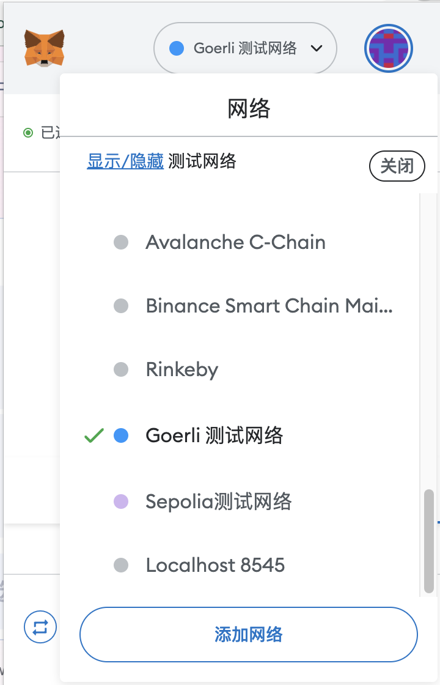
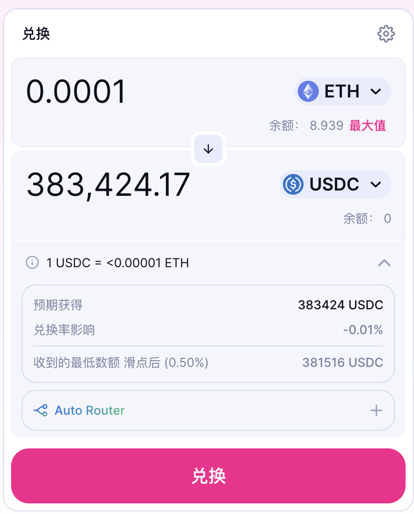
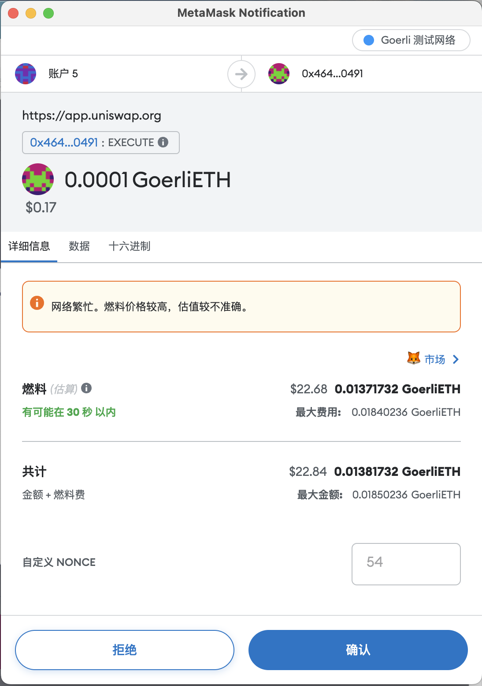
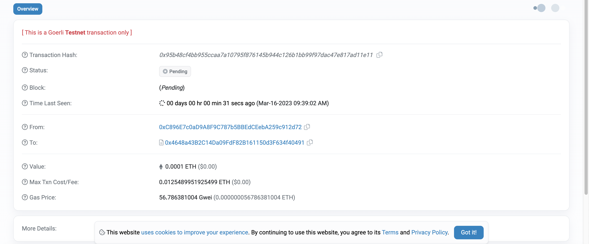
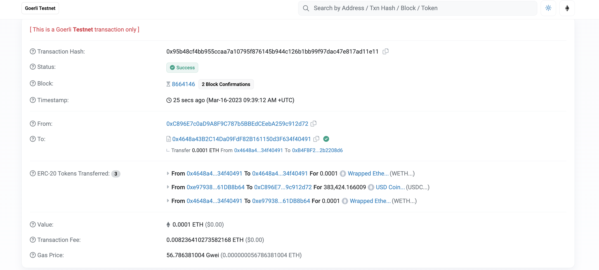

# Use Your First Web3 DApp


> 💡 Teaching yourself `Web3` isn't easy. As someone who recently got started with Web3, I've put together the simplest and most straightforward beginner's tutorial. By integrating quality open-source community resources, I hope to guide everyone from beginner to expert in Web3. Updated 1-3 lessons per week.
>
> Follow me on Twitter: [@bhbtc1337](https://twitter.com/bhbtc1337)
>
>
> Join our WeChat group: [Form Link](https://forms.gle/QMBwL6LwZyQew1tX8)
>
> Articles are open-sourced on GitHub: [Get-Started-with-Web3](https://github.com/beihaili/Get-Started-with-Web3)
>
> Recommended exchange for buying BTC / ETH / USDT: [Binance](https://www.binance.com/en) [Registration Link](https://accounts.marketwebb.me/register?ref=39797374)

## Table of Contents

- [Introduction](#introduction)
- [What Is a DApp?](#what-is-a-dapp)
- [How a DApp Works](#how-a-dapp-works)
- [Use Your First Web3 DApp](#use-your-first-web3-dapp)
- [FAQ](#faq)
- [Summary](#summary)

## Introduction

Remember the delight and wonder of using a mobile app for the very first time? Every new app represented a new world opening up. In the Web3 world, these applications are called "DApps" (Decentralized Applications), and they have a similar transformative power — the potential to fundamentally change how finance, social media, and many other fields operate.

Today, we'll explore how to use your first Web3 DApp! For Web3 newcomers, this will be an important transition from "observer" to "participant." No programming skills required — just a few clicks and you'll be at the heart of this new world.

## What Is a DApp?

DApp stands for `Decentralized Application`. A DApp is a blockchain-based application that doesn't rely on centralized servers but rather on the blockchain network. The execution results of DApps are recorded on the blockchain, and anyone can query the transaction results through the blockchain. DApps have a wide range of use cases, including:

- **Decentralized Finance (DeFi)**: Notable examples include Uniswap, Compound, Aave, Synthetix, MakerDAO, Yearn Finance, Curve Finance, Balancer, and more.
- **Decentralized Social**: Notable examples include Damus, Lens Protocol, and more.
- **NFTs**: Notable examples include OpenSea, Rarible, SuperRare, and more.
- **Other**: Governance, voting — notable examples include Snapshot, Gnosis, and more.

## How a DApp Works

The process of running a DApp is as follows:

1. A developer creates a blockchain wallet and obtains some Ether to pay for transaction fees.
2. The developer writes the DApp's smart contracts using the Solidity programming language.
3. The developer deploys the smart contracts to the Ethereum network using tools such as Remix or Truffle.
4. The developer creates a frontend application to interact with the smart contracts, using frameworks like React or AngularJS.
5. Advanced users and developers can connect the frontend to the Ethereum network through web3 libraries to interact with smart contracts.
6. Regular users interact with smart contracts through the frontend application — submitting transactions or querying data.

For this quick-start guide, we'll only cover step 6 — how regular users interact with smart contracts through the frontend application. Steps 1-5 will be covered in future articles.

## Use Your First Web3 DApp

Here we'll use [Uniswap](https://uniswap.org/) as an example to demonstrate how to use your first Web3 DApp.

1. Open [Uniswap](https://app.uniswap.org/#/swap). In `MetaMask`, select a test network (e.g., `Sepolia`). Click `Connect to a wallet`, select `MetaMask`, and then click `Connect`.

   > ⚠️ **Note**: The screenshots below show the Görli test network, which has since been deprecated. Please use the **Sepolia** test network instead — the workflow is identical.

   <div align="center">  </div>

2. Click `Select a token`, choose `ETH`, then click `Select`. Click `Select a token` again, choose `USDC`, then click `Select`.
   <div align="center">  </div>

3. Enter the amount you want to swap — `0.0001` — then click `Swap`. Click `Confirm Swap`, then click `Swap`.
   <div align="center">  </div>

4. The transaction has now been submitted to the Ethereum network and is waiting to be processed. Click `View on Etherscan`, then click `View`.
   <div align="center">  </div>

5. The transaction was successfully included on-chain. You can look up the transaction result on the [Ethereum block explorer](https://goerli.etherscan.io/).
   <div align="center">  </div>

## 📖 DApp Category Overview

The Web3 world has a vast and diverse array of DApps. Below is a summary of major categories and their representative projects to help you quickly understand the DApp ecosystem.

### 🔑 Major DApp Categories

| Category | Description | Representative Projects | Chains |
|----------|------------|------------------------|--------|
| **DEX (Decentralized Exchange)** | Swap tokens without intermediaries | Uniswap, SushiSwap, Curve, 1inch | Ethereum, L2s |
| **Lending Protocols** | Decentralized lending markets | Aave, Compound, MakerDAO, Morpho | Ethereum, L2s |
| **Liquid Staking** | Stake ETH while receiving liquid tokens | Lido, Rocket Pool, Frax ETH | Ethereum |
| **Yield Aggregators** | Automatically optimize DeFi yields | Yearn Finance, Beefy, Convex | Multi-chain |
| **NFT Marketplaces** | Create and trade digital collectibles | OpenSea, Blur, Magic Eden, Rarible | Ethereum, Solana |
| **GameFi** | Play-to-earn blockchain games | Axie Infinity, StepN, Illuvium, Big Time | Multi-chain |
| **Decentralized Social** | Social platforms where users own their data | Lens Protocol, Farcaster, Nostr | Polygon, Multi-chain |
| **DAO Governance** | Decentralized organization management | Snapshot, Tally, Aragon, Gnosis Safe | Ethereum |
| **Cross-Chain Bridges** | Transfer assets between blockchains | Stargate, Across, Wormhole, LayerZero | Multi-chain |
| **Oracles** | Bring off-chain data on-chain | Chainlink, Pyth Network, API3 | Multi-chain |

### 💡 Core DeFi Protocol Data (Reference)

| Protocol | Type | TVL Scale | Chains Supported | Features |
|----------|------|-----------|-----------------|----------|
| **Lido** | Liquid Staking | $20B+ | 1 | Leading ETH staking protocol |
| **Aave** | Lending | $15B+ | 10+ | Leading multi-chain lending |
| **Uniswap** | DEX | $5B+ | 10+ | Pioneer of the AMM model |
| **MakerDAO** | Stablecoin / Lending | $8B+ | 1 | Issuer of DAI stablecoin |
| **Curve** | Stablecoin DEX | $2B+ | 10+ | Most efficient for stablecoin swaps |

> 💡 **Tip**: TVL (Total Value Locked) is an important metric for measuring the scale of DeFi protocols. You can check real-time TVL rankings at [DefiLlama](https://defillama.com/).

## 📖 Uniswap Hands-On Example

Uniswap is the quintessential DEX (Decentralized Exchange). Once you master Uniswap, you'll be able to use most DEXes.

### 🔑 Detailed Steps

**Step 1: Connect Your Wallet**

1. Visit [app.uniswap.org](https://app.uniswap.org)
2. Click **Connect Wallet** in the top-right corner
3. Select **MetaMask**
4. When the MetaMask popup appears, click **Connect**
5. After connecting, your wallet address will appear in the top-right corner

**Step 2: Select Trading Pair and Network**

1. Click the network selector at the top and make sure you're on the right network
   - Ethereum Mainnet: Higher gas fees, suitable for large trades
   - Arbitrum/Optimism/Base: Low gas fees, suitable for small trades and learning
2. In the **You pay** field, select the token you want to sell (e.g., ETH)
3. In the **You receive** field, select the token you want to buy (e.g., USDC)

**Step 3: Set Transaction Parameters**

1. Enter the amount you want to swap
2. Click the gear icon in the top-right to set **Slippage tolerance**:
   ```
   Slippage setting recommendations:
   - Major tokens (ETH, USDC, etc.): 0.5% is sufficient
   - Medium-liquidity tokens: 1-3%
   - Low-liquidity tokens: 5% or higher (use caution)
   ```
3. Review the transaction details:
   - **Rate**: Exchange rate
   - **Price Impact**: How your trade affects the price (< 1% is normal)
   - **Minimum received**: The minimum amount you'll receive after accounting for slippage
   - **Network fee**: Estimated gas fee

**Step 4: Confirm the Transaction**

1. Click the **Swap** button
2. MetaMask popup shows the transaction details
3. Confirm the gas fee is reasonable, then click **Confirm**
4. Wait for the blockchain to confirm the transaction (typically 15 seconds to a few minutes)
5. Once successful, you can view the transaction in MetaMask or on a block explorer

> ⚠️ **Important**: If this is your first time trading a particular token, Uniswap will first require you to submit an **Approve** (authorization) transaction, allowing the Uniswap contract to use your tokens. This approval transaction also requires gas.

### 🔑 Uniswap Advanced Features

| Feature | Description | Target Users |
|---------|------------|-------------|
| **Swap** | Token exchange | All users |
| **Pool** | Provide liquidity to earn fees | Advanced users |
| **Limit** | Limit order trading | Users with trading experience |
| **Send** | Swap and send directly to another address | Users needing transfers |

## 📖 Aave Lending Hands-On Example

Aave is the largest decentralized lending protocol, allowing you to deposit assets to earn interest or collateralize assets to borrow other tokens.

### 🔑 Core Concepts

| Concept | Description |
|---------|------------|
| **Supply** | Deposit assets into Aave to earn interest |
| **Borrow** | Borrow other tokens after providing collateral |
| **APY (Annual Percentage Yield)** | Annualized interest earned on deposits |
| **APR (Annual Percentage Rate)** | Annualized interest cost on borrowings |
| **Health Factor** | Metric measuring borrowing safety; > 1 is safe |
| **LTV (Loan-to-Value)** | Ratio of borrowable amount to collateral value |
| **Liquidation** | When Health Factor < 1, collateral is forcibly sold |

### 🔑 Deposit Steps

1. Visit [app.aave.com](https://app.aave.com)
2. Connect your MetaMask wallet
3. Select the asset you want to deposit (e.g., ETH)
4. Enter the deposit amount
5. Click **Supply** and confirm the transaction in MetaMask
6. After a successful deposit, you'll receive **aTokens** (e.g., aETH) representing your deposit receipt
7. aTokens automatically appreciate over time, representing your continuously earned interest

### 🔑 Borrowing Steps

1. First complete a deposit (to serve as collateral)
2. Find the asset you want to borrow on the Dashboard
3. Click **Borrow**
4. Select the interest rate mode:
   - **Variable Rate**: Interest rate fluctuates with the market
   - **Stable Rate**: Interest rate is relatively fixed (not supported for all assets)
5. Enter the borrowing amount
6. **Pay close attention to the Health Factor**:
   ```
   Health Factor safe ranges:
   > 2.0  : Very safe
   1.5-2.0: Safe
   1.0-1.5: Caution needed — consider repaying or adding collateral
   < 1.0  : Liquidation triggered! Collateral will be auctioned off
   ```
7. Confirm the transaction and the borrowed funds will arrive

> ⚠️ **Important**: DeFi lending carries liquidation risk! When the value of your collateral drops or the price of the borrowed asset rises, the Health Factor will decrease. If it falls below 1, your collateral will be liquidated, potentially resulting in significant asset loss. We recommend always keeping Health Factor > 1.5 and setting up price alerts.

### 💡 Useful Aave Data Views

- **Deposit APY**: View the deposit interest rate for each asset on the Aave homepage
- **Borrow APR**: Similarly, view borrowing rates on the homepage
- **Your Position**: The Dashboard page shows your deposits, borrowings, and Health Factor
- **Historical Rates**: Check historical rate changes on [Aave's official stats page](https://aave.com/)

## 📖 Understanding Transaction Approval UIs

When performing operations in DApps, MetaMask will pop up a confirmation window. Learning to read this information is crucial.

### 🔑 Key MetaMask Popup Information

```
┌─────────────────────────────────────┐
│         MetaMask Notification        │
│                                     │
│  🦊 metamask.io                     │
│                                     │
│  [DApp Name] requests the following: │
│                                     │
│  ┌─────────────────────────────┐    │
│  │ Contract: 0x1234...5678      │    │ ← Verify this is the official contract
│  │ Function: approve()          │    │ ← Operation type
│  │ Spend limit: 115792...(MAX)  │    │ ← Watch the approval amount!
│  └─────────────────────────────┘    │
│                                     │
│  Estimated Gas: $2.50               │
│  ┌─────────┐  ┌─────────────┐      │
│  │  Reject  │  │   Confirm   │      │
│  └─────────┘  └─────────────┘      │
└─────────────────────────────────────┘
```

### 🔑 Key Items to Check

| Check Item | Description | Risk Level |
|-----------|------------|------------|
| **Request Origin** | Confirm the DApp URL is correct | High |
| **Contract Address** | Compare with the officially published contract address | High |
| **Operation Type** | approve = authorization, transfer = transfer | High |
| **Approval Amount** | Unlimited vs. exact amount | Medium |
| **Gas Fee** | Is it reasonable? Abnormally high gas may indicate a problem | Medium |
| **Recipient Address** | Confirm the receiving address is correct when transferring | High |

### 🔑 Common Transaction Types Explained

| MetaMask Display | Meaning | Notes |
|-----------------|---------|-------|
| **Approve** | Authorize a DApp to use your tokens | Recommend setting an exact amount, not unlimited |
| **Transfer** | Direct token transfer | Verify receiving address and amount |
| **Swap** | Token exchange | Check slippage settings and minimum received |
| **Supply/Deposit** | Deposit assets into a protocol | Verify the protocol's contract address |
| **Borrow** | Borrow from a protocol | Watch the Health Factor |
| **Claim** | Claim rewards | Ensure it's the official claim page |

> ⚠️ **Important**: If the gas fee in the MetaMask popup is abnormally high (tens of times higher than usual), **do not confirm**! This could mean the transaction will fail but still consume gas, or that you're interacting with a malicious contract.

## 📖 Gas Fee Optimization Tips

Gas fees are one of the biggest costs when using Ethereum DApps. Learning to optimize gas can save you significant money.

### 🔑 Understanding Gas Fee Components

```
Ethereum Gas Fee = Gas Used × (Base Fee + Priority Fee)

- Gas Used: Computational work consumed by the transaction (determined by transaction complexity)
- Base Fee: Base rate (automatically adjusted based on network congestion)
- Priority Fee: Tip (extra reward for validators, affects confirmation speed)
```

### 🔑 Gas Fee Optimization Strategies

| Strategy | Savings | Difficulty | Description |
|----------|---------|-----------|-------------|
| **Choose off-peak hours** | 30-70% | Easy | UTC early morning (Asian morning) rates are usually lowest |
| **Use L2 networks** | 90-99% | Easy | Arbitrum, Optimism, Base, etc. |
| **Batch operations** | 20-40% | Medium | Combine multiple operations into one transaction |
| **Set exact approvals** | Indirect savings | Easy | Avoids future need to revoke unlimited approvals |
| **Gas Tokens** | 10-20% | Advanced | Store gas when low, consume when high |

### 🔑 Ethereum L2 Gas Fee Comparison

| Network | Simple Transfer | Swap Cost | Confirmation Time | Security |
|---------|----------------|-----------|-------------------|----------|
| **Ethereum L1** | $1-50 | $5-100+ | ~12 sec | Highest |
| **Arbitrum** | $0.01-0.5 | $0.05-1 | ~1 sec | High (Optimistic Rollup) |
| **Optimism** | $0.01-0.5 | $0.05-1 | ~2 sec | High (Optimistic Rollup) |
| **Base** | $0.001-0.1 | $0.01-0.5 | ~2 sec | High (Optimistic Rollup) |
| **zkSync Era** | $0.01-0.3 | $0.05-0.5 | ~5 min | High (ZK Rollup) |
| **Polygon** | $0.001-0.01 | $0.01-0.05 | ~2 sec | Medium (Sidechain) |

> 💡 **Tip**: If you're a beginner learning DApp operations, we strongly recommend practicing on an L2 network (such as Arbitrum or Base) first. Gas fees are usually just a few cents, so even if you make a mistake, the loss is minimal. You can transfer ETH from L1 to L2 using the official bridge or third-party bridges (like Stargate).

### 🔑 Real-Time Gas Fee Tools

- **ETH Gas Station**: [ethgasstation.info](https://ethgasstation.info/) — Real-time Ethereum gas fee monitoring
- **Blocknative Gas Estimator**: Browser extension that shows gas fees in real time
- **Ultrasound.money**: [ultrasound.money](https://ultrasound.money/) — Ethereum burn and gas data

## 📖 DApp Security Considerations

The DApp world is full of opportunities but also full of risks. Here's the essential knowledge to keep yourself safe.

### 🔑 Security Checklist Before Using a DApp

| Check Item | How to Verify | Importance |
|-----------|--------------|-----------|
| **Smart contract audited** | Check the project's Audit report on their website | Critical |
| **Project is open-source** | View source code on GitHub | High |
| **TVL and user count** | Check data on DefiLlama | High |
| **Project age** | Longer operation = more battle-tested | Medium |
| **Community reputation** | Twitter, Discord community activity | Medium |
| **Insurance coverage** | Covered by insurance protocols like Nexus Mutual | Medium |

### 🔑 Token Approval Management

When you use DApps, you typically need to authorize (Approve) the DApp contract to use your tokens. **Unlimited approvals are one of the biggest security risks**.

**Managing approvals with revoke.cash**:

1. Visit [revoke.cash](https://revoke.cash/)
2. Connect your wallet
3. View all authorized contracts
4. For DApps you no longer use, click **Revoke**
5. Confirm the revocation transaction in MetaMask

**Approval management best practices**:

```
Recommended:
✅ Only approve the exact amount needed for each transaction
✅ Check your approval list monthly
✅ Immediately revoke approvals for DApps you no longer use
✅ Keep large holdings in a wallet that doesn't interact with DApps

Not recommended:
❌ Granting unlimited approval to all DApps
❌ Never checking your approval status
❌ Using your main wallet for high-risk DApp interactions
```

### 🔑 Common Phishing Tactics and Prevention

| Phishing Tactic | How It Appears | Prevention |
|----------------|---------------|------------|
| **Fake websites** | Domain very similar to the official site | Type URLs manually or use bookmarks |
| **Malicious airdrops** | Unknown tokens appear in your wallet | Don't try to sell unknown tokens |
| **Fake support agents** | "Support" DMs you on Discord/Telegram | Official support never DMs first |
| **Fraudulent contracts** | Contract address differs from the official one | Get contract addresses from official channels |
| **Signature phishing** | Asks you to sign seemingly harmless messages | Read signing content carefully |
| **Permit phishing** | Exploits the ERC-20 Permit function | Don't sign permits on untrusted websites |

> ⚠️ **Important**: In the Web3 world, **you are the sole person responsible for your asset security**. No bank customer service will help you recover stolen assets, and there's no "forgot password" button to click. Building good security habits is essential for long-term survival in Web3.

### 💡 Security Tips for Beginners

1. **Multi-wallet strategy**:
   - **Hot wallet**: Small funds for daily DApp interactions
   - **Cold wallet**: Large funds, rarely interacts with DApps
2. **Test with small amounts first**: Try any new DApp with a small amount first
3. **Stay skeptical**: If a project promises "risk-free high returns," it's 99% a scam
4. **Follow security news**: Follow [rekt.news](https://rekt.news/) for the latest security incidents
5. **Learn the fundamentals**: Understanding the basics of smart contracts helps identify risks

## FAQ

#### ❓ What's the main difference between a decentralized application (DApp) and a traditional app?

The main differences between DApps and traditional apps are:

1. **Storage**: DApp code and data are stored on a distributed blockchain, not centralized servers.
2. **Control**: No single entity can shut down or control a DApp, since it runs on a decentralized network.
3. **Transparency**: DApp code and interactions are fully open and transparent — anyone can inspect them.
4. **Fees**: Using DApps typically requires paying small amounts of cryptocurrency as gas fees.

#### ❓ Why is Uniswap considered an important DApp in the Web3 space?

Uniswap is considered an important Web3 DApp because:

1. It was the first decentralized exchange to successfully implement the Automated Market Maker (AMM) model.
2. It has no order book — pricing and trading are done entirely through liquidity pools.
3. Anyone can permissionlessly add tokens and provide liquidity.
4. It spearheaded the development of DeFi (Decentralized Finance) as a major sector.

#### ❓ Do the tokens I use on testnet DApps have real value?

Testnet tokens typically have no real value since they were created solely for testing purposes. Most testnet assets are entirely valueless and exist only for development and learning purposes.

## Summary

Today, you've taken an important step in your Web3 journey — you used your first decentralized application! Think about it: you just completed a cryptocurrency swap without any intermediary. This isn't just a simple operation — it's a small revolution against the traditional financial system.

Look forward to learning about and experimenting with more DApps! In the next article, we'll introduce more useful Web3 websites to help you explore this exciting new world further. Traditional finance has built walls and gates, but blockchain tears down these barriers, putting true financial freedom in your own hands.

Congratulations — you can now participate as a user in virtually any blockchain DApp! 🎉🎉🎉

---

<div align="center">
<a href="https://github.com/beihaili/Get-Started-with-Web3">🏠 Back to Home</a> |
<a href="https://twitter.com/bhbtc1337">🐦 Follow the Author</a> |
<a href="https://forms.gle/QMBwL6LwZyQew1tX8">📝 Join the Community</a>
</div>
