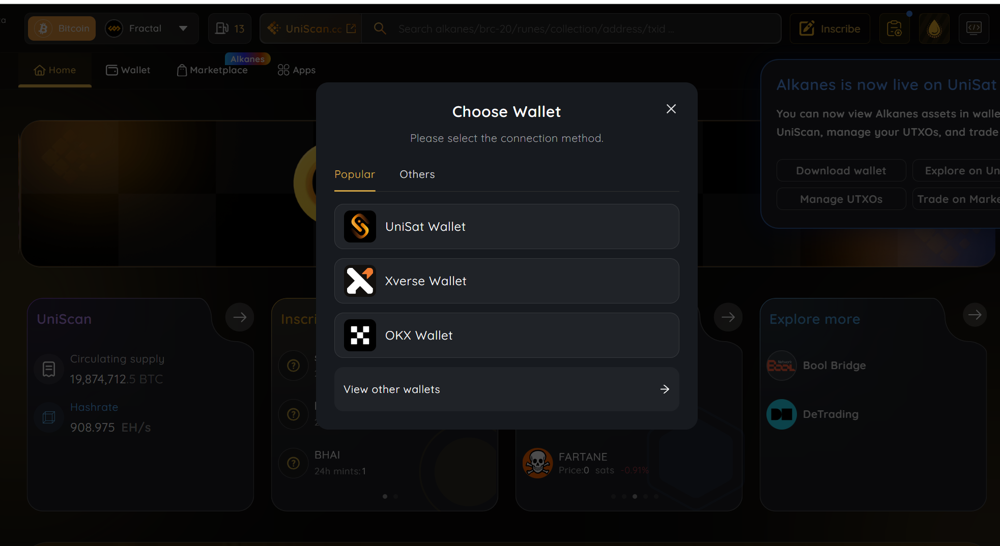

# 第 15 讲：比特币钱包


> 💡 自学入门 `Web3` 不是一件容易的事，作为一个刚刚入门 Web3 的新人，梳理一下最简单直观的 `Web3` 小白入门教程。整合开源社区优质资源，为大家从入门到精通 Web3 指路。每周更新 1-3 讲。
> 
> 欢迎关注我的推特：[@bhbtc1337](https://twitter.com/bhbtc1337)
> 
> 进入微信交流群请填表：[表格链接](https://forms.gle/QMBwL6LwZyQew1tX8)
> 
> 文章开源在 GitHub：[Get-Started-with-Web3](https://github.com/beihaili/Get-Started-with-Web3)
> 
> 购买 BTC / ETH / USDT 等加密货币推荐 [币安](https://www.binance.com/zh-CN)[注册链接](https://accounts.marketwebb.me/register?ref=39797374)

## 目录

- [前言](# 前言)
- [比特币钱包基本概念](# 比特币钱包基本概念)
- [创建自己的比特币钱包](# 创建自己的比特币钱包)
- [常见问题](# 常见问题)
- [结语](# 结语)

## 前言

当进入加密货币世界时，拥有一个安全可靠的比特币钱包是你的第一道门槛。就像你不会把现金随意放在街头一样，你的加密资产同样需要一个安全的「容器」来存储和管理。

区块链的世界被形容为一片黑暗森林，每个参与者都需要学会保护自己的财产安全，因为这里没有人会为你负责。和《三体》中的黑暗森林法则类似，区块链世界里，保护好自己的私钥，藏得越深越安全，切记 `Not Your Key, Not Your Coin` 。 

对于初学者而言，你可能需要一些时间来适应这个世界的规则 —— 例如，当你丢失钱包密码时，这里没有「找回密码」的按钮 😂 。在这一节中，我们将一起探讨比特币钱包的核心概念，不同类型的钱包及其利弊，以及如何一步步创建属于你自己的第一个比特币钱包。

## 比特币钱包基本概念

### 什么是比特币钱包

比特币钱包是用于存储和管理比特币私钥的工具。比特币钱包并不直接存储比特币，而是存储一组密钥对（私钥和公钥）。私钥用来签署交易，而公钥通过加密算法生成比特币地址，用于接收比特币。钱包是用户与比特币网络互动的桥梁，它允许你接收、发送和管理比特币资产。

### 比特币钱包的种类

比特币钱包可以从以下两个维度来进行分类：

#### 根据是否触网分类

1. ** 热钱包 **：热钱包连接互联网，适合日常使用和交易。这类钱包包括浏览器插件钱包、手机钱包和桌面钱包。由于热钱包始终在线，它们容易受到网络攻击，因此安全性较低。

2. ** 冷钱包 **：冷钱包不连接互联网，适合长期存储比特币。包括硬件钱包和纸钱包等。冷钱包因为不联网，安全性更高，但使用起来不如热钱包方便。

#### 根据验证方式分类

1. ** 全节点钱包 **：全节点钱包是运行完整的比特币区块链节点的软件，它不仅管理私钥，还直接与比特币网络同步所有区块数据。全节点钱包提供最高级别的安全性和隐私性，但需要大量的存储空间和网络带宽。

2. ** 轻量级钱包 **：轻量级钱包不下载整个区块链数据，而是依赖第三方节点进行交易验证。虽然这些钱包更轻便，适合移动设备使用，但安全性和隐私性略低于全节点钱包。

### 比特币钱包的用途

比特币钱包的主要用途包括：

1. ** 存储比特币 **：钱包用来安全存储比特币的私钥，确保你的比特币资产只有你能控制。

2. ** 接收和发送比特币 **：钱包生成的比特币地址可以用来接收比特币，你也可以使用钱包发送比特币给其他人。

3. ** 管理资产 **：钱包提供的界面和工具可以帮助你查看余额、交易记录以及管理多种加密货币资产。

## 手把手教你创建一个比特币钱包

### 浏览器插件钱包

浏览器插件钱包是最方便的热钱包之一，非常适合日常使用。以下是创建浏览器插件钱包的步骤：

1. ** 选择钱包插件 **：推荐使用广泛使用和开源的钱包插件，如 [UniSat](https://unisat.io/) 。首页如下所示：
<div align="center">  </div>

2. ** 安装插件 **：访问插件的官方网站，按照提示将其安装到浏览器中。首页上点击右上角的 connect ，会让你选择连接一个钱包，选择 UniSat Wallet ，或者直接选择首页中的 wallet 选项下载，是一样的效果。
<div align="center">  </div>
  点击第四项下载浏览器扩展程序：
<div align="center">  </div>
  点击右上角的添加至 Chrome ：
<div align="center">  </div>
  耐心等待下载和安装：
<div align="center">  </div>

3. ** 创建新钱包 **：安装后，运行插件会弹窗提示：
<div align="center">  </div>
  打开插件并选择「创建新钱包」。根据提示设置一个强密码，并妥善保存钱包的助记词。创建钱包后会让你设置一个密码，这个密码是用来在这个机器上查询私钥的。

4. ** 备份助记词 **：助记词是恢复钱包的唯一途径，必须妥善保管，确保其不会丢失或泄露。备份完成助记词之后，第二步会让你选择钱包地址：
<div align="center">  </div>
  不同的地址应对不同的使用场景，交易手续费也不同。可以先选择默认的第一个地址类型，交易费用较低。但是对于一些特殊的场景，如 Ordinals 协议类型的交易，需要使用 Taproot 地址，这个后续可以在钱包设置中灵活修改。

5. ** 开始使用 **：创建完成后，你可以使用钱包生成比特币地址，接收和发送比特币。
<div align="center">  </div>

### 旧手机自制冷钱包

旧手机可以被用来制作一个高安全性的冷钱包，用于长期存储比特币。

1. ** 准备工作 **：找到一部旧手机，并将其恢复出厂设置，确保没有恶意软件。（选做）物理损坏旧手机的信号接收和发送模块。

2. ** 安装钱包应用 **：在手机上安装一个支持离线使用的钱包应用，如 [比太钱包](https://www.bitcoin.com/zh-cn/btc-wallet/) 。

3. ** 断开网络 **：在安装完钱包应用后，断开手机的网络连接 (Wi-Fi 和移动数据)。

4. ** 创建冷钱包 **：打开钱包应用，选择「创建新钱包」，确保生成的私钥随机，生成钱包助记词。

5. ** 重点：备份助记词 **：将助记词抄写两份，加上冷钱包手机一共形成三份备份，分别放在不同的地方，注意防水防止字迹变淡消失。（这里的三份是经验之谈，能够比较好的平衡丢失和被人盗窃）。

6. ** 转移比特币 **：使用热钱包发送比特币到冷钱包的地址，并确保冷钱包的私钥不与网络连接。

7. ** 离线存储 **：将手机关机，并安全存放在一个防火、防水的地方，作为离线冷钱包。

### 全节点钱包

全节点钱包适合那些希望完全控制自己的比特币交易和隐私的用户。

1. ** 安装 Bitcoin Core**：访问 Bitcoin Core 官方网站，下载并安装全节点钱包软件。

2. ** 初次同步 **：启动 Bitcoin Core ，软件会开始下载整个比特币区块链数据。这可能需要数天时间和数百 GB 的存储空间。

3. ** 创建钱包 **：在 Bitcoin Core 完成初次同步后，选择「文件」菜单中的「创建钱包」选项。为新钱包设置名称，并根据需要选择是否加密。

4. ** 备份钱包 **：在「文件」菜单中选择「备份钱包」，将钱包文件保存到安全的地方。确保备份副本离线存储，防止丢失。

5. ** 管理比特币 **：你现在可以使用全节点钱包生成地址、接收比特币、发送比特币，并参与比特币网络的共识。

通过这几个步骤，你可以创建一个适合自己需求的比特币钱包，无论是用于日常交易还是长期存储比特币资产。选择适合的工具并了解其使用方法，是保障数字资产安全的重要一步。

## 📖 钱包类型对比表

选择合适的钱包是保护你比特币资产的第一步。下面这张表从多个维度对比了常见的钱包类型，帮助你做出最适合自己的选择。

| 钱包类型 | 安全性 | 便利性 | 成本 | 适用场景 | 代表产品 | 优点 | 缺点 |
|----------|--------|--------|------|----------|----------|------|------|
| ** 浏览器插件钱包 ** | ★★☆☆☆ | ★★★★★ | 免费 | 日常交易、DApp 交互 | UniSat, MetaMask | 使用方便，支持 DApp | 易受网络攻击、钓鱼风险高 |
| ** 手机钱包 ** | ★★★☆☆ | ★★★★☆ | 免费 | 日常支付、小额存储 | Blue Wallet, Muun | 移动端便携 | 手机丢失 / 被盗风险 |
| ** 桌面钱包 ** | ★★★☆☆ | ★★★☆☆ | 免费 | 中等金额管理 | Sparrow, Electrum | 功能丰富、支持高级操作 | 需要安全的操作系统环境 |
| ** 硬件钱包 ** | ★★★★★ | ★★☆☆☆ | $60-$250 | 大额长期存储 | Ledger, Trezor, Coldcard | 私钥离线隔离 | 需购买设备、操作门槛较高 |
| ** 纸钱包 ** | ★★★★☆ | ★☆☆☆☆ | 免费 | 长期冷存储 | 自行生成 | 完全离线、成本为零 | 容易物理损坏、不便交易 |
| ** 脑钱包 ** | ★☆☆☆☆ | ★☆☆☆☆ | 免费 | 不推荐使用 | 无 | 无需物理存储 | 极易被暴力破解、安全性极低 |
| ** 全节点钱包 ** | ★★★★★ | ★★☆☆☆ | 免费（需硬盘空间） | 高隐私需求、验证交易 | Bitcoin Core | 最高隐私和安全性 | 需要数百 GB 存储和同步时间 |
| ** 多签钱包 ** | ★★★★★ | ★★☆☆☆ | 免费 / 付费 | 大额资产、机构管理 | Sparrow (多签), Nunchuk | 多方验证、防单点故障 | 配置复杂、需要多个签名设备 |

> 💡 ** 小贴士 **：对于初学者，推荐从手机钱包（如 Blue Wallet）开始，小额学习操作流程。当持有金额增大后，务必升级到硬件钱包。大额资产建议使用多签方案。

## 📖 HD 钱包派生路径详解

现代比特币钱包大多采用 **HD 钱包 **（Hierarchical Deterministic Wallet，分层确定性钱包）架构。一个助记词可以派生出无限多个地址，背后的技术标准就是 BIP32/BIP44/BIP84/BIP86。

### 🔑 什么是 HD 钱包

HD 钱包通过一个 ** 主种子 **（由助记词生成）按照树状结构派生出无数个子密钥对。这意味着：

- ** 一组助记词 = 无限个地址 **：不需要为每个地址单独备份
- ** 确定性 **：相同的助记词在任何兼容钱包中都会生成完全相同的地址集
- ** 隐私性 **：可以为每笔交易使用新地址，增加隐私性

### 🔑 BIP 标准详解

| BIP 标准 | 名称 | 用途 | 地址前缀 | 路径格式 |
|----------|------|------|----------|----------|
| **BIP32** | 分层确定性钱包 | 定义了从种子派生密钥的树状结构 | - | `m / 子路径` |
| **BIP39** | 助记词标准 | 将随机数编码为人类可读的单词序列 | - | - |
| **BIP44** | 多币种多账户 | 传统地址（Legacy）的派生路径标准 | `1...` | `m/44'/0'/0'/0/0` |
| **BIP49** | 兼容隔离见证 | 兼容 SegWit 地址（P2SH-P2WPKH） | `3...` | `m/49'/0'/0'/0/0` |
| **BIP84** | 原生隔离见证 | 原生 SegWit 地址（bech32） | `bc1q...` | `m/84'/0'/0'/0/0` |
| **BIP86** | Taproot | Taproot 地址（bech32m） | `bc1p...` | `m/86'/0'/0'/0/0` |

### 💡 派生路径结构解读

以路径 `m/84'/0'/0'/0/0` 为例：

```
m / 84' / 0' / 0' / 0 / 0
│    │     │     │    │   │
│    │     │     │    │   └── 地址索引（第 1 个地址）
│    │     │     │    └────── 0 = 外部链（收款）, 1 = 内部链（找零）
│    │     │     └─────────── 账户索引（第 1 个账户）
│    │     └───────────────── 币种（0 = 比特币，60 = 以太坊）
│    └─────────────────────── BIP 标准号（84 = 原生 SegWit）
└──────────────────────────── 主密钥（master）
```

> 💡 ** 小贴士 **：路径中的 `'`（撇号）表示「硬化派生」（Hardened Derivation），意味着该层级的子密钥无法从公钥推导出来，提高了安全性。

### 🔑 常见派生路径示例

```
# Legacy 地址（P2PKH）- 以 1 开头
m/44'/0'/0'/0/0  →  1BvBMSEYstWetqTFn5Au4m4GFg7xJaNVN2
m/44'/0'/0'/0/1  →  1JvF1TGAXHQnMqr4jGqK7Npt7qc8FVcaYz

# 兼容 SegWit 地址（P2SH-P2WPKH）- 以 3 开头
m/49'/0'/0'/0/0  →  3J98t1WpEZ73CNmQviecrnyiWrnqRhWNLy

# 原生 SegWit 地址（bech32）- 以 bc1q 开头（推荐）
m/84'/0'/0'/0/0  →  bc1qw508d6qejxtdg4y5r3zarvary0c5xw7kv8f3t4

# Taproot 地址（bech32m）- 以 bc1p 开头（最新）
m/86'/0'/0'/0/0  →  bc1p5d7rjq7g6rdk2yhzks9smlaqtedr4dekq08ge8ztwac72sfr9rusxg3297
```

> ⚠️ ** 重要提示 **：不同地址类型的手续费不同。原生 SegWit（bc1q）地址的交易费用比 Legacy（1 开头）地址低约 30-40%，Taproot（bc1p）地址在某些场景下费用更低。推荐优先使用 bc1q 或 bc1p 地址。

## 📖 各主流钱包实操步骤

### 🔑 Sparrow Wallet（桌面钱包）

Sparrow Wallet 是一款功能强大的比特币桌面钱包，支持 PSBT、多签、硬件钱包连接等高级功能。

** 安装步骤：**

1. 访问 [Sparrow Wallet 官网](https://sparrowwallet.com/) 下载对应操作系统的安装包
2. ** 验证下载文件签名 **（重要！防止供应链攻击）：
   ```bash
   # 导入开发者 GPG 公钥
   gpg --keyserver keyserver.ubuntu.com --recv-keys D4D0D3202FC06849A257B38DE94618334C674B40
   # 验证签名
   gpg --verify sparrow-1.9.1-manifest.txt.asc sparrow-1.9.1-manifest.txt
   ```
3. 安装并打开 Sparrow Wallet
4. 选择 **New Wallet** 创建新钱包
5. 选择钱包类型：
   - **Single Sig**：单签名（适合个人使用）
   - **Multi Sig**：多签名（适合大额资产）
6. 选择脚本类型（推荐 **Native SegWit (P2WPKH)**）
7. 点击 **New or Imported Software Wallet**
8. 记录 24 个助记词，并妥善备份
9. 设置钱包密码并完成创建

### 🔑 Blue Wallet（手机钱包）

Blue Wallet 是一款开源的比特币手机钱包，支持 iOS 和 Android，并内置闪电网络功能。

** 安装步骤：**

1. 在 App Store 或 Google Play 搜索 **Blue Wallet** 并下载
2. 打开应用，点击 **Add a wallet**（添加钱包）
3. 输入钱包名称
4. 选择钱包类型：
   - **Bitcoin**：链上比特币钱包
   - **Lightning**：闪电网络钱包（小额快速支付）
5. 点击 **Create**（创建）
6. ** 备份助记词 **：应用会显示 12 个英文单词，务必手写记录
7. 完成验证后即可开始使用

### 🔑 Ledger 硬件钱包

Ledger 是目前最流行的硬件钱包之一，通过物理设备隔离私钥，提供最高级别的安全性。

** 设置步骤：**

1. 从 [Ledger 官网](https://www.ledger.com/) 购买设备（切勿在非官方渠道购买！）
2. 下载并安装 **Ledger Live** 桌面应用
3. 用 USB 线连接 Ledger 设备到电脑
4. 在设备上选择 **Set up as new device**
5. 设置 4-8 位 **PIN 码 **
6. 设备会生成并显示 **24 个助记词 **：
   - 在 Ledger 提供的恢复卡上逐一抄写
   - ** 永远不要在任何电子设备上输入或拍照！**
7. 完成助记词验证
8. 在 Ledger Live 中安装 **Bitcoin App**
9. 添加比特币账户，选择地址类型（推荐 Native SegWit）
10. 生成收款地址，开始使用

> ⚠️ ** 重要提示 **：购买硬件钱包务必从官方渠道！二手或非官方渠道的设备可能已被植入恶意固件，导致私钥被窃取。收到设备后，确认包装完好且设备处于未初始化状态。

## 📖 钱包安全最佳实践

安全是比特币存储的第一要务。以下是经过实践验证的安全策略。

### 🔑 助记词备份策略

| 备份方式 | 安全性 | 持久性 | 推荐度 | 说明 |
|----------|--------|--------|--------|------|
| 纸质抄写 | ★★★☆☆ | ★★☆☆☆ | 适中 | 注意防水防火，字迹可能褪色 |
| 金属助记词板 | ★★★★★ | ★★★★★ | 强烈推荐 | 可抗火灾、水灾，如 Cryptosteel、Billfodl |
| 密码管理器 | ★★★☆☆ | ★★★★☆ | 适中 | 如 1Password，需信任服务商 |
| 加密 U 盘 | ★★★☆☆ | ★★★☆☆ | 适中 | 电子存储设备可能损坏 |
| 分片存储（Shamir） | ★★★★★ | ★★★★☆ | 推荐 | 将助记词分成多份，任意 N 份可恢复 |

** 核心原则：**

- ** 至少两份备份 **，存放在不同的物理位置
- ** 永远不要 ** 将助记词以明文形式存储在联网设备上
- ** 永远不要 ** 拍照或截图助记词
- ** 永远不要 ** 通过邮件、微信等方式发送助记词
- ** 定期检查 ** 备份是否完好可读

### 🔑 多签（Multi-Sig）方案

多签方案要求多把私钥中的指定数量共同签名才能发起交易，大幅提升安全性：

```
常见多签方案：
- 2-of-3：3 把密钥中需要 2 把签名（推荐个人使用）
- 3-of-5：5 把密钥中需要 3 把签名（推荐机构使用）
```

**2-of-3 多签示例布局：**

- ** 密钥 1**：家中的硬件钱包（如 Ledger）
- ** 密钥 2**：保险箱中的另一个硬件钱包（如 Coldcard）
- ** 密钥 3**：可信亲属处的助记词备份

这样即使任何一把密钥丢失或被盗，资产依然安全。

### 🔑 继承规划

比特币资产的继承是一个常被忽视但极为重要的话题：

1. ** 建立继承文件 **：记录钱包类型、使用的 BIP 标准、大致金额范围（不含助记词）
2. ** 信任的执行者 **：指定一位可信人员了解你有加密货币资产
3. ** 分层信息 **：
   - 律师处：密封信件说明加密资产的存在和大致操作流程
   - 保险箱 / 信任人：助记词备份或多签密钥之一
4. ** 定期更新 **：至少每年检查一次继承安排是否依然有效
5. ** 考虑使用时间锁 **：高级用户可以利用比特币脚本设置时间锁交易，在一段时间不活动后自动将资产转移到指定地址

> 💡 ** 小贴士 **：据 Chainalysis 估计，约有 370 万枚比特币可能已永久丢失。做好继承规划不仅是对家人负责，也是对自己负责。

## 📖 常见钱包问题排查

### ❓ 导入助记词后地址不一样怎么办？

这是最常见的问题之一，通常原因包括：

1. ** 派生路径不同 **：不同钱包可能默认使用不同的 BIP 标准
   - 检查原钱包使用的是 BIP44（Legacy）、BIP49（兼容 SegWit）还是 BIP84（原生 SegWit）
   - 在新钱包中选择对应的派生路径
2. ** 密码短语（Passphrase）**：如果原钱包设置了额外的密码短语（第 25 个词），导入时也需要输入
3. ** 助记词标准不同 **：少数钱包使用非 BIP39 标准的助记词

** 解决步骤 **：

```
1. 确认原钱包的地址类型（查看地址前缀：1...、3...、bc1q...、bc1p...）
2. 在新钱包中选择匹配的地址类型
3. 如果仍不匹配，尝试切换不同的 BIP 标准
4. 检查是否遗漏了 Passphrase
```

### ❓ 钱包显示余额为零但链上有币？

可能原因：

1. ** 同步未完成 **：等待钱包完成区块链同步
2. ** 连接的节点有问题 **：尝试切换到其他节点或使用不同的服务器
3. ** 查看的地址类型错误 **：检查钱包中是否显示了所有地址类型的余额
4. ** 钱包索引范围 **：HD 钱包默认只扫描前 20 个地址，如果你的比特币在更后面的地址上，需要调大扫描范围（gap limit）

### ❓ 交易一直未确认怎么办？

1. ** 检查费率 **：在 [mempool.space](https://mempool.space/) 查看当前推荐费率
2. ** 使用 RBF**：如果发送时启用了 RBF（Replace-By-Fee），可以用更高费率重新广播
3. ** 使用 CPFP**：创建一笔新交易花费未确认交易的找零输出，附带更高手续费
4. ** 等待 **：如果费率合理，网络不拥堵时交易最终会被确认
5. ** 交易会过期吗 **：默认情况下，未确认的交易在 14 天后会从大多数节点的内存池中清除

### ❓ 硬件钱包显示固件更新，是否应该更新？

1. ** 务必从官方渠道确认 ** 更新信息，不要点击邮件或网页中的更新链接
2. ** 更新前确认助记词备份 ** 完好可用
3. ** 查看更新日志 **，了解更新内容是否包含安全修复
4. ** 在安全环境下更新 **，使用官方软件（如 Ledger Live）执行更新
5. 更新后 ** 验证钱包地址 ** 是否与之前一致

### ❓ 我应该使用一个钱包还是多个钱包？

建议采用 ** 分层策略 **：

| 用途 | 推荐钱包类型 | 存放金额比例 |
|------|-------------|-------------|
| 日常交易 | 手机钱包 / 浏览器插件钱包 | 5-10% |
| 中等金额 | 桌面钱包 / 单签硬件钱包 | 20-30% |
| 长期储存 | 多签硬件钱包方案 | 60-75% |

> 💡 ** 小贴士 **：不要把所有鸡蛋放在一个篮子里。将资产分散在不同类型的钱包中，既能保证日常使用的便利性，又能确保大部分资产的安全。

## 常见问题

#### ❓ 热钱包和冷钱包有什么区别？

热钱包和冷钱包的主要区别在于：

1. ** 网络连接 **：热钱包保持与互联网连接，冷钱包完全离线、不连接网络。
2. ** 安全性 **：冷钱包安全性更高，因为不存在网络攻击风险；热钱包更容易受到黑客攻击。
3. ** 使用便利性 **：热钱包使用更便捷，可以随时进行交易；冷钱包需要额外的步骤才能发送交易。
4. ** 应用场景 **：热钱包适合日常交易和小额资金；冷钱包适合长期存储和大额资产。

#### ❓ 助记词是什么，为什么这么重要？

助记词是一组用来生成和恢复钱包私钥的普通单词。其重要性在于：

1. ** 私钥恢复 **：如果你的设备丢失或损坏，助记词是恢复钱包访问权的唯一方式。
2. ** 跨平台兼容 **：助记词可以在不同的钱包软件之间共用，方便迁移。
3. ** 人类可读 **：比起复杂的私钥字符串，单词更容易记录和存储。

如果助记词丢失，就相当于永久失去了钱包中的所有资产访问权。

#### ❓ 作为初学者我应该选择什么类型的钱包？

作为初学者，你可以考虑以下选择：

1. ** 开始时 **：选用像 UniSat 这样的浏览器扩展钱包或手机应用钱包，操作相对简单。
2. ** 小额资产 **：对于小额比特币，热钱包是合适的。
3. ** 积累经验后 **：随着资产增长，添加冷钱包来存储大部分资产。

## 结语

创建和管理比特币钱包是每一个 Web3 探索者的基础技能。当你掌握了不同类型钱包的特点和用途后，你将能够根据自身需求做出明智的选择，并安全地管理你的加密资产。

记住，在加密货币世界里，安全不是一个可选项而是必须项。每个人都要为自己的资产安全负责，这就是「Not Your Keys, Not Your Coins」所传达的核心理念。

你的加密货币之旅已经开始，希望你能在这个充满刺激和机会的领域中找到自己的路径。记住，万事开头难，当你走得足够远，回头看看，会发现自己比想象中进步更多。

---

<div align="center">
<a href="https://github.com/beihaili/Get-Started-with-Web3">🏠 返回主页 </a> | 
<a href="https://twitter.com/bhbtc1337">🐦 关注作者 </a> | 
<a href="https://forms.gle/QMBwL6LwZyQew1tX8">📝 加入交流群 </a>
</div>
