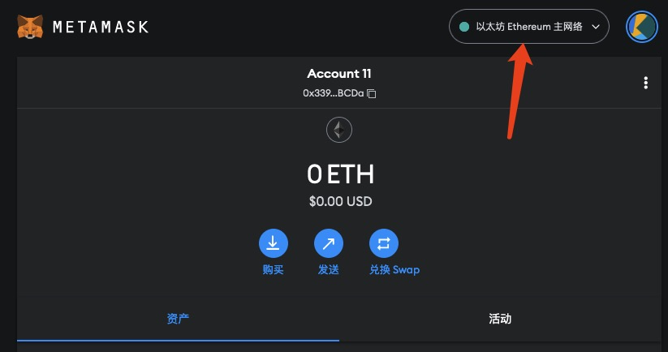

# 发送第一笔 Web3 交易

> 💡 自学入门 `Web3` 不是一件容易的事，作为一个刚刚入门 Web3 的新人，梳理一下最简单直观的 `Web3` 小白入门教程。整合开源社区优质资源，为大家从入门到精通 Web3 指路。每周更新 1-3 讲。
> 
> 欢迎关注我的推特：[@bhbtc1337](https://twitter.com/bhbtc1337)
> 
> 
> 进入微信交流群请填表：[表格链接](https://forms.gle/QMBwL6LwZyQew1tX8)
> 
> 文章开源在 GitHub：[Get-Started-with-Web3](https://github.com/beihaili/Get-Started-with-Web3)
> 
> 购买 BTC / ETH / USDT 等加密货币推荐 [币安](https://www.binance.com/zh-CN)[注册链接](https://accounts.marketwebb.me/register?ref=39797374)

## 目录

- [前言](# 前言)
- [交易是什么](# 交易是什么)
- [0 成本在测试网上发出第一笔交易](#0 - 成本在测试网上发出第一笔交易)
- [（选做）在主网上发出第一笔交易](# 选做在主网上发出第一笔交易)
- [常见问题](# 常见问题)
- [总结](# 总结)

## 前言

还记得第一次用手机转账给朋友的经历吗？那种成功完成操作的成就感是始终让人难忘的。今天，我们将在 Web3 世界中体验更加有意义的一步 —— 第一笔区块链交易。

与传统银行交易不同，Web3 交易不需要任何中间人，不需要等待周末或者节假日，更不需要担心国际汇款的高额手续费。今天，我将一步步带你完成你人生中第一笔 Web3 交易，体验区块链技术带来的全新金融可能性！

## 交易是什么

交易是一种在区块链上执行的动作，它可以是一次转账，也可以是一次合约调用。交易的执行需要消耗一定的 Gas，Gas 是用户为了执行交易向矿工或验证节点发送的一定数量的代币，Gas 的多少是由网络的实时情况决定的，通常矿工或验证节点会优先打包高 Gas 的交易上链。交易的执行结果会被写入区块链中，所有人都可以通过区块链查询到交易的执行结果。

## 0 成本在测试网上发出第一笔交易

### 1. 选择测试网络

首先我们要选择一个合适的测试网络方便发送交易，由于测试网络可以免费领取代币，又不会占用主网宝贵的资源，所以我们选择测试网络进行第一笔交易的发送。打开小狐狸钱包，点击右上角的网络信息。

  

选择测试网络，如果跳转到设置页面就在设置页面中打开测试网络选项。

  

选择 Sepolia 测试网络。

### 2. 领取测试代币

下一步我们去 [Sepolia 水龙头](https://www.alchemy.com/faucets/ethereum-sepolia) 领取测试代币。登录网站，填入我们的钱包地址，点击 Send me ETH 按钮，等待一会就可以收到测试代币了。

  

点击后可以看到水龙头发送代币的交易信息。

  

回到钱包中我们可以看到代币余额变化了。

  

### 3. 发送交易

点击小狐狸钱包的「发送」按钮可以看到发送交易的页面，填入接收地址，这里我们方便起见写入发送地址。

  

点击确定后来到发送界面，选择发送资产类型、数额、Gas 费用。

  

Gas 费用可以根据需要选择低、中、高三种类型，也可以自定义 Gas 费用。Gas 费用越高交易被打包的优先级越高，但是 Gas 费用越高，交易的执行成本也越高。

  

  

最后点击发送按钮，发送交易。

### 4. 查询交易

发送交易后点击活动即可查询发出的交易。

  

目前交易显示待处理，说明交易已经发送出去，但是还没有被验证节点打包上链。

  

点击交易可以查看交易详情，交易详情中点击「在区块链浏览器上查看」可以看到更多信息。

  

在浏览器中可以看到：
- 交易哈希
- 交易状态
- 上链区块
- 时间戳
- 发送交易地址
- 接收交易地址
- 交易金额
- 交易费用

点击显示详细信息可以看到更多信息，包括：

- Gas Price
- Gas Limit
- Gas Fees
- Burnt & Txn Savings fees
- Other attributes
- Input data

  

## （选做）在主网上发出第一笔交易

### 1. 获取主网代币

和测试网上发送交易的情况一样，在主网上发送交易同样需要一定的代币作为 Gas。

我们可以通过交易所或者其他途径获取代币。小额的代币获取可以尝试加入我们的群聊，在群里找群友私下交易一下（建议 50 元以下的可以找群友勾兑，有风险，大额不建议）。这里还需要双方查询当前的资产价格，可以通过 [CoinMarketCap](https://coinmarketcap.com/) 或者 [CoinGecko](https://www.coingecko.com/zh) 查询。CoinMarketCap 和 CoinGecko 是两个常用的查询数字资产价格的网站，上面提供大部分数字资产的价格信息。

通过交易所途径获得代币这里我们以行业内的头部 OKX 交易所为例进行介绍。打开 OKX 交易所，注册账号，完成实名认证，然后通过 C2C 交易获得数字资产。C2C 交易就是用户之间的交易，用户可以在 OKX 上发布自己的交易信息，然后其他用户可以看到这个信息并进行交易。交易由 OKX 提供中间担保，这个方案比较安全。一般是先用法定货币购买 USDT，然后在交易所内用 USDT 购买其他数字资产（例如用 USDT 换 ETH）。这里我们以 ETH 为例，C2C 交易后等待 24 小时冷冻期，购买 ETH，然后点击提币，选择 ETH 主网，粘贴自己的钱包地址，输入密码点击确认提币。等待一会儿后交易所会将代币从交易所地址转到你的地址，然后就可以在钱包中看到自己的 ETH 余额了。

P.S. 可以通过推荐链接注册 OKX 账号，有手续费优惠：[OKX 注册](https://cnouyi.studio/join/7133496)

## 常见问题

#### ❓ 为什么我需要支付 Gas 费用？

Gas 费用是区块链网络的「燃料」，用于补偿矿工或验证者的计算资源消耗。想象成是你要送一封快递，必须支付邮费才能将快递送到目的地。不同的是，Gas 费用会因网络拥堵程度而浮动变化。

#### ❓ 交易没有被确认，我该怎么办？

这种情况通常是因为 Gas 费用设置过低或网络拥堵。你可以：

1. 等待 —— 有时网络拥堵会自行缓解
2. 如果钱包支持，可以尝试「加速 Gas」或「取消交易」功能
3. 下次尝试设置更高的 Gas 费用

#### ❓ 测试网和主网有什么区别？

主要区别如下：

1. ** 价值 **：测试网上的代币没有实际价值，而主网代币有真实的经济价值
2. ** 安全性 **：主网有更多的节点和更强的安全保障
3. ** 可获得性 **：测试网代币可以免费获取，主网代币需要购买
4. ** 用途 **：测试网用于开发和测试，主网用于实际交易

## 总结

今天，你成功完成了人生中第一笔 Web3 交易！这看似只是一个简单的操作，却代表着全新金融世界的大门向你打开了。想一想，你现在可以在几分钟内将资产发送给地球上任何角落的人，不受中心化机构的限制，不需要露出你的个人信息，不需要为跨国付款支付高额手续费。

交易是我们接触区块链最直接的方式，也是 Web3 世界中最基础的功能。随着你继续探索，你将很快发现这只是开始 —— DeFi、NFT、DAO 等更多激动人心的可能性正等待着你去探索。

在下一课中，我们将介绍如何与去中心化应用（DApps）进行交互，打开 Web3 更多的可能性。做好准备，旅程才刚刚开始！

---

<a href="https://github.com/beihaili/Get-Started-with-Web3">🏠 返回主页 </a> | 
<a href="https://twitter.com/bhbtc1337">🐦 关注作者 </a> | 
<a href="https://forms.gle/QMBwL6LwZyQew1tX8">📝 加入交流群 </a>

