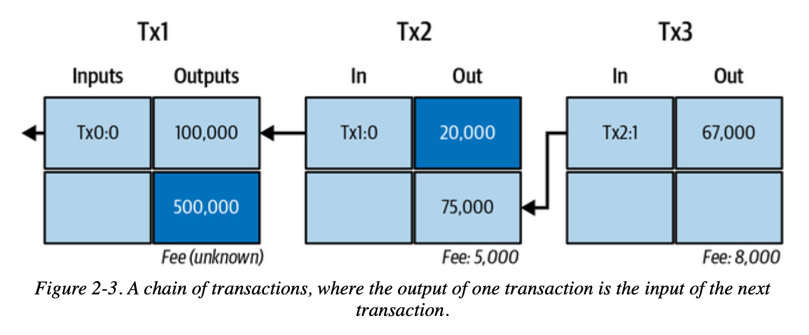
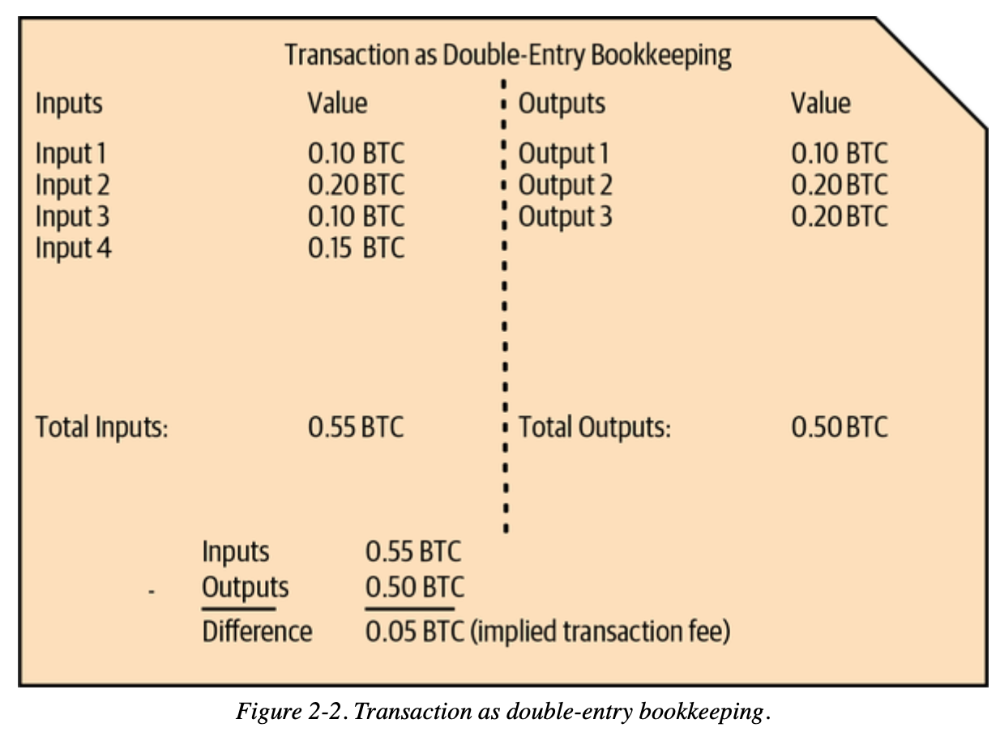

# 第 03 讲：比特币交易基础


> 💡 自学入门 `Web3` 不是一件容易的事，作为一个刚刚入门 Web3 的新人，梳理一下最简单直观的 `Web3` 小白入门教程。整合开源社区优质资源，为大家从入门到精通 Web3 指路。每周更新 1-3 讲。
> 
> 欢迎关注我的推特：[@bhbtc1337](https://twitter.com/bhbtc1337)
> 
> 进入微信交流群请填表：[表格链接](https://forms.gle/QMBwL6LwZyQew1tX8)
> 
> 文章开源在 GitHub：[Get-Started-with-Web3](https://github.com/beihaili/Get-Started-with-Web3)
> 
> 购买 BTC/ETH/USDT 等加密货币推荐 [币安](https://www.binance.com/zh-CN)[注册链接](https://accounts.marketwebb.me/register?ref=39797374)

## 目录

- [前言：为什么银行的记账方式不适合比特币？](# 前言为什么银行的记账方式不适合比特币)
- [UTXO 模型：现金 vs 银行账户的哲学](#utxo 模型现金 vs 银行账户的哲学)
- [交易结构：数字化的现金流转](# 交易结构数字化的现金流转)
- [输入与输出：钱从哪里来到哪里去](# 输入与输出钱从哪里来到哪里去)
- [交易验证：数学如何保证安全](# 交易验证数学如何保证安全)
- [实际操作：手把手创建交易](# 实际操作手把手创建交易)
- [常见问题](# 常见问题)
- [结语](# 结语)

## 前言：为什么银行的记账方式不适合比特币？

想象你在管理一个完全没有信任的环境中的资金流转 —— 比如一群互不认识的人之间要记录借贷关系，但没有任何中央机构来监督。

** 传统银行方式：**
```
Alice 账户：余额 100 BTC
Bob 账户：余额 50 BTC

Alice 转给 Bob 10 BTC：
Alice 账户：100 - 10 = 90 BTC ✅
Bob 账户：50 + 10 = 60 BTC ✅
```

** 问题来了：**
- 谁来保证 Alice 真的有 100 BTC？
- 谁来防止 Alice 同时告诉多个人「我有 100 BTC」？
- 如果没有银行，如何防止双重支付？

** 比特币的解决方案：不记录余额，只记录现金流转 **

就像用现金一样：
- 你口袋里有几张纸币，每张都有编号
- 要花钱时，必须拿出具体的纸币
- 别人能验证这张纸币确实是你的，且没有被花掉过

这就是比特币的 UTXO（未花费交易输出）模型的核心思想。

## UTXO 模型：现金 vs 银行账户的哲学

### 为什么选择「现金模式」？

** 银行账户模式的问题：**
- 需要中央权威维护账户余额
- 容易出现双重支付（同一笔钱花两次）
- 需要复杂的锁定和同步机制
- 难以在分布式环境中达成共识

** 现金模式的优势：**
- 每张「纸币」都有独立身份
- 花掉就销毁，无法重复使用
- 容易验证：检查纸币是否存在且未使用
- 天然防止双重支付

### UTXO 模型详解

** 核心概念：**
```
UTXO = 一张还没花掉的「数字纸币」
每个 UTXO 包含：
- 金额：这张「纸币」值多少钱
- 锁定条件：谁能花掉这张「纸币」
```

** 实际例子：**
```
Alice 的「钱包」里有：
- UTXO1: 30 BTC（来自工资）
- UTXO2: 70 BTC（来自投资收益）
总财富：100 BTC

Alice 要给 Bob 转 50 BTC：
❌ 不能直接「减少余额」
✅ 必须选择具体的 UTXO 来花费
```



### 转账过程：数字「破钱找零」

** 场景：** Alice 用 70 BTC 的 UTXO 买 50 BTC 的东西

```json
{
  "inputs": [
    {"previous_utxo": "70 BTC", "owner": "Alice"}
  ],
  "outputs": [
    {"amount": "50 BTC", "recipient": "Bob"},
    {"amount": "19.99 BTC", "recipient": "Alice（找零地址）"}
  ],
  "fee": "0.01 BTC"
}
```

** 结果：**
- Alice 的 70 BTC UTXO 被「销毁」
- 创建两个新 UTXO：Bob 的 50 BTC + Alice 的 19.99 BTC
- 0.01 BTC 给矿工作为手续费

这就像你用 100 元纸币买了 50 元东西，收银员：
1. 收走你的 100 元纸币（销毁旧 UTXO）
2. 给商家 50 元（新 UTXO）
3. 找给你 49 元（找零 UTXO）
4. 1 元作为「服务费」

### 深入技术细节：UTXO 集合管理

**UTXO 集合的数据结构：**
```
全网 UTXO 集合 = {
    "txid1:vout0": {value: 1.5, scriptPubKey: "..."},
    "txid2:vout1": {value: 0.8, scriptPubKey: "..."},
    "txid3:vout0": {value: 2.1, scriptPubKey: "..."},
    ...
}
```

** 关键特性：**
- ** 唯一标识 **：每个 UTXO 用「交易 ID: 输出索引」唯一标识
- ** 原子操作 **：UTXO 要么完全存在，要么完全不存在
- ** 无需排序 **：UTXO 之间没有先后关系
- ** 并行验证 **：不同 UTXO 可以并行验证

** 与银行模式对比：**

| 特性 | 银行账户模式 | UTXO 模式 |
|------|-------------|----------|
| 状态存储 | 账户余额 | 未花费输出集合 |
| 支付方式 | 余额扣减 | UTXO 消费 + 新建 |
| 双重支付防护 | 数据库锁 | 密码学证明 |
| 并行处理 | 困难（需要锁定账户） | 容易（独立 UTXO） |
| 隐私保护 | 差（账户关联） | 好（地址分离） |

## 交易结构：数字化的现金流转

### 交易的构成要素

每笔比特币交易就像一张复杂的「转账凭证」：



** 基本组成：**
```
交易 = 输入列表 + 输出列表 + 元数据
```

** 具体结构：**
```json
{
  "txid": "f4184fc596403b9d638783cf57adfe4c75c605f6356fbc91338530e9831e9e16",
  "version": 1,
  "locktime": 0,
  "vin": [输入数组],
  "vout": [输出数组]
}
```

### 深入技术细节：交易二进制格式

** 交易的线性化格式：**
```
[4 字节版本] [变长输入数量] [输入数据...] [变长输出数量] [输出数据...] [4 字节锁定时间]
```

** 序列化过程：**
1. ** 版本号 **：定义交易解析规则
2. ** 输入计数 **：使用变长整数编码
3. ** 输入数据 **：按顺序序列化每个输入
4. ** 输出计数 **：使用变长整数编码
5. ** 输出数据 **：按顺序序列化每个输出
6. ** 锁定时间 **：4 字节时间戳或区块高度

** 变长整数编码：**
```
< 0xFD: 1 字节直接表示
0xFD: 2 字节表示
0xFE: 4 字节表示  
0xFF: 8 字节表示
```

## 输入与输出：钱从哪里来到哪里去

### 交易输入：证明「我有钱花」

每个输入就像一张「取钱凭证」：

```json
{
  "txid": "0437cd7f8525ceed2324359c2d0ba26006d92d856a9c20fa0241106ee5a597c9",
  "vout": 0,
  "scriptSig": {
    "asm": "3045022100... 0279be667ef9dcbb...",
    "hex": "483045022100...21036873b4df35e5b6a967cf7ed4e6a9b6e0a6e2ff7c7b99ee1a8e6a4e4b1b6d6d6d"
  },
  "sequence": 4294967295
}
```

** 字段解释：**
- **TXID**：指向之前交易的「身份证号」
- **VOUT**：指定要花费的具体输出（第几个）
- **ScriptSig**：包含数字签名和公钥的「所有权证明」
- **Sequence**：序列号，用于高级功能

** 关键理解：ScriptSig 的工作原理 **
```
ScriptSig = [数字签名] [公钥]

验证过程：
1. 提取公钥，计算对应的比特币地址
2. 检查这个地址是否匹配被花费 UTXO 的锁定条件
3. 使用公钥验证数字签名是否正确
4. 确认签名对应的是当前交易的内容
```

### 交易输出：指定「钱给谁」

每个输出就像一张「存钱凭证」：

```json
{
  "value": 0.01000000,
  "n": 0,
  "scriptPubKey": {
    "asm": "OP_DUP OP_HASH160 389ffce9cd9ae88dcc0631e88a821ffdbe9bfe26 OP_EQUALVERIFY OP_CHECKSIG",
    "hex": "76a914389ffce9cd9ae88dcc0631e88a821ffdbe9bfe2688ac",
    "type": "pubkeyhash",
    "address": "16CQL6VEW2RWkZ9WfGS8NhisDVZi5tCZRE"
  }
}
```

** 字段解释：**
- **Value**：金额（以聪为单位，1 BTC = 100,000,000 聪）
- **ScriptPubKey**：锁定脚本，定义「解锁条件」
- **Address**：对应的比特币地址（便于人类理解）

**P2PKH 锁定脚本详解：**
```
OP_DUP OP_HASH160 < 公钥哈希 > OP_EQUALVERIFY OP_CHECKSIG

翻译成人话：
「谁能提供一个公钥，使得：
1. 公钥的哈希等于指定值
2. 用这个公钥能验证提供的签名
谁就能花费这笔钱」
```

### 为什么需要输入和输出都有脚本？

** 双重验证机制：**
```
输出脚本（锁）：「必须是 Alice 才能花费」
输入脚本（钥匙）：「我是 Alice，这是我的证明」

验证过程：
锁 + 钥匙 → 数学运算 → True/False
```

这就像：
- ** 输出脚本 ** 是保险箱上的锁，定义开锁条件
- ** 输入脚本 ** 是钥匙和密码，证明你能开锁

## 交易验证：数学如何保证安全

### 为什么需要验证？

在没有中央银行的世界里，每个人都要自己验证收到的钱是否「真钱」：

** 需要检查的问题：**
- 这笔钱是否真的存在？
- 转账的人是否真的拥有这笔钱？
- 这笔钱之前是否已经被花掉了？
- 签名是否正确？

### 验证的四个层次

#### 1. 格式验证：基本合规检查
```
检查项目：
- 交易结构是否完整
- 字段类型是否正确
- 数据长度是否合理
- 是否符合协议规范
```

#### 2. UTXO 验证：钱是否真实存在
```
检查项目：
- 输入引用的 UTXO 是否存在于 UTXO 集合中
- 被引用的 UTXO 是否已经被花费
- 输入金额是否足够支付输出金额
```

#### 3. 脚本验证：密码学证明
```
验证过程：
输入脚本 + 输出脚本 → 脚本引擎执行 → True/False

具体对于 P2PKH：
1. 提取输入脚本中的公钥和签名
2. 计算公钥哈希，与输出脚本中的哈希比较
3. 使用公钥验证签名是否正确
4. 确认签名对应当前交易内容
```

#### 4. 经济规则验证：数学平衡
```
检查项目：
- 输出总额 ≤ 输入总额
- 矿工费 = 输入总额 - 输出总额 ≥ 0
- 单个输出金额 > 0
- 总金额不超过 2100 万 BTC 限制
```

### 深入技术：脚本验证引擎

** 比特币脚本是基于栈的编程语言：**

```
P2PKH 验证过程（栈操作）：

初始栈：[]
执行输入脚本：[签名] [公钥]
栈状态：[签名，公钥]

执行输出脚本：
OP_DUP → [签名，公钥，公钥]
OP_HASH160 → [签名，公钥，公钥哈希]
< 目标哈希 > → [签名，公钥，公钥哈希，目标哈希]
OP_EQUALVERIFY → [签名，公钥] (如果哈希匹配)
OP_CHECKSIG → [True] (如果签名验证成功)

最终：栈顶为 True 表示验证通过
```

## 实际操作：手把手创建交易

### 第一步：查看可用资金

```python
# 查看 UTXO（相当于查看钱包里有哪些纸币）
utxos = rpc.listunspent ()
for utxo in utxos:
    print (f"UTXO: {utxo ['amount']} BTC (来自 {utxo ['txid'][:8]}...)")
```

### 第二步：选择要花费的 UTXO

```python
# 选择足够大的 UTXO（相当于选择一张足够大的纸币）
def select_utxo (utxos, target_amount):
    for utxo in sorted (utxos, key=lambda x: x ['amount'], reverse=True):
        if utxo ['amount'] >= target_amount:
            return utxo
    return None
```

### 第三步：构造交易

```python
# 创建交易结构
def create_transaction (from_utxo, to_address, amount):
    inputs = [{
        "txid": from_utxo ['txid'],
        "vout": from_utxo ['vout']
    }]
    
    outputs = {
        to_address: amount,
        "找零地址": from_utxo ['amount'] - amount - 0.0001  # 减去矿工费
    }
    
    return rpc.createrawtransaction (inputs, outputs)
```

### 完整交易流程

详细的交易创建、签名和广播流程请参考：[transaction_examples.py](./transaction_examples.py)

## 常见问题

### ❓ 为什么比特币不直接记录账户余额？

** 技术原因：**
- ** 分布式共识困难 **：在分布式网络中，维护全局账户状态需要复杂同步
- ** 双重支付防护 **：UTXO 模型天然防止同一笔钱被花费两次
- ** 并行处理能力 **：不同 UTXO 可以并行验证，提高网络效率

** 哲学原因：**
- ** 去中心化原则 **：不需要中央机构维护账户状态
- ** 透明性 **：每笔钱的来源去向完全透明
- ** 隐私保护 **：可以为每笔交易使用新地址

### ❓ 什么是交易延展性？

** 问题描述：**
交易 ID 由整个交易内容计算得出，但签名部分可能被恶意修改而不影响交易有效性，导致相同交易有不同 ID。

** 具体例子：**
```
原始交易：TXID = A1B2C3...
恶意修改签名格式：TXID = D4E5F6...
但两个交易都有效且效果相同
```

** 解决方案：**
SegWit（隔离见证）将签名数据分离，解决了这个问题。

### ❓ 如何计算合适的矿工费？

** 费用计算公式：**
```
矿工费 = 交易大小 (字节) × 费率 (聪 / 字节)
```

** 动态费率策略：**
```python
def estimate_fee (target_confirmations):
    fee_rate = rpc.estimatesmartfee (target_confirmations)
    return fee_rate ['feerate']  # BTC/KB

# 不同优先级的费率
urgent_fee = estimate_fee (1)    # 下个区块确认
normal_fee = estimate_fee (6)    # 1 小时内确认  
economy_fee = estimate_fee (144) # 24 小时内确认
```

** 典型交易大小：**
- 简单 P2PKH 交易：~225 字节
- 2 输入 2 输出 P2PKH：~400 字节
- SegWit 交易：比传统交易小 20-40%

### ❓ 为什么需要确认？

** 确认过程：**
```
0 确认：交易在内存池中
1 确认：交易被打包进区块
6 确认：交易被 6 个区块深度保护
```

** 安全性递增：**
- **1 确认 **：基本安全，适合小额交易
- **3 确认 **：中等安全，适合中等金额
- **6 确认 **：高安全，交易所和大额交易标准

** 数学原理：**
要逆转一个有 n 个确认的交易，攻击者需要：
- 控制超过 51% 的网络算力
- 重新挖掘从该交易开始的所有后续区块
- 成本随确认数指数级增长

### ❓ 什么是替换交易 (RBF)？

**Replace-By-Fee 机制：**
- 在交易未确认时，可以发送更高费用的版本
- 矿工优先打包费用更高的交易
- 原交易会被新交易替换

** 使用场景：**
```
场景 1：费用估算不准确，交易长时间未确认
解决：发送高费用版本，加速确认

场景 2：发现转账金额错误
解决：发送更正版本（如果还未确认）
```

## 结语

比特币交易系统的设计体现了去中心化系统的智慧：

### 🏛️ 设计哲学

- ** 信任最小化 **：不依赖任何中央权威
- ** 透明可验证 **：每笔交易都可独立验证
- ** 数学保证 **：用密码学而非人类承诺保证安全
- ** 经济激励 **：矿工费机制确保网络运行

### 🔧 技术特色

- **UTXO 模型 **：简单、健壮、并行友好
- ** 脚本系统 **：灵活、安全、可扩展
- ** 费用市场 **：动态调节、供需平衡
- ** 确认机制 **：概率安全、可量化风险

### 🚀 实际价值

掌握交易基础后，你能够：
- 理解任何比特币钱包的运行原理
- 开发自己的交易分析工具
- 优化交易费用和确认时间
- 为进阶技术（多重签名、SegWit、Taproot）打基础

比特币交易不仅仅是技术，更是一种新的价值交换哲学。它证明了：在数学和密码学的基础上，我们可以构建一个不需要信任中介的全球价值网络。

每一笔交易，都是对「代码即法律」理念的实践；每一次验证，都是对去中心化共识的贡献。

> 🌟 ** 完整代码示例 **：本章涉及的所有交易操作代码实现请查看：[transaction_examples.py](./transaction_examples.py)

---

<div align="center">
<a href="https://github.com/beihaili/Get-Started-with-Web3">🏠 返回主页 </a> | 
<a href="https://twitter.com/bhbtc1337">🐦 关注作者 </a> | 
<a href="https://forms.gle/QMBwL6LwZyQew1tX8">📝 加入交流群 </a>
</div>
