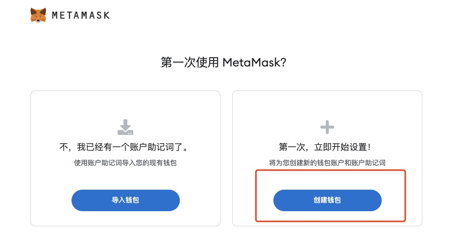

# 创建你的第一个 Web3 身份


> 💡 自学入门 `Web3` 不是一件容易的事，作为一个刚刚入门 Web3 的新人，梳理一下最简单直观的 `Web3` 小白入门教程。整合开源社区优质资源，为大家从入门到精通 Web3 指路。每周更新 1-3 讲。
> 
> 欢迎关注我的推特：[@bhbtc1337](https://twitter.com/bhbtc1337)
> 
> 
> 进入微信交流群请填表：[表格链接](https://forms.gle/QMBwL6LwZyQew1tX8)
> 
> 文章开源在 GitHub：[Get-Started-with-Web3](https://github.com/beihaili/Get-Started-with-Web3)
> 
> 购买 BTC / ETH / USDT 等加密货币推荐 [币安](https://www.binance.com/zh-CN)[注册链接](https://accounts.marketwebb.me/register?ref=39797374)

## 目录

- [前言](# 前言)
- [Web3 简述](#web3 - 简述)
- [小狐狸钱包 MetaMask 简述](# 小狐狸钱包 - metamask - 简述)
- [使用 MetaMask 创建第一个 Web3 身份](# 使用 - metamask - 创建第一个 - web3 - 身份)
- [常见问题](# 常见问题)
- [总结](# 总结)

## 前言

还记得第一次接触互联网时的那种兴奋和好奇吗？今天，我们站在了另一个技术革命的起点 —— Web3。这个全新的网络世界不再由科技巨头控制，而是由每一个参与者共同拥有。作为一名 Web3 新人，我深知迈出第一步的重要性和挑战。希望通过这篇文章，能让你轻松获得自己的第一个 Web3 身份，打开这扇通往数字未来的大门！

## Web3 简述

`Web3` 是一个开放的网络，任何人都可以在上面建立自己的应用，而不需要依赖于任何中心化的服务。就技术而言，`Web3` 是基于区块链技术的去中心化网络。另一种更符合现状的说法是在 Web2 网站上加上小狐狸钱包 `MetaMask`，这个网站就变成了 `Web3` 网站😂。

想象一下，如果互联网是一个大型商场：
- Web1 是只能看橱窗的时代
- Web2 是能够在商场内购物的时代
- Web3 则是你成为商场共同所有者的时代

## 小狐狸钱包 MetaMask 简述

`MetaMask` 是一个去中心化的钱包浏览器插件，可以让用户轻松接入 `Web3` 的世界，绝大多数 `Web3` 项目都支持 `MetaMask`。

简单来说，MetaMask 就像是你的 Web3 护照，它：
- 保管你的数字资产（加密货币）
- 证明你的身份
- 允许你与 Web3 应用互动

## 使用 MetaMask 创建第一个 Web3 身份

与动不动就要关联手机号的 `Web2` 不同，创建 `Web3` 身份的过程简单得令人感到不可思议。我们接下来会带领大家使用 `MetaMask` 创建一个 `Web3` 身份，保证全过程不超过 5 分钟。

创建 `Web3` 身份拢共分几步？三步！

- 第一步：安装 `MetaMask` 浏览器插件
- 第二步：创建 `MetaMask` 账户
- 第三步：备份 `MetaMask` 账户

### 第一步：安装 MetaMask 浏览器插件

用 `Chrome` 浏览器访问 [MetaMask 官网](https://metamask.io/)，点击 `Get Chrome Extension`，然后点击 `Add to Chrome`，即可安装 `MetaMask` 浏览器插件。

<div align="center">  </div>

<div align="center">  </div>

### 第二步：创建 MetaMask 账户

点击 `MetaMask` 浏览器插件，点击「开始使用」，点击「我同意」，点击「创建钱包」，设置密码后即可创建 `MetaMask` 账户。

<div align="center">  </div>

### 第三步：备份 MetaMask 账户

第一次创建账户默认会进行备份，推荐找个僻静地方抄到纸上，或者存到 1Password 等密码管理工具中，如果选择复制助记词到电脑上最好进行加密存储。

<div align="center">  </div>

### MetaMask 界面

恭喜你，你已经拥有了一个 `Web3` 身份。我们来熟悉一下 `MetaMask` 的界面。

<div align="center">  </div>

- 最上面的 `Ethereum Mainnet` 是网络选择，默认选择 `Ethereum Mainnet`
- `0x...` 是你的 `MetaMask` 账户地址
- `0 ETH` 是你的 `MetaMask` 账户余额

## 📖 MetaMask 详细安装和操作流程

前面我们快速走过了三步创建流程，下面展开讲解每一步的细节和注意事项。

### 🔑 下载与安装

1. ** 打开 Chrome 浏览器 **，访问 MetaMask 官方网站：[https://metamask.io](https://metamask.io)

> ⚠️ ** 重要提示 **：务必确认网址是 `metamask.io`，不要通过搜索引擎点击广告链接！曾有大量用户因安装了假冒的 MetaMask 插件而丢失资产。

2. 点击 **Download** 按钮，选择 **Chrome** 浏览器
3. 跳转到 Chrome Web Store 后，点击 **Add to Chrome**
4. 在弹出的确认窗口中点击 **Add extension**
5. 安装完成后，浏览器右上角会出现狐狸图标

** 支持的浏览器和平台 **：

| 平台 | 支持情况 | 下载方式 |
|------|---------|----------|
| Chrome | 支持 | Chrome Web Store |
| Firefox | 支持 | Firefox Add-ons |
| Brave | 支持 | Chrome Web Store |
| Edge | 支持 | Chrome Web Store |
| iOS | 支持 | App Store |
| Android | 支持 | Google Play |

### 🔑 创建钱包详细步骤

1. 点击浏览器右上角的 MetaMask 狐狸图标
2. 选择 **Create a new wallet**（创建新钱包）
3. 阅读并同意用户协议
4. ** 设置密码 **：
   - 至少 8 个字符
   - 建议使用大小写字母 + 数字 + 特殊字符的组合
   - 此密码仅用于在当前设备上解锁 MetaMask
   - ** 注意 **：此密码 ≠ 助记词，忘记密码可以通过助记词恢复
5. 观看助记词安全提示视频（建议新手认真看完）
6. ** 记录助记词 **：MetaMask 会显示 12 个英文单词
7. ** 验证助记词 **：按正确顺序点击单词完成验证
8. 完成！你的第一个 Web3 身份已创建

### 🔑 添加自定义网络

MetaMask 默认连接以太坊主网，你可以手动添加其他 EVM 兼容网络：

1. 点击 MetaMask 顶部的网络下拉菜单
2. 点击 **Add network**（添加网络）
3. 填写网络信息，以添加 Polygon 为例：

```
网络名称：Polygon Mainnet
RPC URL：https://polygon-rpc.com
链 ID：137
货币符号：MATIC
区块浏览器：https://polygonscan.com
```

** 常用 EVM 网络信息 **：

| 网络名称 | 链 ID | 货币符号 | RPC URL |
|----------|-------|----------|---------|
| Ethereum Mainnet | 1 | ETH | https://eth.llamarpc.com |
| Polygon | 137 | MATIC | https://polygon-rpc.com |
| Arbitrum One | 42161 | ETH | https://arb1.arbitrum.io/rpc |
| Optimism | 10 | ETH | https://mainnet.optimism.io |
| BSC | 56 | BNB | https://bsc-dataseed.binance.org |
| Avalanche C-Chain | 43114 | AVAX | https://api.avax.network/ext/bc/C/rpc |
| Base | 8453 | ETH | https://mainnet.base.org |

> 💡 ** 小贴士 **：你也可以访问 [Chainlist.org](https://chainlist.org/) 网站，一键添加各种 EVM 网络到 MetaMask，省去手动填写的麻烦。

## 📖 地址格式说明

了解以太坊地址的格式和规则，可以帮你避免转账错误和资产丢失。

### 🔑 以太坊地址结构

以太坊地址是一个 42 个字符的十六进制字符串，由 `0x` 前缀 + 40 个十六进制字符组成：

```
0x71C7656EC7ab88b098defB751B7401B5f6d8976F
│  │                                        │
│  └────────── 40 个十六进制字符 ──────────────┘
└── 前缀
```

** 地址生成过程 **：

```
私钥（256 位随机数）
    ↓ 椭圆曲线运算（secp256k1）
公钥（512 位）
    ↓ Keccak-256 哈希
哈希值（256 位）
    ↓ 取最后 20 字节
以太坊地址（160 位 = 40 十六进制字符）
    ↓ 加前缀 0x
完整地址：0x71C7656EC7ab88b098defB751B7401B5f6d8976F
```

### 🔑 EIP-55 校验和地址

以太坊通过大小写混合来实现地址校验（EIP-55 标准）：

```
无校验：0x71c7656ec7ab88b098defb751b7401b5f6d8976f（全小写）
有校验：0x71C7656EC7ab88b098defB751B7401B5f6d8976F（大小写混合）
```

大写和小写字母的位置是通过哈希计算确定的。如果你手动输入地址时不小心改了大小写，钱包软件可以检测到错误并发出警告。

> 💡 ** 小贴士 **：转账时务必使用复制粘贴而非手动输入地址。发送前仔细核对地址的前 4 位和后 4 位是否正确。

### 🔑 ENS 域名

**ENS**（Ethereum Name Service，以太坊域名服务）允许你将复杂的以太坊地址映射为人类可读的域名：

```
地址：0x71C7656EC7ab88b098defB751B7401B5f6d8976F
ENS 域名：vitalik.eth
```

ENS 域名的优势：
- ** 易记 **：比 42 位十六进制字符好记得多
- ** 多用途 **：可以指向以太坊地址、其他链地址、IPFS 内容等
- ** 去中心化 **：域名注册在以太坊智能合约上，无需中心化机构
- ** 身份标识 **：ENS 域名正在成为 Web3 世界的身份名片

** 注册 ENS 域名 **：访问 [app.ens.domains](https://app.ens.domains/) 搜索并注册你喜欢的 `.eth` 域名，价格根据名称长度而定（5+ 字符约 $5 / 年）。

## 📖 钱包备份策略

助记词是你 Web3 身份的生命线。一旦丢失，没有任何人能帮你找回。

### 🔑 助记词安全原则

| 做 | 不要做 |
|----|--------|
| 用纸笔手写记录 | 截图或拍照保存 |
| 存放在多个安全位置 | 存储在云端（iCloud、Google Drive） |
| 使用金属助记词板防灾 | 通过微信 / 邮件发送给任何人 |
| 考虑使用密码管理器加密 | 保存在电脑的 txt 文件中 |
| 定期检查备份是否完好 | 在任何网站上输入助记词 |

### 🔑 推荐备份方案

** 方案一：基础备份（适合小额资产）**

1. 用纸笔抄写助记词两份
2. 分别存放在家中两个不同的安全位置
3. 确保防水防火（可使用密封塑料袋）

** 方案二：进阶备份（适合中等金额）**

1. 购买金属助记词板（如 Cryptosteel Capsule），将助记词刻入金属
2. 纸质备份一份作为冗余
3. 金属板存放在家庭保险箱
4. 纸质备份存放在另一个物理位置（如父母家）

** 方案三：高级备份（适合大额资产）**

1. 使用 **Shamir 分片方案 ** 将助记词分成 3 份，任意 2 份可恢复
2. 三份分别存放在不同城市的安全位置
3. 结合硬件钱包使用
4. 制定继承计划

> ⚠️ ** 重要提示 **：永远不要只有一份备份！火灾、水灾、搬家丢失等情况都可能导致唯一备份的丢失。同时也不要存太多份，备份越多，被他人发现的风险越大。2-3 份是比较好的平衡。

## 📖 多链身份管理

在 Web3 世界中，你的一组助记词可以生成多个区块链上的地址。理解多链身份管理是成为 Web3 老手的必备技能。

### 🔑 EVM 兼容链：相同地址

所有 EVM（以太坊虚拟机）兼容链共享 ** 相同的地址格式和派生方式 **。这意味着：

```
同一组助记词在以下链上会生成完全相同的地址：
- Ethereum: 0x71C7656EC7ab88b098defB751B7401B5f6d8976F
- Polygon:  0x71C7656EC7ab88b098defB751B7401B5f6d8976F
- BSC:      0x71C7656EC7ab88b098defB751B7401B5f6d8976F
- Arbitrum: 0x71C7656EC7ab88b098defB751B7401B5f6d8976F
- Optimism: 0x71C7656EC7ab88b098defB751B7401B5f6d8976F
- Base:     0x71C7656EC7ab88b098defB751B7401B5f6d8976F
```

这是因为 EVM 链都使用相同的密码学标准（secp256k1 曲线 + Keccak-256 哈希）。

### 🔑 非 EVM 链：不同地址格式

不同区块链使用不同的地址格式和派生路径：

| 区块链 | 地址格式 | 示例 | 助记词兼容性 |
|--------|----------|------|-------------|
| **Ethereum/EVM** | 0x + 40 位十六进制 | `0x71C7...976F` | BIP39 兼容 |
| **Bitcoin** | bc1/1/3 开头 | `bc1qw508...v8f3t4` | BIP39 兼容但派生路径不同 |
| **Solana** | Base58 编码 32 字节 | `7EcDhS...3rPk` | 使用不同派生路径 ed25519 |
| **Cosmos** | cosmos1 前缀 | `cosmos1...` | BIP39 兼容但派生路径不同 |
| **Polkadot** | SS58 编码 | `15oF4u...` | 使用 sr25519 曲线 |
| **Tron** | T 开头 Base58 | `TJCnKs...` | BIP39 兼容但派生路径不同 |

> ⚠️ ** 重要提示 **：虽然助记词格式相同（BIP39），但同一组助记词在不同链上会生成 ** 完全不同的地址 **（除了 EVM 链之间）。不要向错误的链地址发送资产，否则可能永久丢失！

### 🔑 多链钱包管理建议

1. **EVM 链 **：使用 MetaMask 管理所有 EVM 兼容链资产
2. ** 比特币 **：使用专门的比特币钱包（如 Sparrow、Blue Wallet）
3. **Solana**：使用 Phantom 或 Backpack 钱包
4. **Cosmos 生态 **：使用 Keplr 钱包
5. ** 统一管理 **：也可以使用支持多链的钱包（如 OKX Wallet、Rabby Wallet）

## 📖 常见错误与解决方案

### ❓ 错误一：在钓鱼网站输入了助记词

** 严重程度 **：极高

** 症状 **：某网站声称需要输入助记词来「验证钱包」或「领取空投」

** 解决方案 **：
1. ** 立即 ** 创建新钱包
2. ** 立即 ** 将所有资产转移到新钱包
3. 旧钱包视为已泄露，永远不再使用
4. 检查是否有未授权的 Token 授权

> ⚠️ ** 重要提示 **：MetaMask 和所有正规钱包、DApp ** 永远不会 ** 要求你输入助记词。任何要求输入助记词的网站 100% 是骗局。

### ❓ 错误二：向错误的网络发送了代币

** 严重程度 **：中等

** 症状 **：在 Polygon 网络上发送了代币，但收款方只查看了以太坊主网

** 解决方案 **：
1. 通知收款方切换到正确的网络查看
2. 如果 MetaMask 中没有该网络，手动添加即可
3. 因为 EVM 链地址相同，资产不会丢失

### ❓ 错误三：Gas 费设置过低导致交易失败

** 严重程度 **：低

** 症状 **：交易长时间 Pending 或最终失败

** 解决方案 **：
1. 在 MetaMask 的 Activity 中找到 Pending 的交易
2. 点击 **Speed Up**（加速）增加 Gas 费
3. 或点击 **Cancel**（取消）来取消交易
4. 以后发送交易时使用 MetaMask 推荐的 Gas 费

### ❓ 错误四：授权了恶意合约无限额度

** 严重程度 **：高

** 症状 **：代币莫名消失，被未知合约转走

** 解决方案 **：
1. 访问 [revoke.cash](https://revoke.cash/) 连接钱包
2. 查看所有 Token 授权记录
3. 撤销可疑或不再需要的授权
4. 养成定期检查授权的习惯

### ❓ 错误五：未备份助记词就重装了浏览器

** 严重程度 **：极高（如未备份则无法恢复）

** 症状 **：重装浏览器或更换电脑后 MetaMask 为空

** 解决方案 **：
1. 如果有助记词备份：重新安装 MetaMask → 选择 **Import wallet** → 输入助记词即可恢复
2. 如果没有备份：很遗憾，资产将永久丢失
3. ** 预防措施 **：创建钱包后第一时间备份助记词！

## 📖 Web3 身份进阶

当你熟悉了基础的钱包操作后，可以探索更多 Web3 身份相关的前沿概念。

### 🔑 ENS 域名 —— 你的 Web3 名片

ENS（Ethereum Name Service）不仅是一个域名服务，更是你在 Web3 世界的身份标识：

- ** 社交身份 **：在 Twitter、Discord 等平台展示你的 `.eth` 域名
- ** 收款地址 **：别人可以直接向 `yourname.eth` 发送 ETH 和代币
- ** 去中心化网站 **：将 `.eth` 域名指向 IPFS 上的网站
- ** 子域名 **：可以创建子域名如 `blog.yourname.eth`
- **NFT 属性 **：ENS 域名本身就是一个 NFT，可以交易和转让

### 🔑 Lens Protocol —— 去中心化社交图谱

Lens Protocol 是一个建立在 Polygon 上的去中心化社交协议：

- **Profile NFT**：你的社交身份是一个 NFT
- ** 内容所有权 **：你发布的所有内容归你所有
- ** 可组合性 **：多个前端应用（如 Hey、Orb）共享同一个社交图谱
- ** 数据便携 **：切换应用时，你的粉丝和内容跟着你走

### 🔑 SBT（灵魂绑定代币）—— 不可转让的身份凭证

SBT（Soulbound Token）是一种不可转让的 NFT，用于表示身份、资质、声誉等：

- ** 教育证书 **：完成课程的链上证明
- ** 社区贡献 **：参与 DAO 治理的记录
- ** 技能认证 **：开发者技能的链上凭证
- ** 信用评分 **：去中心化的信用记录

| 概念 | 可转让 | 用途 | 示例 |
|------|--------|------|------|
| NFT | 可以 | 数字艺术、收藏品 | BAYC, CryptoPunks |
| ENS | 可以 | 域名、身份标识 | vitalik.eth |
| SBT | 不可以 | 身份凭证、声誉 | POAP, Gitcoin Passport |

> 💡 ** 小贴士 **：Web3 身份的核心理念是「自主身份」（Self-Sovereign Identity）—— 你完全拥有和控制自己的身份数据，不依赖任何中心化机构。这与 Web2 世界中由平台控制用户数据的模式形成了鲜明对比。

## 常见问题

#### ❓ 我的助记词丢失了，怎么办？

这是非常严重的问题。如果助记词丢失，就意味着你可能永久失去对钱包的控制权。请立即创建新钱包，并将资产转移到新钱包。以后务必妥善保管助记词，可以考虑：
- 抄写在纸上并放在保险箱
- 使用专业密码管理器加密存储
- 将助记词分成几部分，存放在不同的安全地方

#### ❓ MetaMask 支持哪些区块链网络？

MetaMask 默认支持以太坊主网，但也可以添加其他兼容 EVM 的网络，如：
- Binance Smart Chain (BSC)
- Polygon
- Avalanche
- Optimism
- Arbitrum
等等

#### ❓ 使用 MetaMask 需要付费吗？

MetaMask 本身是免费的，但在区块链上进行交易时需要支付网络的「燃料费」（Gas Fee）。这些费用不会进入 MetaMask 的口袋，而是支付给网络上的验证者。

## 总结

你可能注意到在生成 `Web3` 身份的过程中没有任何验证，这意味着在 `Web3` 世界里人们就像戴上了一层面具，任何人都可以随意创造自己的身份，这创造了空前的自由，也放大了人性的善良和恶意，意味着在 `Web3` 世界里，你不能相信任何人，需要更加小心地保护自己，任何时候都要 `Do Your Own Research`。

恭喜看到这里的你🎉你已经踏出了去往 `Web3` 世界的第一步！这扇门开启的不仅是一个钱包，更是一个充满无限可能的宇宙。想象一下，在这个世界里，你可以成为自己数据的真正主人，可以参与治理重要项目，甚至创建只属于你的数字王国。

接下来的旅程会更加精彩，我们将一起探索如何进行第一笔交易、参与 DeFi、收藏 NFT，以及更多 Web3 的奇妙应用。准备好了吗？Web3 的冒险才刚刚开始！

---

<div align="center">
<a href="https://github.com/beihaili/Get-Started-with-Web3">🏠 返回主页 </a> | 
<a href="https://twitter.com/bhbtc1337">🐦 关注作者 </a> | 
<a href="https://forms.gle/QMBwL6LwZyQew1tX8">📝 加入交流群 </a>
</div>
