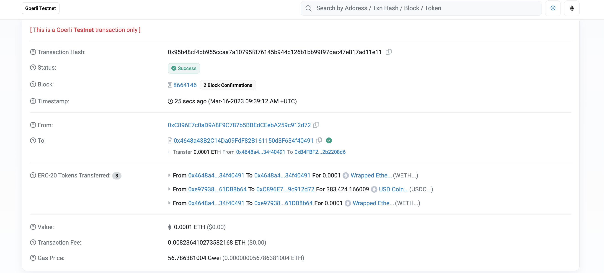

# 使用 Web3 的第一个 DApp

> 💡 自学入门 `Web3` 不是一件容易的事，作为一个刚刚入门 Web3 的新人，梳理一下最简单直观的 `Web3` 小白入门教程。整合开源社区优质资源，为大家从入门到精通 Web3 指路。每周更新 1-3 讲。
> 
> 欢迎关注我的推特：[@bhbtc1337](https://twitter.com/bhbtc1337)
> 
> 
> 进入微信交流群请填表：[表格链接](https://forms.gle/QMBwL6LwZyQew1tX8)
> 
> 文章开源在 GitHub：[Get-Started-with-Web3](https://github.com/beihaili/Get-Started-with-Web3)
> 
> 购买 BTC / ETH / USDT 等加密货币推荐 [币安](https://www.binance.com/zh-CN)[注册链接](https://accounts.marketwebb.me/register?ref=39797374)

## 目录

- [前言](# 前言)
- [DApp 是什么](#dapp - 是什么)
- [运行 DApp 的流程](# 运行 - dapp - 的流程)
- [使用 Web3 的第一个 DApp](# 使用 - web3 - 的第一个 - dapp)
- [常见问题](# 常见问题)
- [总结](# 总结)

## 前言

还记得第一次使用手机应用时的惊喜和喜悦吗？每一个新应用都代表着一个新世界的打开。在 Web3 世界中，这些应用被称为「DApps」（去中心化应用），它们有着异曲同工的力量 —— 能够彻底改变金融、社交和其他领域的运作方式。

今天，我们将一起探索如何使用您的第一个 Web3 DApp！对于 Web3 新手来说，这将是一次从「观察者」转变为「参与者」的重要转变。不需要编程技能，只需要动动手指，就能进入这个新世界的核心。

## DApp 是什么

DApp 是 `Decentralized Application` 的缩写，中文翻译为去中心化应用。DApp 是一种基于区块链的应用，它的运行不依赖于中心化的服务器，而是依赖于区块链网络。DApp 的运行结果会被写入区块链中，所有人都可以通过区块链查询到交易的执行结果。DApp 的应用场景广泛，可应用于：

- ** 去中心化金融 **：著名的有 Uniswap、Compound、Aave、Synthetix、MakerDAO、Yearn Finance、Curve Finance、Balancer 等。
- ** 去中心化社交 **：著名的有 Damus、Lens Protocol 等。
- **NFT**：著名的有 OpenSea、Rarible、SuperRare 等。
- ** 其他 **：治理、投票，著名的有 Snapshot、Gnosis 等。

## 运行 DApp 的流程

运行 DApp 的流程如下：

1. 开发者创建一个区块链钱包，并获得一些以太币来支付交易费用。
2. 开发者编写 DApp 的智能合约，并使用 Solidity 编程语言进行编码。
3. 开发者部署智能合约到以太坊网络中，例如通过 Remix 或 Truffle 等工具。
4. 开发者创建一个前端应用程序来与智能合约进行交互，例如使用 React 或 AngularJS 等工具。
5. 专业用户和开发者可以通过 web3 库连接前端应用程序和以太坊网络，以便与智能合约进行交互。
6. 普通用户通过前端应用程序与智能合约进行交互，例如提交交易或查询数据。

作为快速入门，本文仅介绍第 6 步，即普通用户通过前端应用程序与智能合约进行交互。第 1-5 步的内容将在后续的文章中介绍。

## 使用 Web3 的第一个 DApp

这里以 [Uniswap](https://uniswap.org/) 为例，介绍如何使用 Web3 的第一个 DApp。

1. 打开 [Uniswap](https://app.uniswap.org/#/swap)，点击 `MetaMask` 选择 `Görli 测试网络`。点击 `Connect to a wallet`，选择 `MetaMask`，然后点击 `Connect`。
   
  

2. 点击 `Select a token`，选择 `ETH`，然后点击 `Select`。点击 `Select a token`，选择 `USDC`，然后点击 `Select`。
   P.S. 现在 `Görli 测试网络` 上的 ETH 通过 [LayerZero 跨链桥](https://testnetbridge.com/) 可以兑换真 ETH，所以测试网 ETH 价格很高 hhh。
   
  

3. 输入希望交换的金额 `0.0001`，然后点击 `Swap`。点击 `Confirm Swap`，然后点击 `Swap`。
   
  

4. 这时交易已经被提交到以太坊网络中，等待被打包。点击 `View on Etherscan`，然后点击 `View`。
   
  

5. 交易成功上链，可以在 [以太坊区块浏览器](https://goerli.etherscan.io/) 中查询到交易的执行结果。
   
  

## 常见问题

#### ❓ 什么是去中心化应用（DApp）和传统应用的主要区别？

DApp 与传统应用的主要区别在于：

1. ** 存储位置 **：DApp 的代码和数据存储在分布式的区块链上，而非中心化服务器。
2. ** 控制权 **：没有单一实体能够关闭或控制 DApp，因为它运行在去中心化网络上。
3. ** 透明性 **：DApp 的代码和交互完全公开透明，任何人都可以查看。
4. ** 手续费 **：使用 DApp 通常需要支付小额的加密货币作为 Gas 费用。

#### ❓ 为什么 Uniswap 被称为 Web3 领域的重要 DApp？

Uniswap 被称为 Web3 领域的重要 DApp 因为：

1. 它是第一个成功实现自动做市商（AMM）模式的去中心化交易所。
2. 没有订单簿，完全通过流动性池进行估值和交易。
3. 任何人都可以无需许可即添加代币和提供流动性。
4. 它引领了 DeFi（去中心化金融）这一重要领域的发展。

#### ❓ 我可以在测试网上使用 DApp 测试的代币有真实价值吗？

通常测试网代币没有真实价值，因为它们就是为了测试目的被创建的。然而，文章中提到一个特殊情况，现在 Görli 测试网上的 ETH 可以通过 LayerZero 跨链桥兑换真实的 ETH，所以这些测试网 ETH 确实有一定价值。但这是罕见的特殊情况，大多数测试网资产没有真实价值。

## 总结

今天，你在 Web3 旅程中迈出了重要的一步 —— 使用了第一个去中心化应用！想象一下，你刚刚在没有任何中间商的情况下完成了一笔加密货币的交换。这不仅仅是一个简单的操作，而是对传统金融系统的一次小小革命。

期待学习和实践更多的 DApp 吧！在下一篇文章中，我们将介绍更多 Web3 领域的有用网站，帮助你深入探索这个令人兴奋的新世界。传统金融系统打造了墙与门，而区块链打破了这些障碍，让你的财务自由真正掌握在自己手中。

恭喜你，现在你可以作为用户参与到几乎所有的区块链 DApp 应用了！🎉🎉🎉

---

<a href="https://github.com/beihaili/Get-Started-with-Web3">🏠 返回主页 </a> | 
<a href="https://twitter.com/bhbtc1337">🐦 关注作者 </a> | 
<a href="https://forms.gle/QMBwL6LwZyQew1tX8">📝 加入交流群 </a>

