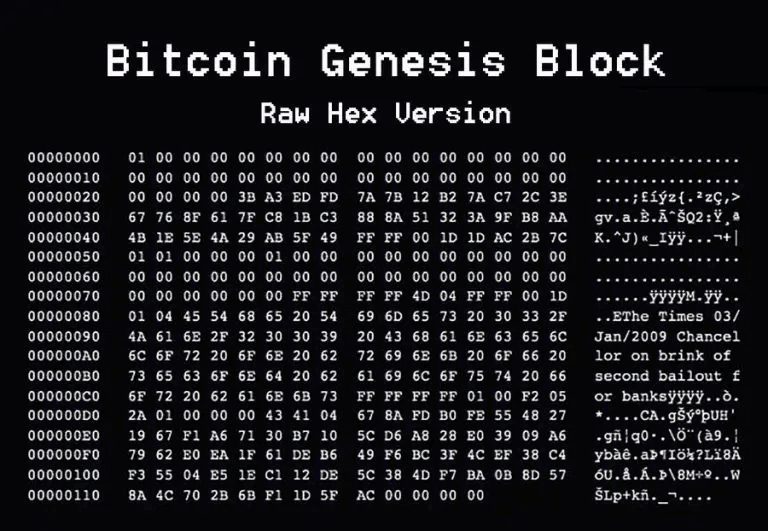
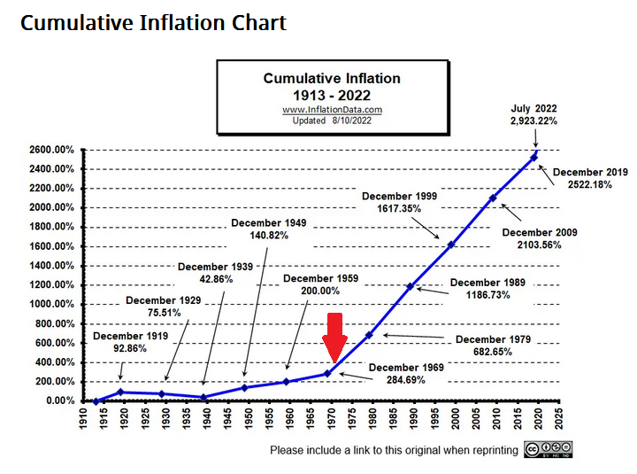

# 第一章 诞生

致敬《明朝那些事儿》，我们还是从一份档案开始。

| 项目 | 内容 |
|------|------|
| **姓名** | 比特币（Bitcoin） |
| **别名（外号）** | 大饼、BTC |
| **性别** | 无（或者说，你想让它是什么就是什么） |
| **民族** | 无（真正的世界公民） |
| **出生日期** | 2008年10月31日（中本聪在密码学邮件组发表比特币白皮书） 2009年1月3日（中本聪在芬兰赫尔辛基的一台小型服务器上挖出比特币创世区块） |
| **出生地点** | 据说是一个位于赫尔辛基的小型服务器(IP地址：88.195.241.165) |
| **社会关系** | 父/母：中本聪（Satoshi Nakamoto），一个连是男是女、是人是鬼都不知道的神秘人物 |
| **能力特点** | **• 去中心化** 　　没老大，大家说了算  **• 不可篡改** 　　写上去就别想改，比你老婆的记忆力还好  **• 可追溯** 　　干了啥都明明白白，别想赖账 |
| **主要经历** | **📅 2009-2010年** 　　一文不值。主要由极客们用爱发电，挖出来当游戏积分玩，免费送来送去。  **📅 2010年** 　　首次实现"购买力"，一个程序员用一万个币换了两个披萨。  **📅 2011年** 　　价格首次突破1美元。（终于能正经当钱用了，虽然是1美元）  **📅 2011-2013年** 　　跟着一个叫"丝绸之路"的暗网黑帮大佬混，声名狼藉。经历了币生第一次过山车式的大起大落，价格从几十美元冲到一千多又迅速腰斩。  **📅 2017年-2018年** 　　被一大帮叫做ICO（首次代币发行）的小弟簇拥着，一飞冲天，价格冲到近两万美元。全世界的大爷大妈都知道了它的名字，投机者拥而入。  **📅 2020年至今** 　　跟着华尔街的西装精英们混，登堂入室。 |

---

一切的一切，都从2009年1月3日，赫尔辛基的那台服务器上开始。

历史上但凡有大人物出场，史书上总得弄点神神叨叨的记载。比如朱元璋出生时"红光满地"，邻居以为失火了。比特币嘛，好像没这个待遇，没刮风也没打雷。

但它也有个特别的"胎记"。它的爹（或者妈）中本聪，在第一个数据块里，没头没尾地塞了一句话：

> "The Times 03/Jan/2009 Chancellor on brink of second bailout for banks"

这句话是什么意思呢？翻译过来就是：2009年1月3日的《泰晤士报》头版标题——"英国财政大臣正处于对银行进行第二次紧急援助的边缘"。

一个划时代的发明，它的"出生证明"上写的不是"我来过，我看见，我征服"，而是一条财经新闻。这事儿就很有意思了。

---

要搞明白中本聪为啥要特意记下这句话，就得看看当时的世界是个什么烂摊子。

时间往前倒几个月，2008年。由美国次贷危机引发的金融风暴，把全世界的银行和金融机构搞得人仰马翻。简单说，就是华尔街那帮穿西装打领带的聪明人，设计了一堆花里胡哨、谁也看不懂的金融产品，然后玩脱了，欠了一屁股还不上的债。

这帮人自己惹了祸，怎么办？很简单，手一摊：政府，救我！

于是，各国政府纷纷开启了印钞机，拿出纳税人的血汗钱，几千亿几千亿地去救助那些濒临破产的银行。英国的情况尤其惨，救了一轮发现是个无底洞，眼看着又要进行"第二次"，也就是中本聪记下的这个新闻标题。

这就好比你家邻居天天胡吃海喝，把家底败光了，还欠了一屁股债。结果居委会跑来跟你说，为了社区稳定，大家凑点钱帮他还债吧。

你是什么心情？

当时全世界的普通人，就是这个心情。

所以，中本聪留下这句话作为比特币的"出厂设置"，意思就再明白不过了。他不是在记录历史，他是在吐槽，是在表达不满。这行字，就是比特币的"出厂设置"，是它的精神内核：

> **信不过你们这帮中心化的机构，我自己另起炉灶，玩个新的。**

这个新炉灶，就是比特币系统。

整个金融系统的病根，其实埋得更深。

有个很有名的网站，叫"1971年他妈的发生了什么？"（wtfhappenedin1971.com）。网站上用一大堆图表告诉你，自1971年之后，通货膨胀、贫富差距等等问题都开始急剧恶化。

 

为啥是1971年？因为那一年，美国总统尼克松宣布，美元跟黄金脱钩了。

在这之前，美元不能瞎印，印多少得有多少黄金储备在后面撑着。可脱钩之后，就好像给印钞机松了绑，从此马力全开，想印多少就印多少。这就是为什么我们手里的钱越来越不值钱，我们赚钱的速度，永远跟不上东西涨价的速度。

有一个叫哈耶克的老头，早在1976年就写了本叫《货币的非国家化》的书，把这事儿给预言了。他说：

> "I do not think it is an exaggeration to say that history is largely a history of inflation, and usually of inflations engineered by governments for the gain of governments."

> "我认为，毫不夸张地说，历史在很大程度上就是一部通货膨胀史，而且通常是由政府为自身利益所设计的通货膨胀史。"

> "The root and source of all monetary evil is the government's monopoly on money."

> "所有货币罪恶的根源，就是政府对货币的垄断。"

通俗点说，就是**指望政府不滥发货币，比指望猫不偷腥还难**。

2008年的金融危机，就是这颗"病根"结出的一个大"恶果"。

---

中本聪把这一切都看在眼里，他决定自己动手，写一个不受政府控制、不受任何人情关系影响、只认代码和数学的货币系统。

于是，**人类历史上第一个不由任何政府控制、不受任何人情关系影响、只认代码和数学的货币系统**，就这样诞生了。

它就像传说中的凤凰，必须在旧世界的废墟和烈火中，才能诞生。

当然，在2009年，没人把它当回事。它只是中本聪在旧金融世界的废墟上，种下的一颗小小的、倔强的种子。一颗由代码、愤懑与理想浇灌的种子。

但种子的命运，就是生长。

它注定要在极客的荒原上扎根，在暗网的泥潭里汲取养分，在华尔街的温室里开花，最终长成一棵无人能忽视的参天大树，它的根系将动摇整个传统金融世界的地基。

**前进，比特币！**

**你的根已经破土，你的前方，是星辰大海！**
