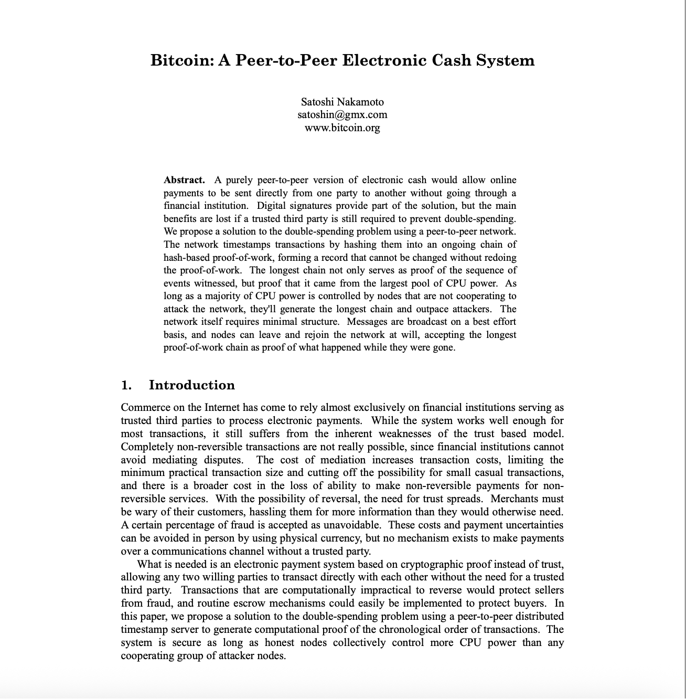

# 创世纪：2008时机成熟

> 💡 见证历史转折的关键时刻。2008年金融危机暴露了传统货币体系的根本缺陷，为比特币的诞生创造了完美的时机。10月31日，中本聪发布白皮书，将哈耶克的预言、密码朋克的技术以及时代的愤怒，凝聚成9页改变世界的文档。
> 
> 欢迎关注我的推特：[@bhbtc1337](https://twitter.com/bhbtc1337)
> 
> 进入微信交流群请填表：[表格链接](https://forms.gle/QMBwL6LwZyQew1tX8)
> 
> 文章开源在 GitHub：[Get-Started-with-Web3](https://github.com/beihaili/Get-Started-with-Web3)

> *"政府经常攻击金融网络，我们正在经历的金融崩溃就是最近一次攻击的后果。"*  
> ——James A. Donald，密码学邮件组（2008年）

**📅 2008年，比特币诞生前1年**

这是一个特殊的年份，哈耶克预言的法定货币体系的根本缺陷，终于暴露在了全世界面前。

由美国次贷危机引发的金融风暴，把全世界的银行和金融机构搞得人仰马翻。简单说，就是华尔街那帮穿西装打领带的聪明人，设计了一堆花里胡哨、谁也看不懂的金融产品，然后玩脱了，欠了一屁股还不上的债。

这帮人自己惹了祸，怎么办？很简单，手一摊：**政府，救我！**

于是，各国政府纷纷开启了印钞机，拿出纳税人的血汗钱，几千亿几千亿地去救助那些濒临破产的银行。英国的情况尤其惨，救了一轮发现是个无底洞，眼看着又要进行"第二次救助"。

这就好比你家邻居天天胡吃海喝，把家底败光了，还欠了一屁股债。结果居委会跑来跟你说，为了社区稳定，大家凑点钱帮他还债吧。

你是什么心情？

当时全世界的普通人，就是这个心情。

更让人愤怒的是，那些造成危机的金融机构不仅没有承担责任，反而还拿着救助资金发放巨额奖金。整个体系的逻辑是：**利润私有化，风险社会化**。

---

就在全世界对传统金融体系彻底失望的时候，**📅 2008年10月31日，下午2:10**，一个叫**中本聪**的神秘人，在密码朋克邮件组里发了一封邮件。

邮件很简短，只有几句话：

> *"我一直在研究一个新的电子现金系统，这个系统完全是点对点的，无需信任第三方。"*

邮件的标题很简单：**Bitcoin: A Peer-to-Peer Electronic Cash System**（比特币：一个点对点的电子现金系统）

附件是一个9页的PDF文件，这份文件就是后来所说的比特币白皮书。

这份白皮书，看起来平淡无奇。没有华丽的格式，没有炫目的图表，没有详细的分析，甚至连作者的真实身份都不知道。看起来就像一个未经雕琢的原石。

但是，它直面并优雅地解决了困扰密码朋克二十年的核心难题——**双花问题**。

在数字世界里，复制几乎零成本；你可以复制一首歌、一部电影或一张图片。但货币不能被随意复制。此前的一切数字货币探索，无不依赖某个中心化机构来防止双重支付：比如乔姆的 eCash 需要银行，几乎所有电子支付体系也要倚赖“可信第三方”。

中本聪给出了一条截然不同的路径：在去中心化网络中，借助工作量证明，从机制上消除双花的可能性——

> *"我们提出了一个解决双重支付问题的方案，使用点对点网络。网络通过将交易哈希到一个持续的基于哈希的工作量证明链中来给交易打时间戳，形成一个不重做工作量证明就无法改变的记录。"*

通俗地说，为了避免同一笔钱被花两次，需要一个公开账本来记录“哪笔钱已花、哪笔钱未花”。又不希望由中心裁判来维护账本，于是比特币改为“按工作量公平选出临时记账者”。每次记账都与上一页账本首尾相接，层层相扣，逐步形成一条“链”。在这条链上试图篡改历史几乎不可能，双花也因此被阻断。

那如何确保记账者诚实？其一，激励相容：诚实记账才能获得区块奖励，作恶等于自毁收益；其二，**最长链原则**：若有人作恶，其他节点会拒绝承认其账本，继续在“诚实链”上扩展。随着新区块不断叠加，大家自然把“最长的有效链”视作唯一真相。

---

更令人惊叹的是，中本聪将密码朋克们20年来积累的技术拼图，完美地组合在了一起：

- **Adam Back的Hashcash** → 变成了挖矿的工作量证明
- **Wei Dai的b-money** → 变成了分布式账本和共识机制
- **Nick Szabo的时间戳服务** → 变成了区块链的时间排序
- **Merkle树数据结构** → 变成了高效的交易验证
- **数字签名技术** → 变成了所有权证明

每一项技术都不是中本聪发明的，但他像一个天才的建筑师，用这些"砖块"建造出了一座前所未有的大厦。

**💡 设计哲学：简洁而优雅**

整个系统的设计体现了一种近乎完美的简洁性：

- **没有中心** → 就没有单点故障
- **没有许可** → 任何人都可以参与
- **没有信任** → 只需要验证就够了
- **没有权威** → 代码即法律

正如白皮书的摘要所说：

> *"一个纯粹的点对点版本的电子现金将允许在线支付直接从一方发送到另一方，而无需通过金融机构的负担。"*

这不仅仅是技术方案，更是哲学宣言。

---

中本聪选择在这个时候发布白皮书，绝不是偶然：

- **技术已成熟**：所有必要的密码学工具都已就位
- **社会有需求**：金融危机让人们渴望替代方案  
- **环境已具备**：互联网的普及为去中心化网络提供了基础

当华尔街的金融巨头们正在为自己的贪婪付出代价时，一个神秘的程序员用九页纸描绘了金融的未来。

当各国政府正在疯狂印钞救助银行时，有人设计了一个总量恒定、不可增发的货币系统。

当人们对"太大而不能倒"的机构彻底失望时，有人创造了一个没有任何机构、完全去中心化的网络。

这不是巧合，这是历史的必然。

---

九页纸的白皮书，不仅仅是一份技术文档，更是一个时代的分水岭。

在这份看似平凡的PDF文件中，哈耶克的预言找到了技术实现的路径，乔姆的失败教训得到了完美的解决，密码朋克们20年的技术积累找到了最佳的组合方式。

2008年的金融危机不是偶然，它暴露了传统金融体系的根本缺陷。而中本聪的白皮书，正是对这场危机最有力的回答。

当华尔街的巨头们还在为救助资金争论不休时，一个神秘的程序员已经用代码勾勒出了金融的未来。

当各国政府还在疯狂印钞稀释货币价值时，有人设计了一个总量恒定、永不增发的货币系统。

当人们对"太大而不能倒"的机构彻底失望时，有人创造了一个没有任何中心机构的分布式网络。

**理想不再只是理想，预言正在成为现实。** 

那座通天的巴别塔，正在拔地而起。

但白皮书只是开始。真正的创世，还在后面。

---

<a href="https://github.com/beihaili/Get-Started-with-Web3">🏠 返回主页</a> | 
<a href="https://twitter.com/bhbtc1337">🐦 关注作者</a> | 
<a href="https://forms.gle/QMBwL6LwZyQew1tX8">📝 加入交流群</a>

